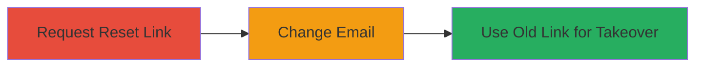

---
tags:
  - account-takeover
  - password-reset
  - authentication-bypass
  - business-logic
type: attack_chain
tools: []
tactics:
  - '[[Initial Access]]'
verified: false
platforms:
  - Web
submitted: true
complexity: medium
created_at: '2023-10-01T00:00:00Z'
procedures:
  - '[[procedures/Request-and-Copy-Password-Reset-Link]]'
  - '[[procedures/Change-Account-Email-Address]]'
  - '[[procedures/Use-Old-Reset-Link-for-Takeover]]'
step_count: 3
techniques:
  - '[[Valid Accounts]]'
updated_at: '2025-12-14T17:33:24.574Z'
description: >-
  Multi-stage attack exploiting Imgur's password reset mechanism where links
  remain valid after email changes, enabling unauthorized account takeover.
skill_level: intermediate
impact_level: high
id: 25665624-6cd4-4b2d-92cc-4d393125fc7f
validated: true
mitre_tactics:
  - '[[Initial Access]]'
mitre_techniques:
  - '[[Valid Accounts]]'
---
# Imgur Account Takeover via Non-Expiring Password Reset Links After Email Change

Multi-stage attack chain demonstrating a complete attack workflow exploiting a flaw in Imgur's password reset process. The vulnerability allows an attacker with temporary access to an account to obtain a reset link, change the email to evade further notifications, and then use the old link to takeover the account by resetting the password.

## Chain Metrics Dashboard

| Metric | Value |
|--------|-------|
| Chain Status | Unverified |
| Total Steps | 3 |
| Execution Time | ~5 minutes |
| Skill Level | Intermediate |
| Complexity | Medium |
| Impact Level | High |

## Attack Flow Visualization

## Prerequisites & Requirements

### Required Tools

- Web browser (e.g., Chrome or Firefox)

### Target Environment

- Imgur web application
- Valid initial access to the target account (e.g., via phishing or prior compromise)
- No special ports or services required beyond standard HTTPS access

### Initial Access Requirements

- Attacker must have temporary login credentials to the target Imgur account
- Internet access to Imgur's website (https://imgur.com)
- Email access to receive the initial reset link

## Detailed Attack Procedures

### Step 1: Obtain Password Reset Link
procedure: [[procedures/Request-and-Copy-Password-Reset-Link]]

**Objective**: Request a password reset for the target account and securely copy the reset link without activating it, preserving it for later use after email changes.

**Instructions**: Navigate to Imgur's login page and initiate a password reset by entering the target username or email. Check the associated email inbox for the reset link, then copy the full URL from the email body without clicking it. Paste it into a text editor for storage.

**Expected Output**: A copied URL in the format similar to https://imgur.com/reset-password?token=abc123...

**Success Indicators**:
- Reset email received and link copied successfully
- Link stored without being consumed

### Step 2: Modify Account Email
procedure: [[procedures/Change-Account-Email-Address]]

**Objective**: Log in to the target account and update the email address to a controlled one, attempting to secure the account from further resets while leaving the old link valid due to the vulnerability.

**Instructions**: Log in to the Imgur account using current credentials. Navigate to account settings, select the Email and Password section, enter a new email address under the attacker's control, and complete the verification process by checking the new email for a confirmation link and activating it.

**Expected Output**: Account email updated successfully, with confirmation message displayed.

**Success Indicators**:
- New email verified and set as primary
- No invalidation of prior reset links (vulnerability exploitation point)

### Step 3: Execute Account Takeover
procedure: [[procedures/Use-Old-Reset-Link-for-Takeover]]

**Objective**: Use the previously copied reset link to change the account password, achieving full takeover despite the email change.

**Instructions**: After email update, paste the original reset link into the browser and follow the prompts to set a new password. The link will remain functional, allowing password reset without access to the new email.

**Expected Output**: Password successfully changed, with login possible using the new credentials.

**Success Indicators**:
- New password set via old link
- Attacker can log in with updated credentials, confirming takeover

## Attack Chain Summary

### Key Achievements

1. Obtained and preserved a password reset link without consumption
2. Changed the account email to disrupt legitimate recovery
3. Used the stale link to reset the password and takeover the account

## Technique & Tactic Coverage

### MITRE ATT&CK Techniques

- [[Valid Accounts]]

### MITRE ATT&CK Tactics

- [[Initial Access]]

---
*Last updated: 2023-10-01T00:00:00Z*
