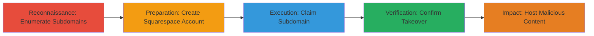

---
tags:
  - subdomain-takeover
  - dns-hijacking
  - phishing
  - squarespace
  - imgur
type: attack_chain
tools:
  - '[[tools/c99-Subdomain-Finder]]'
  - '[[tools/SimpleScreenRecorder]]'
tactics:
  - '[[Initial Access]]'
  - '[[Reconnaissance]]'
verified: false
platforms:
  - Web
  - DNS
submitted: true
created_at: '2023-10-01T00:00:00Z'
procedures:
  - '[[procedures/Enumerate-Subdomains-for-Dangling-Records]]'
  - '[[procedures/Create-Squarespace-Account-for-Domain-Management]]'
  - '[[procedures/Claim-Subdomain-via-Squarespace]]'
  - '[[procedures/Verify-Subdomain-Takeover]]'
step_count: 4
techniques:
  - '[[Exploit Public-Facing Application]]'
  - '[[Email Accounts]]'
updated_at: '2025-12-14T04:51:10.513Z'
description: >-
  A multi-stage attack exploiting a dangling DNS record on an Imgur subdomain to
  claim control via Squarespace, enabling malicious content hosting under a
  trusted domain.
id: 42aec241-6637-40bd-9ead-6b598706716c
validated: true
mitre_tactics:
  - '[[Initial Access]]'
  - '[[Reconnaissance]]'
mitre_techniques:
  - '[[Exploit Public-Facing Application]]'
  - '[[Email Accounts]]'
---
# Imgur Subdomain Takeover via Unclaimed Squarespace DNS Record

Multi-stage attack chain demonstrating a subdomain takeover on Imgur by exploiting an unclaimed subdomain with a dangling CNAME record pointing to Squarespace verification servers. The attacker scans for subdomains, creates a Squarespace account, claims the subdomain, and verifies control, allowing hosting of phishing or malicious content under Imgur's trusted domain.

## Chain Metrics Dashboard

| Metric | Value |
|--------|-------|
| Chain Status | Unverified |
| Total Steps | 4 |
| Execution Time | ~15 minutes |
| Skill Level | Intermediate |
| Complexity | Medium |
| Impact Level | High |

## Attack Flow Visualization



## Prerequisites & Requirements

### Required Tools

- [[tools/c99-Subdomain-Finder]]
- [[tools/SimpleScreenRecorder]]

### Target Environment

- Web platform with DNS resolution
- Access to Squarespace for domain claiming
- No special ports required beyond standard DNS (port 53)

### Initial Access Requirements

- Internet access for subdomain scanning
- No prior credentials needed for Imgur; free Squarespace trial suffices
- Basic knowledge of DNS records and subdomain enumeration

## Detailed Attack Procedures

### Step 1: Enumerate Subdomains for Dangling Records
procedure: [[procedures/Enumerate-Subdomains-for-Dangling-Records]]

**Objective**: Identify unclaimed or dangling subdomains of the target domain (e.g., imgur.com) that may have outdated DNS records pointing to third-party services like Squarespace.

**Instructions**: Use an online subdomain enumeration tool to scan for subdomains. For example, input 'imgur.com' into the scanner to generate a list and check for ones resolving to verification endpoints like verify.squarespace.com.

```bash
# No direct command; use web-based tool at https://subdomainfinder.c99.nl/
# Enter target: imgur.com
# Output: List including 8ybhy85kld9zp9xf84x6.imgur.com with CNAME to verify.squarespace.com
```

**Expected Output**: A list of subdomains, highlighting '8ybhy85kld9zp9xf84x6.imgur.com' as dangling with an old CNAME record.

**Success Indicators**:
- Subdomain list generated
- Dangling record identified (CNAME to verify.squarespace.com)

### Step 2: Create Squarespace Account for Domain Management
procedure: [[procedures/Create-Squarespace-Account-for-Domain-Management]]

**Objective**: Set up a free Squarespace trial account to access domain claiming features, enabling the attacker to hijack unclaimed subdomains.

**Instructions**: Navigate to squarespace.com and sign up for a free trial. No payment details are required initially, providing access to domain settings.

```bash
# No command; browser-based signup
# Visit: https://www.squarespace.com/
# Click 'Start Free Trial' and complete registration
```

**Expected Output**: Active Squarespace account dashboard with access to Settings > Domains.

**Success Indicators**:
- Account created successfully
- Domain management panel accessible

### Step 3: Claim Subdomain via Squarespace
procedure: [[procedures/Claim-Subdomain-via-Squarespace]]

**Objective**: Claim the identified dangling subdomain by adding it as a custom domain in Squarespace, redirecting its DNS to the attacker's site.

**Instructions**: In the Squarespace dashboard, go to Settings > Domains > Use a Domain I Own. Enter the subdomain '8ybhy85kld9zp9xf84x6.imgur.com' and follow the verification process, which succeeds due to the existing CNAME.

```bash
# No command; UI-based
# Path: Settings > Domains > Use Domain I Own > Enter subdomain > Claim
# DNS Update: CNAME points to attacker's Squarespace site
```

**Expected Output**: Subdomain claimed; DNS now resolves to attacker's Squarespace page via updated CNAME.

**Success Indicators**:
- Claim confirmation in Squarespace
- DNS propagation (check with [[commands/dig-dns-lookup-for-subdomain-resolution]])

### Step 4: Verify Subdomain Takeover
procedure: [[procedures/Verify-Subdomain-Takeover]]

**Objective**: Confirm control by accessing the subdomain and capturing proof of the redirect to the attacker's content.

**Instructions**: Visit the subdomain URL in a browser and use screen recording to document the before/after states. Optionally, use DNS lookup to verify resolution.

```bash
# Use browser or [[commands/dig-dns-lookup-for-subdomain-resolution]]
dig 8ybhy85kld9zp9xf84x6.imgur.com
# Record screen with SimpleScreenRecorder showing resolution to Squarespace
```

**Expected Output**: Subdomain loads attacker's Squarespace page; DNS shows CNAME to verify.squarespace.com and A records (198.185.159.177, etc.).

**Success Indicators**:
- Subdomain resolves to controlled site
- Screenshots/video POC captured

## Attack Chain Summary

### Key Achievements

1. Identified and enumerated a dangling Imgur subdomain
2. Successfully claimed control via free Squarespace account
3. Verified takeover with DNS and visual proof
4. Enabled potential phishing/malware under trusted Imgur domain

## Technique & Tactic Coverage

### MITRE ATT&CK Techniques

- [[Exploit Public-Facing Application]]
- [[Email Accounts]]

### MITRE ATT&CK Tactics

- [[Initial Access]]
- [[Reconnaissance]]

---
*Last updated: 2023-10-01T00:00:00Z*
