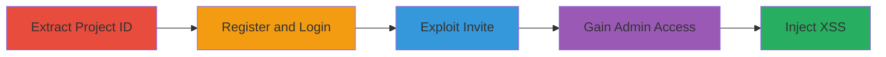

# Improper Access Control in ReadMe.io Leading to Admin Privilege Escalation and Stored XSS on Uber Developer Portal

Multi-stage attack chain demonstrating exploitation of improper access controls in ReadMe.io to gain admin access to Uber's developer documentation project, followed by stored XSS injection affecting developer.uber.com.

## Chain Metrics Dashboard

| Metric | Value |
|--------|-------|
| Chain Status | Unverified |
| Total Steps | 5 |
| Execution Time | ~10 minutes |
| Skill Level | Intermediate |
| Complexity | Medium |
| Impact Level | High |

## Attack Flow Visualization



## Prerequisites & Requirements

### Required Tools

- Browser developer tools for source inspection
- HTTP client like curl for POST requests

### Target Environment

- Web platform
- Access to public ReadMe.io pages (e.g., https://uber.readme.io/inactive)
- No special credentials needed initially

### Initial Access Requirements

- Internet access
- Ability to register free accounts on ReadMe.io
- Email for verification

## Detailed Attack Procedures

### Step 1: Extract Project ID
procedure: [[procedures/Extract-Uber-Project-ID-from-Public-Inactive-Page]]

**Objective**: Identify the Uber project ID from publicly accessible source code to prepare for privilege escalation.

**Instructions**: Load the inactive page in a browser and inspect the HTML source to locate the project ID in the 'project-info' div.

**Expected Output**: Project ID such as "578cd33dc27ce20e004e397b".

**Success Indicators**:
- Project ID extracted successfully
- No authentication required

### Step 2: Register and Verify Account
procedure: [[procedures/Register-and-Verify-Account-on-ReadMe-io]]

**Objective**: Create a legitimate user account on ReadMe.io to enable authenticated requests.

**Instructions**: Navigate to ReadMe.io registration, provide details, and verify via email.

**Expected Output**: Verified user account ready for login.

**Success Indicators**:
- Email verification email received and confirmed
- Account active

### Step 3: Login to Dashboard
procedure: [[procedures/Login-to-ReadMe-io-Dashboard]]

**Objective**: Authenticate to access the ReadMe.io dashboard for subsequent API interactions.

**Instructions**: Use the registered credentials to log in at https://dash.readme.io.

**Expected Output**: Dashboard access granted with session cookies.

**Success Indicators**:
- Successful login
- Session established (cookies set)

### Step 4: Exploit Invite Acceptance
procedure: [[procedures/Exploit-Invite-Acceptance-for-Admin-Access]]

**Objective**: Bypass access controls by sending a crafted POST to claim admin role using the extracted project ID.

**Instructions**: After login, capture X-XSRF-TOKEN from the dashboard, then execute the POST request using [[commands/readme-io-accept-invite-post]] to the /api/accept-invite endpoint with a hardcoded invite ID.

```bash
curl -X POST https://dash.readme.io/api/accept-invite/5617f98f7f74330d00dfd86d \
  -H "Content-Length: 2" \
  -H "Accept: application/json, text/plain, */*" \
  -H "Origin: https://dash.readme.io" \
  -H "X-XSRF-TOKEN: <your-token>" \
  -H "User-Agent: Mozilla/5.0 (Windows NT 10.0; Win64; x64) AppleWebKit/537.36" \
  -H "Referer: https://dash.readme.io/" \
  -H "Cookie: <your-cookies>" \
  -d '{}'
```

**Expected Output**: Response indicating 'Invite doesn't exist', but admin access granted on refresh.

**Success Indicators**:
- Error response but role change visible
- Admin privileges appear in dashboard

### Step 5: Confirm and Inject XSS
procedure: [[procedures/Confirm-Admin-Privileges-and-Inject-Stored-XSS]]

**Objective**: Verify admin access and inject malicious JavaScript into documentation for stored XSS on developer.uber.com.

**Instructions**: Navigate to the Uber project users page to confirm role, then edit a doc page to inject JS payload like <script>alert('XSS')</script>.

**Expected Output**: JS executes on developer.uber.com pages, potentially hijacking sessions.

**Success Indicators**:
- Admin role confirmed
- XSS payload renders and executes

## Attack Chain Summary

### Key Achievements

1. Unauthorized admin access to Uber's ReadMe.io project via invite bypass.
2. Ability to control documentation content.
3. Stored XSS injection leading to account hijacking on developer.uber.com.

## Technique & Tactic Coverage

### MITRE ATT&CK Techniques

- [[Exploit Public-Facing Application]] Exploit Public-Facing Application
- [[Exploitation for Privilege Escalation]] Exploitation for Privilege Escalation
- [[JavaScript]] JavaScript

### MITRE ATT&CK Tactics

- [[Initial Access]] Initial Access
- [[Privilege Escalation]] Privilege Escalation
- [[Execution]] Execution

---
*Last updated: 2023-10-01T00:00:00Z*
