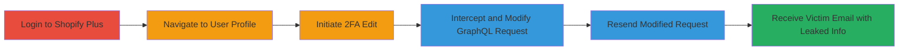

---
tags:
  - idor
  - graphql
  - access-control
  - information-disclosure
  - shopify
type: attack_chain
tools:
  - '[[tools/Burp-Suite]]'
tactics:
  - '[[Discovery]]'
  - '[[Collection]]'
verified: false
platforms:
  - Web
submitted: true
complexity: medium
created_at: '2023-10-01T00:00:00Z'
procedures:
  - '[[procedures/Exploit-Shopify-Plus-GraphQL-IDOR-for-User-Info-Leak]]'
step_count: 6
techniques:
  - '[[Exploit Public-Facing Application]]'
  - '[[Account Discovery]]'
updated_at: '2025-12-14T17:29:56.925Z'
description: >-
  Multi-stage attack exploiting improper access control in Shopify Plus's
  UpdateOrganizationUserTfaEnforcement GraphQL mutation to leak sensitive user
  details from other organizations via unauthorized email notifications.
skill_level: intermediate
impact_level: high
id: 9fff4ff9-4257-4eac-8724-4ce0ead5153e
validated: true
mitre_tactics:
  - '[[Discovery]]'
  - '[[Collection]]'
mitre_techniques:
  - '[[Exploit Public-Facing Application]]'
  - '[[Account Discovery]]'
---
# Improper Access Control in Shopify Plus GraphQL 2FA Enforcement Leading to Cross-Organization User Information Leakage

Multi-stage attack chain demonstrating exploitation of improper access control in Shopify Plus's GraphQL API to leak sensitive user information from unrelated organizations.

## Chain Metrics Dashboard

| Metric | Value |
|--------|-------|
| Chain Status | Unverified |
| Total Steps | 6 |
| Execution Time | ~10 minutes |
| Skill Level | Intermediate |
| Complexity | Medium |
| Impact Level | High |

## Attack Flow Visualization

## Prerequisites & Requirements

### Required Tools

- [[tools/Burp-Suite]]

### Target Environment

- Web platform with Shopify Plus access
- GraphQL API endpoint at https://shopify.plus/[id]/users/api
- No specific ports or services beyond standard HTTPS (443)

### Initial Access Requirements

- Valid Shopify Plus admin credentials for an organization
- Network access to Shopify Plus login and admin dashboard
- Burp Suite configured as proxy for request interception

## Detailed Attack Procedures

### Step 1: Log in to Shopify Plus Account
procedure: [[procedures/Exploit-Shopify-Plus-GraphQL-IDOR-for-User-Info-Leak]]

**Objective**: Gain authenticated access to the Shopify Plus admin dashboard to initiate legitimate user management actions.

**Instructions**: Open a web browser and navigate to the Shopify Plus login page. Enter valid admin credentials for your organization to authenticate.

**Expected Output**: Successful login redirecting to the admin dashboard.

**Success Indicators**:
- Dashboard loads with access to Administration section
- User session established

### Step 2: Navigate to Administration > Users and Select a User Page
procedure: [[procedures/Ensure-Burp-Proxy-Configuration]]

**Objective**: Access the users management interface within the dashboard to prepare for 2FA editing.

**Instructions**: From the main dashboard, click on the Administration menu, then select Users. Choose any user profile from the list to open their details page.

**Expected Output**: User profile page loads, displaying sections like Security.

**Success Indicators**:
- Users list visible
- Selected user profile opens without errors

### Step 3: In the Security Section, Edit the 2FA Setting
procedure: [[procedures/Exploit-Shopify-Plus-GraphQL-IDOR-for-User-Info-Leak]]

**Objective**: Trigger a legitimate GraphQL mutation request for updating 2FA enforcement to intercept it later.

**Instructions**: On the user profile page, scroll to the Security section. Locate the 2FA enforcement setting and initiate an edit (e.g., toggle it to disabled). Submit the change to send the request.

**Expected Output**: Request sent to the GraphQL endpoint; page may show a success or error message.

**Success Indicators**:
- GraphQL POST request intercepted in Burp Suite
- Mutation operation named UpdateOrganizationUserTfaEnforcement visible in payload

### Step 4: Intercept and Observe the POST Request to /users/api
procedure: [[procedures/Exploit-Shopify-Plus-GraphQL-IDOR-for-User-Info-Leak]]

**Objective**: Capture the legitimate GraphQL mutation using Burp Suite to analyze its structure for modification.

**Instructions**: With Burp Suite proxy active, ensure the request to https://shopify.plus/[your-org-id]/users/api is intercepted. Observe the JSON payload, including operationName: 'UpdateOrganizationUserTfaEnforcement', variables with 'id' (base64-encoded user ID) and 'enforced' flag, and the full query string.

**Expected Output**: Intercepted request showing payload like {"operationName":"UpdateOrganizationUserTfaEnforcement","variables":{"id":"Z2lkOi8vb3JnYW5pemF0aW9uL09yZ2FuaXphdGlvblVzZXIvMzQwNTc5Mzg=","enforced":false},"query":"mutation..."}.

**Success Indicators**:
- Request details match GraphQL mutation format
- User ID variable identified for tampering

### Step 5: In Burp Repeater, Modify the id Variable to Target Another Organization's User
procedure: [[procedures/Exploit-Shopify-Plus-GraphQL-IDOR-for-User-Info-Leak]]

**Objective**: Alter the user ID in the GraphQL variables to reference a user from a different organization, bypassing access controls.

**Instructions**: Send the intercepted request to Burp Repeater. Edit the variables.id field to a base64-encoded ID of a target user from another organization (e.g., change to 'Z2lkOi8vb3JnYW5pemF0aW9uL09yZ2FuaXphdGlvblVzZXIvMzQwNzE2MzI='). Keep other fields unchanged and resend the request.

**Expected Output**: API response with an error (e.g., authorization failure), but backend processes the notification.

**Success Indicators**:
- Request resent successfully
- Error response received, but no immediate block

### Step 6: Receive an Email Containing the Victim's Information
procedure: [[procedures/Exploit-Shopify-Plus-GraphQL-IDOR-for-User-Info-Leak]]

**Objective**: Capture the leaked sensitive information sent via email to the targeted user, which discloses details to the attacker.

**Instructions**: Monitor the email inbox associated with the attacker's account or observe the victim's email if accessible. The backend sends a notification email despite the API error.

**Expected Output**: Email to victim (e.g., to Anatoly) revealing 2FA status, first name, last name, email address, and shop ID.

**Success Indicators**:
- Email received with sensitive user/organization details
- Confirmation of cross-organization leakage

## Attack Chain Summary

### Key Achievements

1. Bypassed organization boundaries in GraphQL API via ID modification
2. Triggered unauthorized email notifications leaking PII and org data
3. Demonstrated high-impact information disclosure without direct API success

## Technique & Tactic Coverage

### MITRE ATT&CK Techniques

- [[Exploit Public-Facing Application]] Exploit Public-Facing Application
- [[Account Discovery]] Account Discovery

### MITRE ATT&CK Tactics

- [[Discovery]] Discovery
- [[Collection]] Collection

---

*Last updated: 2023-10-01T00:00:00Z*
