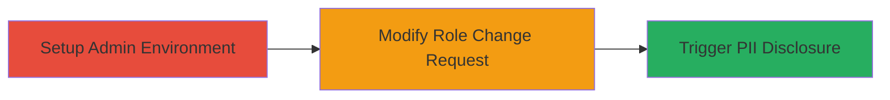

---
tags:
  - access-control
  - idor
  - graphql
  - pii-disclosure
  - shopify
type: attack_chain
tools:
  - '[[tools/Burp-Suite]]'
tactics:
  - '[[Discovery]]'
  - '[[Collection]]'
verified: false
platforms:
  - Web
submitted: true
complexity: medium
created_at: '2023-10-01T00:00:00Z'
procedures:
  - '[[procedures/Setup-Shopify-Plus-Admin-Environment]]'
  - '[[procedures/Initiate-and-Modify-Role-Change-Request]]'
  - '[[procedures/Trigger-and-Observe-PII-Disclosure-Email]]'
step_count: 3
techniques:
  - '[[Account Discovery]]'
  - '[[Steal Web Session Cookie]]'
updated_at: '2025-12-14T17:29:44.860Z'
description: >-
  An attack chain exploiting improper access control in Shopify Plus's GraphQL
  mutation to disclose PII of users from other organizations via unauthorized
  email notifications.
skill_level: intermediate
impact_level: high
id: 8fd5912b-921d-41de-be40-d6af677e2e81
validated: true
mitre_tactics:
  - '[[Discovery]]'
  - '[[Collection]]'
mitre_techniques:
  - '[[Account Discovery]]'
  - '[[Steal Web Session Cookie]]'
---
# Improper Access Control in Shopify Plus UpdateOrganizationUserRole Leading to Cross-Organization PII Disclosure

Multi-stage attack chain demonstrating a complete attack workflow exploiting improper access control in Shopify Plus to disclose PII from other organizations.

## Chain Metrics Dashboard

| Metric | Value |
|--------|-------|
| Chain Status | Unverified |
| Total Steps | 3 |
| Execution Time | ~10 minutes |
| Skill Level | Intermediate |
| Complexity | Medium |
| Impact Level | High |

## Attack Flow Visualization

## Prerequisites & Requirements

### Required Tools

- [[tools/Burp-Suite]]

### Target Environment

- Shopify Plus platform
- Admin access to a Shopify Plus organization
- Network access to https://shopify.plus

### Initial Access Requirements

- Valid admin credentials for a Shopify Plus account
- Ability to intercept HTTP traffic (e.g., via proxy)
- No prior access to target organization needed

## Detailed Attack Procedures

### Step 1: Setup Admin Environment
procedure: [[procedures/Setup-Shopify-Plus-Admin-Environment]]

**Objective**: Establish a controlled environment within Shopify Plus by logging in and creating necessary role and user for testing the role change mutation.

**Instructions**: Log in to your Shopify Plus account, create a new role, add a new user, and navigate to the user's page to prepare for the role change initiation.

**Expected Output**: Access to the new user's detail page with URL like https://shopify.plus/[org-id]/users/[user-id].

**Success Indicators**:
- Successful login and navigation
- New role and user created

### Step 2: Initiate and Modify Role Change Request
procedure: [[procedures/Initiate-and-Modify-Role-Change-Request]]

**Objective**: Trigger the UpdateOrganizationUserRole GraphQL mutation and intercept the request to alter the target user ID, bypassing organization boundaries.

**Instructions**: From the user's page, initiate a role change to capture the POST request to /users/api. Use [[tools/Burp-Suite]] to intercept, decode the base64 user ID, replace it with a target user ID from another organization, re-encode, and forward the modified request.

**Expected Output**: Modified GraphQL mutation with altered 'id' variable sent to the API.

**Success Indicators**:
- Request intercepted and modified successfully
- API receives the tampered mutation

### Step 3: Trigger and Observe PII Disclosure Email
procedure: [[procedures/Trigger-and-Observe-PII-Disclosure-Email]]

**Objective**: Observe the failure of the mutation and the subsequent unauthorized email containing the target user's PII.

**Instructions**: After forwarding the modified request, monitor for API response and check email inbox for notification. The failure triggers an email with the target's first name, last name, and email address.

**Expected Output**: Error response from API and email with disclosed PII.

**Success Indicators**:
- API error received
- Email notification arrives with unauthorized PII

## Attack Chain Summary

### Key Achievements

1. Bypassed organization isolation in Shopify Plus user management
2. Disclosed PII of cross-organization users via notification email
3. Demonstrated improper validation in GraphQL mutation processing

## Technique & Tactic Coverage

### MITRE ATT&CK Techniques

- [[Account Discovery]] Account Discovery
- [[Steal Web Session Cookie]] Data from Information Repositories

### MITRE ATT&CK Tactics

- [[Discovery]] Discovery
- [[Collection]] Collection

---
*Last updated: 2023-10-01T00:00:00Z*
