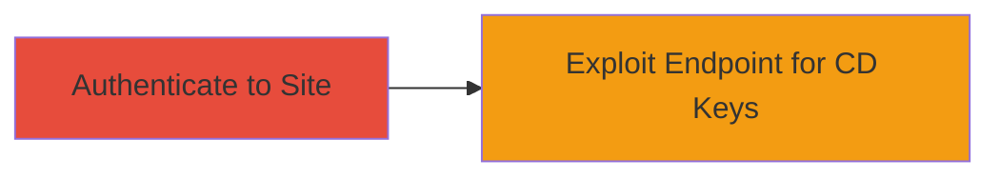

---
tags:
  - improper-access-control
  - steam
  - cd-keys
  - web-vuln
type: attack_chain
tools: []
tactics:
  - '[[Initial Access]]'
  - '[[Privilege Escalation]]'
commands: []
platforms:
  - Web
complexity: low
procedures:
  - '[[procedures/Authenticate-to-Steam-Partner-Site]]'
  - '[[procedures/Exploit-AssignKeys-Endpoint-for-Unauthorized-CD-Keys]]'
step_count: 2
techniques:
  - '[[Valid Accounts]]'
  - '[[Exploit Public-Facing Application]]'
description: >-
  Exploitation of an improper access control vulnerability in Steam's partner
  site to retrieve CD keys for unauthorized games.
skill_level: beginner
impact_level: high
id: 8860eebd-1dd1-40d8-9143-7095797c4cd0
created_at: '2025-12-11T03:47:59.454Z'
updated_at: '2025-12-11T03:47:59.455Z'
verified: false
validated: true
submitted: true
mitre_tactics:
  - '[[TA0001]]'
  - '[[TA0004]]'
mitre_techniques:
  - '[[T1078]]'
  - '[[T1190]]'
---
# Improper Access Control in Steam Partner Endpoint to Download Unauthorized CD Keys

## Overview

This attack chain exploits an improper access control vulnerability in the /partnercdkeys/assignkeys/ endpoint on partner.steamgames.com. Authenticated users can download previously-generated CD keys for games they lack permission to access by specifying certain parameters in requests. The chain begins with authentication to the partner site and proceeds to sending crafted requests to retrieve unauthorized CD keys, potentially allowing distribution or activation of games without authorization.

## Attack Flow Visualization



## Prerequisites & Requirements

### Required Tools

- #curl

### Target Environment

- Platform: Web
- Services: Steam Partner Services
- Network access: Internet access to partner.steamgames.com

### Initial Access Requirements

- Valid credentials for a Steam partner account
- Authenticated session

## Detailed Attack Procedures

## Step 1: Authenticate to Steam Partner Site - [[procedures/Authenticate-to-Steam-Partner-Site]]

### Objective

Gain authenticated access to the partner.steamgames.com site using valid credentials.

### Instructions

Use [[commands/curl-authenticate-steam]] to log in and obtain an authenticated session:

```bash
curl -X POST 'https://partner.steamgames.com/login' --data 'username=yourusername&password=yourpassword' -c cookies.txt
```

This will save the session cookies for subsequent requests.

### Expected Output

Successful login response with session cookies stored.

### Success Indicators

- HTTP 200 OK response
- Valid session cookie present in cookies.txt

## Step 2: Exploit AssignKeys Endpoint for Unauthorized CD Keys - [[procedures/Exploit-AssignKeys-Endpoint-for-Unauthorized-CD-Keys]]

### Objective

Send a crafted request to the /partnercdkeys/assignkeys/ endpoint to download CD keys for games without proper authorization.

### Instructions

Using the authenticated session, execute [[commands/curl-exploit-assignkeys]] with parameters to target an unauthorized game (e.g., specify game ID and key parameters):

```bash
curl -X POST 'https://partner.steamgames.com/partnercdkeys/assignkeys/' --data 'game_id=unauthorized_game_id&key_params=specific_params' -b cookies.txt -o cdkeys.txt
```

This bypasses access controls and downloads the CD keys.

### Expected Output

File cdkeys.txt containing the downloaded CD keys.

### Success Indicators

- HTTP 200 OK response
- CD keys for unauthorized games retrieved in the output file

## Attack Chain Summary

### Key Achievements

1. Gained authenticated access to Steam partner site
2. Bypassed access controls to download unauthorized CD keys
3. Potential for game key distribution without permission

## Technique & Tactic Coverage

### MITRE ATT&CK Techniques

- [[Valid Accounts]]
- [[Exploit Public-Facing Application]]

### MITRE ATT&CK Tactics

- [[Initial Access]]
- [[Privilege Escalation]]
