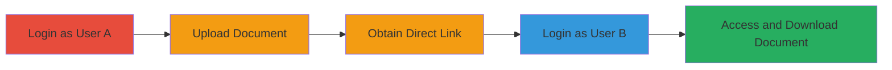

---
tags:
  - incorrect-authorization
  - idor
  - file-access
  - authorization-bypass
type: attack_chain
tools: []
tactics:
  - '[[Lateral Movement]]'
verified: false
platforms:
  - Web
submitted: true
complexity: medium
created_at: '2023-10-01T00:00:00Z'
procedures:
  - '[[procedures/Exploit-TVA-Portal-Incorrect-Authorization]]'
step_count: 5
techniques:
  - '[[Valid Accounts]]'
updated_at: '2025-12-14T17:29:44.679Z'
description: >-
  Multi-stage attack exploiting incorrect authorization in the Tennessee Valley
  Authority portal to access and download documents uploaded by other users via
  direct links without ownership verification.
skill_level: intermediate
impact_level: high
id: 3dcf0f68-93a8-4330-a096-33fde20b39c3
validated: true
mitre_tactics:
  - '[[Lateral Movement]]'
mitre_techniques:
  - '[[Valid Accounts]]'
---
# Incorrect Authorization in TVA Portal Allowing Access to Other Users' Uploaded Documents

Multi-stage attack chain demonstrating exploitation of an incorrect authorization vulnerability in the Tennessee Valley Authority (TVA) portal, where authenticated users can access and download documents uploaded by others without proper ownership checks.

## Chain Metrics Dashboard

| Metric | Value |
|--------|-------|
| Chain Status | Unverified |
| Total Steps | 5 |
| Execution Time | ~10 minutes |
| Skill Level | Intermediate |
| Complexity | Medium |
| Impact Level | High |

## Attack Flow Visualization

## Prerequisites & Requirements

### Required Tools

- Web browser (e.g., Chrome or Firefox with developer tools for inspecting links)

### Target Environment

- Web platform
- TVA portal at https://qcn.mytva.com/
- Access to admin section for file uploads

### Initial Access Requirements

- Valid credentials for at least two different authenticated users (User A and User B)
- Network access to the TVA portal
- No prior access needed beyond authentication

## Detailed Attack Procedures

### Step 1: Login as User A
procedure: [[procedures/Exploit-TVA-Portal-Incorrect-Authorization]]

**Objective**: Authenticate to the portal as the first user to prepare for document upload.

**Instructions**: Open a web browser and navigate to the TVA portal. Enter credentials for User A to log in.

**Expected Output**: Successful login to the dashboard.

**Success Indicators**:
- Access to the portal interface
- Admin section visible

### Step 2: Upload Document as User A
procedure: [[procedures/Exploit-TVA-Portal-Incorrect-Authorization]]

**Objective**: Upload a test document to generate an accessible link.

**Instructions**: Navigate to the admin section of the portal and select the file upload functionality. Choose a sample file (e.g., an image) and complete the upload process.

**Expected Output**: Confirmation of upload success, potentially with a preview or link.

**Success Indicators**:
- File uploaded without errors
- Upload confirmation message displayed

### Step 3: Obtain Direct Link to Uploaded Document
procedure: [[procedures/Exploit-TVA-Portal-Incorrect-Authorization]]

**Objective**: Capture the direct link to the uploaded file for later unauthorized access.

**Instructions**: After upload, click on the link to view the file. Inspect the URL, which will be in the format https://qcn.mytva.com/Admin/FileHandler?ENC=<encoded_string>. Copy this URL, noting the base64-like encoded ENC parameter that serves as the file identifier.

**Expected Output**: Direct URL with ENC parameter.

**Success Indicators**:
- URL accessible and displays the uploaded file
- ENC parameter extracted

### Step 4: Login as User B
procedure: [[procedures/Exploit-TVA-Portal-Incorrect-Authorization]]

**Objective**: Authenticate as a different user to demonstrate cross-user access.

**Instructions**: Log out of User A if necessary, then log in to the portal using credentials for User B.

**Expected Output**: Successful login as User B.

**Success Indicators**:
- Dashboard accessible under User B
- No prior files from User A visible in User B's interface

### Step 5: Access and Download User A's Document as User B
procedure: [[procedures/Exploit-TVA-Portal-Incorrect-Authorization]]

**Objective**: Use the obtained link to unauthorizedly view and download the file.

**Instructions**: While logged in as User B, paste and navigate to the FileHandler URL obtained from Step 3. The file should load without any ownership verification.

**Expected Output**: File displays and can be downloaded by User B.

**Success Indicators**:
- File content visible to User B
- Download option available, confirming data leakage

## Attack Chain Summary

### Key Achievements

1. Successful upload and link generation as one user
2. Unauthorized access to the file by another authenticated user
3. Demonstration of potential sensitive data exposure via link sharing or social engineering

## Technique & Tactic Coverage

### MITRE ATT&CK Techniques

- [[Valid Accounts]]

### MITRE ATT&CK Tactics

- [[Lateral Movement]]

---
*Last updated: 2023-10-01T00:00:00Z*
