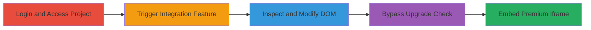

# Infogram Client-Side Privilege Escalation via Iframe Attribute Removal

Multi-stage attack chain demonstrating a complete attack workflow exploiting client-side enforcement in Infogram's project integration feature.

## Chain Metrics Dashboard

| Metric | Value |
|--------|-------|
| Chain Status | Unverified |
| Total Steps | 5 |
| Execution Time | ~5 minutes |
| Skill Level | Intermediate |
| Complexity | Medium |
| Impact Level | High |

## Attack Flow Visualization

## Prerequisites & Requirements

### Required Tools

- [[tools/Browser-Developer-Tools]]

### Target Environment

- Web platform (Infogram application)
- Required services/ports: Standard HTTPS (443)
- Network access requirements: Internet access to Infogram

### Initial Access Requirements

- Free user account credentials for Infogram
- Network position: External user
- Prior access needed: Valid free-tier login

## Detailed Attack Procedures

### Step 1: Login to Infogram Account

procedure: [[procedures/Bypass-Infogram-Premium-Iframe-Access-via-Developer-Tools]]

**Objective**: Authenticate as a free user to gain initial access to the dashboard.

**Instructions**: Open a web browser and navigate to the Infogram login page. Enter free user credentials to authenticate.

**Expected Output**: Successful login redirecting to the user dashboard.

**Success Indicators**:
- Dashboard loads with free-tier indicators (e.g., upgrade prompts visible)
- No errors in authentication

### Step 2: Navigate to a Project

procedure: [[procedures/Bypass-Infogram-Premium-Iframe-Access-via-Developer-Tools]]

**Objective**: Access an existing project to prepare for integration modifications.

**Instructions**: From the dashboard, select and open an existing project.

**Expected Output**: Project editor interface loads.

**Success Indicators**:
- Project details visible
- Editing tools accessible

### Step 3: Choose Integrations and Select Iframe Option

procedure: [[procedures/Bypass-Infogram-Premium-Iframe-Access-via-Developer-Tools]]

**Objective**: Trigger the premium feature check to expose the client-side enforcement.

**Instructions**: In the project settings, navigate to the 'integrations' section and click on the 'IFrame' option.

**Expected Output**: Upgrade notification appears for free users, with the iframe icon showing restricted access.

**Success Indicators**:
- Upgrade prompt displayed
- Iframe icon element visible in the UI

### Step 4: Inspect and Remove Upgrade Attribute

procedure: [[procedures/Bypass-Infogram-Premium-Iframe-Access-via-Developer-Tools]]

**Objective**: Use developer tools to bypass the client-side restriction by modifying the HTML attribute.

**Instructions**: Open browser developer tools (F12 or right-click inspect), locate the iframe icon element, and remove the `data-upgrade="true"` attribute from the HTML.

**Expected Output**: The upgrade prompt no longer triggers upon interaction with the iframe option.

**Success Indicators**:
- Attribute successfully deleted in inspector
- No upgrade modal appears on re-click

### Step 5: Add Iframe to Project

procedure: [[procedures/Bypass-Infogram-Premium-Iframe-Access-via-Developer-Tools]]

**Objective**: Embed the premium iframe feature without payment, achieving privilege escalation.

**Instructions**: Click the iframe option again and configure/add an iframe to the project.

**Expected Output**: Iframe successfully embedded and functional in the project.

**Success Indicators**:
- Iframe added without upgrade prompt
- Project saves with embedded iframe
- Unauthorized premium feature usage confirmed

## Attack Chain Summary

### Key Achievements

1. Bypassed client-side access controls using browser tools
2. Accessed premium iframe embedding as a free user
3. Demonstrated lack of server-side validation for feature enforcement

## Technique & Tactic Coverage

### MITRE ATT&CK Techniques

- [[Exploitation for Privilege Escalation]] Exploitation for Privilege Escalation
- [[Exploit Public-Facing Application]] Exploit Public-Facing Application

### MITRE ATT&CK Tactics

- [[Privilege Escalation]] Privilege Escalation

---

*Last updated: 2024-01-01T00:00:00Z*
