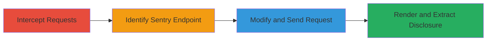

---
tags:
  - information-disclosure
  - sentry
  - misconfiguration
  - web
type: attack_chain
tools:
  - '[[tools/Burp-Suite]]'
tactics:
  - '[[Discovery]]'
verified: false
platforms:
  - Web
submitted: true
complexity: medium
created_at: '2023-10-01T00:00:00Z'
procedures:
  - '[[procedures/Configure-Burp-Suite-for-Request-Interception]]'
  - '[[procedures/Identify-and-Target-Sentry-Store-Endpoint]]'
  - '[[procedures/Modify-Request-to-Trigger-Disclosure]]'
  - '[[procedures/Analyze-Response-for-Server-Information-Exfiltration]]'
step_count: 4
techniques:
  - '[[System Information Discovery]]'
  - '[[Gather Victim Host Information]]'
updated_at: '2025-12-14T17:25:18.313Z'
description: >-
  A multi-stage attack exploiting a misconfigured Sentry error tracking instance
  to disclose sensitive server information via request modification and response
  rendering.
skill_level: intermediate
impact_level: high
id: c1efb540-10a9-4217-9884-d8aabc751cd9
validated: true
mitre_tactics:
  - '[[Discovery]]'
mitre_techniques:
  - '[[System Information Discovery]]'
  - '[[Gather Victim Host Information]]'
---
# Information Disclosure Through Misconfigured Sentry Error Tracking Instance

Multi-stage attack chain demonstrating exploitation of a misconfigured Sentry instance for sensitive server information disclosure. The attacker intercepts application requests, identifies the Sentry endpoint, modifies the HTTP method to POST, and renders the response to reveal debug details about the server, including internals that could facilitate further attacks.

## Chain Metrics Dashboard

| Metric | Value |
|--------|-------|
| Chain Status | Unverified |
| Total Steps | 4 |
| Execution Time | ~10 minutes |
| Skill Level | Intermediate |
| Complexity | Medium |
| Impact Level | High |

## Attack Flow Visualization

## Prerequisites & Requirements

### Required Tools

- [[tools/Burp-Suite]]

### Target Environment

- Web application with integrated Sentry error tracking
- Exposed Sentry instance without authentication
- Network access to the application's endpoints

### Initial Access Requirements

- Ability to proxy traffic through Burp Suite (e.g., browser configured to use Burp proxy)
- No prior credentials needed; assumes public-facing application

## Detailed Attack Procedures

### Step 1: Configure Interception
procedure: [[procedures/Configure-Burp-Suite-for-Request-Interception]]

**Objective**: Set up Burp Suite to intercept and monitor requests to the target application, preparing for endpoint discovery and modification.

**Instructions**: Launch Burp Suite and configure your browser to route traffic through the Burp proxy (default: 127.0.0.1:8080). Navigate to the target application to generate initial requests. In the Proxy tab, intercept a request to capture ongoing traffic.

**Expected Output**: Captured HTTP requests visible in Burp's Proxy > HTTP history.

**Success Indicators**:
- Traffic successfully intercepted
- Application requests appear in Burp interface

### Step 2: Identify Sentry Endpoint
procedure: [[procedures/Identify-and-Target-Sentry-Store-Endpoint]]

**Objective**: Observe application behavior to detect Sentry usage and locate the /api/20/store endpoint for potential exploitation.

**Instructions**: While intercepting requests, monitor for error-related traffic or JavaScript that references Sentry. Manually send a GET request to the suspected Sentry endpoint (e.g., https://target.com/api/20/store) using Burp Repeater to confirm exposure.

**Expected Output**: Response indicating Sentry presence, such as error tracking metadata.

**Success Indicators**:
- Sentry endpoint responds without authentication
- Evidence of error tracking integration confirmed

### Step 3: Modify and Exploit Request
procedure: [[procedures/Modify-Request-to-Trigger-Disclosure]]

**Objective**: Alter the intercepted request to POST method with appropriate headers to trigger the misconfigured response from the Sentry store endpoint.

**Instructions**: In Burp Repeater, copy the intercepted GET request to /api/20/store. Change the method to POST, add headers: Host: target.com, Content-Type: application/x-www-form-urlencoded, Content-Length: 0, Sec-Fetch-Site: same-origin, Sec-Fetch-Mode: cors, Sec-Fetch-Dest: empty, Accept: */*, Accept-Language: en-US,en;q=0.5, Accept-Encoding: gzip, deflate, br. Set body to empty. Forward the request.

**Expected Output**: HTTP 200 response with raw data that can be rendered.

**Success Indicators**:
- Request successfully modified and sent
- Response received without errors

### Step 4: Extract Disclosed Information
procedure: [[procedures/Analyze-Response-for-Server-Information-Exfiltration]]

**Objective**: Render the response UI in Burp to visualize and extract sensitive server details, such as debug information and internals.

**Instructions**: In the Burp Repeater response tab, click the [Render] button to process the HTML/JS response. Review the rendered UI for exposed data, including server configuration, stack traces, and details about the affected server.

**Expected Output**: Rendered page showing sensitive disclosures, e.g., server paths, versions, and potential attack vectors.

**Success Indicators**:
- UI renders successfully revealing debug info
- Sensitive server details (e.g., [█████]) extracted

## Attack Chain Summary

### Key Achievements

1. Successful interception and modification of requests using Burp Suite
2. Exploitation of unauthenticated Sentry /api/20/store endpoint
3. Disclosure of high-impact server internals leading to $750 bounty

## Technique & Tactic Coverage

### MITRE ATT&CK Techniques

- [[System Information Discovery]]
- [[Gather Victim Host Information]]

### MITRE ATT&CK Tactics

- [[Discovery]]

---

*Last updated: 2023-10-01T00:00:00Z*
