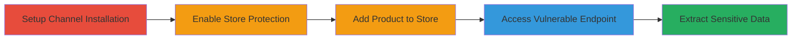

---
tags:
  - information-disclosure
  - shopify
  - google-sales-channel
  - reconnaissance
type: attack_chain
tools: []
tactics:
  - '[[Reconnaissance]]'
verified: false
platforms:
  - Web
submitted: true
complexity: low
created_at: '2024-01-01T00:00:00Z'
procedures:
  - '[[procedures/Install-Google-Sales-Channel-on-Shopify-Store]]'
  - '[[procedures/Enable-Password-Protection-on-Shopify-Store]]'
  - '[[procedures/Add-Product-to-Shopify-Store]]'
  - '[[procedures/Access-Shopify-Google-Sales-Channel-Endpoint]]'
  - '[[procedures/Extract-Disclosed-Information-from-Response]]'
step_count: 4
techniques:
  - '[[Client Configurations]]'
updated_at: '2025-12-14T17:24:56.764Z'
description: >-
  Multi-stage attack chain exploiting an unauthenticated information disclosure
  vulnerability in Shopify's Google Sales Channel to extract sensitive store
  data like contact emails and channel IDs from password-protected stores.
skill_level: beginner
impact_level: medium
id: 29ea7c55-ee45-4bf9-95d5-8a759bbe3b16
validated: true
mitre_tactics:
  - '[[Reconnaissance]]'
mitre_techniques:
  - '[[Client Configurations]]'
---
# Information Disclosure in Shopify Google Sales Channel Exposing Store Emails and IDs

Multi-stage attack chain demonstrating a complete attack workflow for exploiting an information disclosure vulnerability in Shopify's Google Sales Channel. This allows unauthenticated attackers to retrieve sensitive store details, such as contact emails and channel IDs, even from password-protected storefronts. The chain is adapted for demonstration purposes, noting that initial setup steps (installing the channel and adding products) require administrative access to the target store for reproduction, while the core exploitation (accessing the endpoint) can be performed externally if a product ID is known or discoverable.

## Chain Metrics Dashboard

| Metric | Value |
|--------|-------|
| Chain Status | Unverified |
| Total Steps | 4 |
| Execution Time | ~5 minutes |
| Skill Level | Beginner |
| Complexity | Low |
| Impact Level | Medium |

## Attack Flow Visualization

## Prerequisites & Requirements

### Required Tools

- Web browser or HTTP client (e.g., curl, though none specifically required)

### Target Environment

- Shopify platform with Google Sales Channel installed
- Web-based access to Shopify admin and storefront

### Initial Access Requirements

- Administrative access to the target Shopify store for setup steps (for reproduction; in real attacks, product IDs may be guessed or enumerated from public sources)
- Knowledge of the target store domain (e.g., your-store.myshopify.com)
- No authentication required for the exploitation endpoint

## Detailed Attack Procedures

### Step 1: Install Google Sales Channel
procedure: [[procedures/Install-Google-Sales-Channel-on-Shopify-Store]]

**Objective**: Enable the Google Sales Channel on the target Shopify store to make the vulnerable endpoint available.

**Instructions**: Log in to the Shopify admin and install the Google channel app from the Shopify App Store.

**Expected Output**: Confirmation that the Google Sales Channel is installed and active on the store.

**Success Indicators**:
- Google channel appears in the store's sales channels list
- No errors during installation

### Step 2: Enable Password Protection
procedure: [[procedures/Enable-Password-Protection-on-Shopify-Store]]

**Objective**: Secure the storefront with password protection to simulate a private store, highlighting that the vulnerability bypasses this control.

**Instructions**: In the Shopify admin, navigate to Online Store > Preferences and enable password protection by setting a password.

**Expected Output**: Storefront requires password for access, confirming protection is active.

**Success Indicators**:
- Attempting to access the storefront without password shows a login page
- Admin confirms protection status

### Step 3: Add Product to Store
procedure: [[procedures/Add-Product-to-Shopify-Store]]

**Objective**: Create a product in the store to obtain a valid product ID needed for the vulnerable endpoint query.

**Instructions**: In the Shopify admin, go to Products > Add product, fill in basic details (e.g., title, description), and save to generate a product ID.

**Expected Output**: New product created with an assigned ID (e.g., 1234567890).

**Success Indicators**:
- Product appears in the products list
- Product ID is visible in the admin URL or details

### Step 4: Access Vulnerable Endpoint
procedure: [[procedures/Access-Shopify-Google-Sales-Channel-Endpoint]]

**Objective**: Request the unauthenticated endpoint using the store domain and product ID to trigger the disclosure.

**Instructions**: Use a web browser or HTTP client to GET the URL: https://google-shopping.shopifycloud.com/shopify/products?shop=your-store.myshopify.com&id=PRODUCT_ID&locale=en, replacing placeholders with actual values.

**Expected Output**: HTTP response containing embedded sensitive data attributes.

**Success Indicators**:
- Response status 200 OK
- Presence of data-channel-id and data-user-email in the HTML

### Step 5: Extract Disclosed Information
procedure: [[procedures/Extract-Disclosed-Information-from-Response]]

**Objective**: Parse the response to obtain the exposed store contact email and Google channel ID.

**Instructions**: Inspect the HTTP response body for attributes like data-channel-id="70715703461" and data-user-email="victim@example.com".

**Expected Output**: Extracted values: channel ID (numeric) and email address.

**Success Indicators**:
- Valid email format retrieved
- Channel ID matches expected Shopify format (numeric string)

## Attack Chain Summary

### Key Achievements

1. Bypassed password protection to access sensitive store data unauthenticated
2. Exposed private contact emails not visible in public store settings
3. Retrieved Google channel IDs for potential further abuse or targeting

## Technique & Tactic Coverage

### MITRE ATT&CK Techniques

- [[Client Configurations]]

### MITRE ATT&CK Tactics

- [[Reconnaissance]]

---
*Last updated: 2024-01-01T00:00:00Z*
