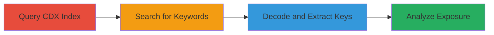

# Information Disclosure of API Keys via Internet Archive CDX Indexing

Multi-stage attack chain demonstrating how to discover and extract sensitive configuration data from archived web content using the Internet Archive's CDX index. This technique targets client-side JavaScript files that inadvertently expose API keys, such as those for PayPal, Stripe, and Sentry, leading to potential information disclosure.

## Chain Metrics Dashboard

| Metric | Value |
|--------|-------|
| Chain Status | Unverified |
| Total Steps | 3 |
| Execution Time | ~5 minutes |
| Skill Level | Beginner |
| Complexity | Low |
| Impact Level | Medium |

## Attack Flow Visualization



## Prerequisites & Requirements

### Required Tools

- [[tools/Web-Archive-CDX-Search]]
- [[tools/beautifier-io]]

### Target Environment

- Web platform with archived content on Internet Archive
- No special access required; public internet connection

### Initial Access Requirements

- None; relies on public archives
- Basic knowledge of URL encoding and JSON

## Detailed Attack Procedures

### Step 1: Query Internet Archive CDX for Domain
procedure: [[procedures/Query-Internet-Archive-CDX-for-Domain]]

**Objective**: Retrieve a list of archived URLs for the target domain to identify potential sources of sensitive data.

**Instructions**: Use the CDX search endpoint to fetch archived URLs. Execute the following using [[commands/curl-cdx-query]]:

```bash
curl "https://web.archive.org/cdx/search/cdx?url=subscriptions.firefox.com/*&collapse=urlkey&output=text&fl=original" > archived_urls.txt
```

**Expected Output**: A text file listing archived URLs in the format of original URLs.

**Success Indicators**:
- List of archived URLs retrieved without errors
- File contains entries for the target domain

### Step 2: Search Archived Content for Sensitive Keywords
procedure: [[procedures/Search-Archived-Content-for-Sensitive-Keywords]]

**Objective**: Identify archived entries containing potential sensitive data by searching for keywords like 'clientId'.

**Instructions**: Manually or script-search the output file for keywords. For manual search, open archived_urls.txt and grep for 'clientId' using [[commands/grep-search]]:

```bash
grep -i 'clientid' archived_urls.txt
```

This will highlight URLs with encoded JSON potentially containing configurations.

**Expected Output**: Matching URLs, such as one with URL-encoded JSON in the path.

**Success Indicators**:
- Relevant archived URL identified with keyword matches
- Encoded content located for further decoding

### Step 3: Decode and Extract API Keys from JSON
procedure: [[procedures/Decode-and-Extract-API-Keys-from-JSON]]

**Objective**: Decode the archived JSON content and extract sensitive keys for analysis.

**Instructions**: Copy the encoded JSON from the identified URL, decode it manually or with a tool, then beautify. Use [[commands/url-decode]] for decoding if needed, followed by pasting into [[tools/beautifier-io]]. Review for keys like PayPal client_id ('Adb5V3A0jC394H-2nZL9JRBzcre0bNjxm_tqzezZDTTSheL4ANKqvG79uyDw1lwtxuXbDPK7Kdp6pMbr'), Stripe apiKey ('pk_live_HgtiWdwlc5Uq8ZRsPAXIAyRY00CA51o613'), and Sentry DSN ('https://bd67bbdfad9b46a7a2f0faf4aa02c122@o1069899.ingest.sentry.io/6231072').

**Expected Output**: Formatted JSON revealing API configurations.

**Success Indicators**:
- Sensitive keys extracted and documented
- Confirmation of exposure (e.g., via key validation on respective services)

## Attack Chain Summary

### Key Achievements

1. Successfully queried and retrieved archived web content using public tools.
2. Identified and decoded sensitive client-side configurations.
3. Exposed API keys that could lead to unauthorized access or misuse, though some were public-facing.

## Technique & Tactic Coverage

### MITRE ATT&CK Techniques

- [[Search Open Websites-Domains]] Search Open Technical Databases or Platforms
- [[Search Engines]] Search Open Domains and DNS

### MITRE ATT&CK Tactics

- [[Reconnaissance]] Reconnaissance

---
*Last updated: 2023-10-01T00:00:00Z*
