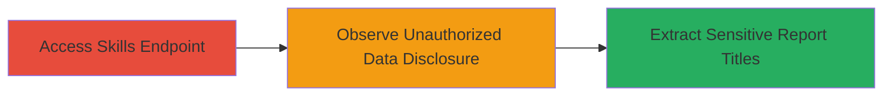

# Information Disclosure of Confidential Bug Report Titles via HackerOne Skills Endpoint

Multi-stage attack chain demonstrating the discovery and exploitation of an information disclosure vulnerability in HackerOne's new 'skills' feature, where an API endpoint exposes sensitive report titles from other users' vulnerability submissions.

## Chain Metrics Dashboard

| Metric | Value |
|--------|-------|
| Chain Status | Unverified |
| Total Steps | 2 |
| Execution Time | ~1 minute |
| Skill Level | Beginner |
| Complexity | Low |
| Impact Level | Medium |

## Attack Flow Visualization



## Prerequisites & Requirements

### Required Tools

- None (uses standard HTTP client like curl or browser)

### Target Environment

- Web platform
- HackerOne application (requires authenticated session during feature rollout)
- No specific services/ports beyond standard HTTPS (443)

### Initial Access Requirements

- Valid HackerOne account with access to the skills feature (paced rollout)
- Authenticated session (login required)
- Network access to hackerone.com

## Detailed Attack Procedures

### Step 1: Access the Skills Endpoint

procedure: [[procedures/Exploit-HackerOne-Skills-Endpoint-for-Report-Title-Disclosure]]

**Objective**: Send a request to the skills API endpoint to retrieve endorsement data, which inadvertently includes other users' report details.

**Instructions**: Authenticate into your HackerOne account and issue a GET request to the skills endpoint using [[commands/get-hackerone-skills-endpoint]]:

```bash
curl -H "Cookie: your_session_cookie" https://hackerone.com/settings/skills
```

Replace `your_session_cookie` with your actual authenticated session cookie obtained from browser developer tools.

**Expected Output**: A JSON response containing an array of skills (e.g., 'Mobile Applications', 'Web Applications') with an 'endorsements' array, including 'report' objects from other users.

**Success Indicators**:
- JSON response received without errors
- Presence of 'endorsements' array in the payload

### Step 2: Observe and Extract Disclosed Report Titles

procedure: [[procedures/Exploit-HackerOne-Skills-Endpoint-for-Report-Title-Disclosure]]

**Objective**: Parse the API response to identify and extract unauthorized report IDs and titles, revealing confidential vulnerability details.

**Instructions**: Review the JSON output from the previous step. Look for entries in the 'endorsements' array under each skill, such as:

```json
{
  "endorsements": [
    {
      "report": {
        "id": 12345,
        "title": "████████ (redacted sensitive title)"
      }
    }
  ]
}
```

Manually inspect or use a JSON parser like `jq` to filter report titles:

```bash
curl -H "Cookie: your_session_cookie" https://hackerone.com/settings/skills | jq '.skills[].endorsements[].report.title'
```

**Expected Output**: List of report titles from other hackers' resolved reports, potentially disclosing fixed vulnerability information.

**Success Indicators**:
- Unauthorized report titles visible in response
- Titles contain sensitive details about vulnerabilities (e.g., specific bugs or endpoints)

## Attack Chain Summary

### Key Achievements

1. Unauthorized access to confidential bug report titles via a misconfigured API query.
2. Exposure of resolved vulnerability details, aiding potential reconnaissance for similar issues.
3. Demonstration of impact leading to a $10,000 bounty on HackerOne.

## Technique & Tactic Coverage

### MITRE ATT&CK Techniques

- [[Exploit Public-Facing Application]]

### MITRE ATT&CK Tactics

- [[Discovery]]
- [[Collection]]

---
*Last updated: 2023-10-01T00:00:00Z*
