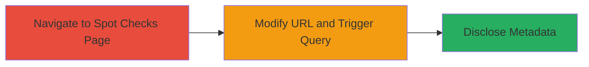

---
tags:
  - information-disclosure
  - graphql
  - idor
  - hackerone
  - web-vulnerability
type: attack_chain
tools: []
tactics:
  - '[[Initial Access]]'
  - '[[Collection]]'
verified: false
platforms:
  - Web
submitted: true
complexity: low
created_at: '2023-10-01T00:00:00Z'
procedures:
  - '[[procedures/Navigate-to-Programs-Spot-Checks-Page]]'
  - '[[procedures/Modify-URL-to-Access-Spot-Check-Metadata]]'
step_count: 2
techniques:
  - '[[Exploit Public-Facing Application]]'
  - '[[Data from Information Repositories]]'
updated_at: '2025-12-14T17:30:35.440Z'
description: >-
  An authenticated hacker exploits a lack of authorization checks in HackerOne's
  Spot Checks feature to disclose sensitive metadata about invited Spot Checks,
  including hacker counts, budgets, and selection criteria, by manipulating the
  URL to trigger an unauthorized GraphQL query.
skill_level: intermediate
impact_level: medium
id: 2bb644e0-37db-455a-b4e4-a4bf6bc71b8e
validated: true
mitre_tactics:
  - '[[Initial Access]]'
  - '[[Collection]]'
mitre_techniques:
  - '[[Exploit Public-Facing Application]]'
  - '[[Data from Information Repositories]]'
---
# Information Disclosure of Confidential Spot Check Metadata via GraphQL Query in HackerOne

Multi-stage attack chain demonstrating how an authenticated hacker can leak private Spot Check details on the HackerOne platform by exploiting URL manipulation and insufficient authorization in the GraphQL backend.

## Chain Metrics Dashboard

| Metric | Value |
|--------|-------|
| Chain Status | Unverified |
| Total Steps | 2 |
| Execution Time | ~2 minutes |
| Skill Level | Intermediate |
| Complexity | Low |
| Impact Level | Medium |

## Attack Flow Visualization

## Prerequisites & Requirements

### Required Tools

- Web browser (e.g., Chrome with developer tools for inspecting network requests)

### Target Environment

- HackerOne platform (web application)
- GraphQL API endpoint
- No specific ports required (HTTPS on standard web ports)

### Initial Access Requirements

- Valid authenticated session as a hacker invited to at least one Spot Check
- Access to a program's Spot Checks page (requires program invitation or visibility)
- Network access to hackerone.com

## Detailed Attack Procedures

### Step 1: Navigate to Program's Spot Checks Page
procedure: [[procedures/Navigate-to-Programs-Spot-Checks-Page]]

**Objective**: Gain access to the program's Spot Checks interface from an authenticated hacker perspective to set up for URL manipulation.

**Instructions**: Log in to your HackerOne account as an authenticated hacker. Navigate to a program where you have visibility, such as one you are invited to or participating in. From the program's dashboard, access the Spot Checks section using the standard URL format for the program view.

**Expected Output**: The Spot Checks page loads, displaying available Spot Checks visible to you, without revealing confidential metadata.

**Success Indicators**:
- Page loads successfully without errors
- You can see the list of Spot Checks you are invited to

### Step 2: Modify URL to Access Spot Check Metadata
procedure: [[procedures/Modify-URL-to-Access-Spot-Check-Metadata]]

**Objective**: Exploit the URL parameter to trigger the SpotCheckSingleQuery GraphQL query with an invited Spot Check ID, bypassing authorization to reveal confidential program metadata.

**Instructions**: While on the program's Spot Checks page, inspect the URL structure, which follows https://hackerone.com/organizations/[organization-id]/spot_checks. Append or modify the path to include a specific Spot Check ID you are invited to, e.g., https://hackerone.com/organizations/[organization-id]/spot_checks/[spot-check-id]. Load the modified URL. This triggers the GraphQL query SpotCheckSingleQuery with variables {"id":"[spot-check-id]","product_area":"spot_checks","product_feature":"view"}.

**Expected Output**: The page or network response reveals sensitive metadata, such as the total number of hackers invited, the budget for the Spot Check, and selection criteria, which should be hidden from hackers.

**Success Indicators**:
- GraphQL response includes fields like hacker count, budget, and criteria
- No authorization error; data is returned from the program owner's perspective

## Attack Chain Summary

### Key Achievements

1. Successful navigation to the vulnerable interface without triggering alerts
2. URL manipulation to access unauthorized GraphQL data
3. Disclosure of confidential operational details, potentially aiding further reconnaissance or competitive intelligence

## Technique & Tactic Coverage

### MITRE ATT&CK Techniques

- [[Exploit Public-Facing Application]] Exploit Public-Facing Application
- [[Data from Information Repositories]] Data from Information Repositories

### MITRE ATT&CK Tactics

- [[Initial Access]] Initial Access
- [[Collection]] Collection

---
*Last updated: 2023-10-01T00:00:00Z*
