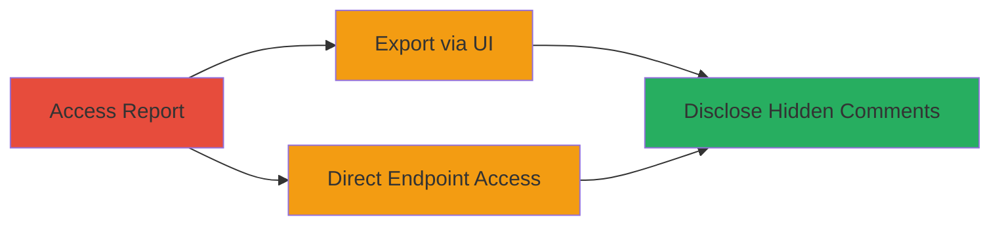

---
tags:
  - information-disclosure
  - web-vulnerability
  - hackerone
type: attack_chain
tools: []
tactics:
  - '[[Collection]]'
commands: []
platforms:
  - Web
complexity: low
procedures:
  - '[[procedures/Access-Partially-Disclosed-Report]]'
  - '[[procedures/Export-Report-via-UI]]'
  - '[[procedures/Direct-Access-to-Export-Endpoint]]'
step_count: 3
techniques:
  - '[[Data from Information Repositories]]'
description: >-
  Exploits a vulnerability in HackerOne's export feature to disclose hidden
  comments in partially disclosed reports
skill_level: beginner
impact_level: medium
id: 4397f9bb-74de-415c-bb92-d6c8bf36085d
created_at: '2025-12-11T03:47:39.525Z'
updated_at: '2025-12-11T03:47:39.525Z'
verified: false
validated: true
submitted: true
mitre_tactics:
  - '[[TA0009]]'
mitre_techniques:
  - '[[T1213]]'
---
# Information Disclosure of Hidden Comments via HackerOne Export Feature

## Overview

This attack chain demonstrates the exploitation of a vulnerability in HackerOne's 'Export as .zip' feature, which allowed unauthorized access to hidden comments in partially disclosed reports. The attack involves accessing a report, using the export functionality through the UI or directly via the endpoint, revealing sensitive comment data that should have been restricted in limited disclosure mode. The impact is limited to comment visibility, with no access to vulnerability details or attachments, and the issue was quickly fixed without known exploitation.

## Attack Flow Visualization



## Prerequisites & Requirements

### Required Tools

- None (web browser or curl for direct access)

### Target Environment

- Platform: Web (HackerOne platform)
- Required services: HackerOne report export system
- Network access: Authenticated access to a partially disclosed report

### Initial Access Requirements

- Valid HackerOne account with access to a partially disclosed report
- No special credentials beyond standard user access

## Detailed Attack Procedures

## Step 1: Access Partially Disclosed Report - [[procedures/Access-Partially-Disclosed-Report]]

### Objective

Navigate to the target partially disclosed report to set up for export exploitation.

### Instructions

Access the report URL directly in a web browser, such as https://hackerone.com/reports/██████████. Ensure you are authenticated and have permission to view the report in limited disclosure mode.

### Expected Output

The report page loads, showing visible content but hiding certain comments.

### Success Indicators

- Report page is accessible
- Limited disclosure mode is active, with some comments hidden

## Step 2: Export Report via UI - [[procedures/Export-Report-via-UI]]

### Objective

Use the built-in export button to trigger the disclosure of hidden comments.

### Instructions

On the report page, locate and click the 'Export' button. This initiates the export feature, which inadvertently includes hidden comments in the exported data.

### Expected Output

A ZIP file or export data is generated, containing the hidden comments.

### Success Indicators

- Export completes successfully
- Hidden comments are visible in the exported content

## Step 3: Direct Access to Export Endpoint - [[procedures/Direct-Access-to-Export-Endpoint]]

### Objective

Bypass the UI and directly query the export endpoint to retrieve raw data including hidden comments.

### Instructions

Use [[commands/curl-hackerone-export]] to access the endpoint:

```bash
curl "https://hackerone.com/reports/█████████/export/raw?include_internal_activities=false"
```

This retrieves the raw export data, exposing the hidden comments.

### Expected Output

Raw data response containing the report's comments, including those intended to be hidden.

### Success Indicators

- HTTP response returns 200 OK
- Response body includes previously hidden comments

## Attack Chain Summary

### Key Achievements

1. Gained access to hidden comments without authorization
2. Demonstrated vulnerability in export functionality
3. Highlighted potential for sensitive information leakage

## Technique & Tactic Coverage

### MITRE ATT&CK Techniques

- [[Data from Information Repositories]]

### MITRE ATT&CK Tactics

- [[Collection]]

*Last updated: [TIMESTAMP]*
