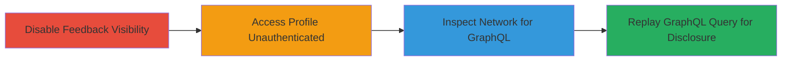

---
tags:
  - information-disclosure
  - graphql
  - hackerone
  - privacy-bypass
  - feedback-leak
type: attack_chain
tools:
  - '[[tools/Browser-Developer-Tools]]'
  - '[[tools/Incognito-Mode-Browser]]'
tactics:
  - '[[Discovery]]'
verified: false
platforms:
  - Web
submitted: true
complexity: medium
created_at: '2023-10-01T00:00:00Z'
procedures:
  - '[[procedures/Disable-Feedback-Visibility-and-Query-GraphQL-for-Disclosure]]'
step_count: 4
techniques:
  - '[[Exploit Public-Facing Application]]'
updated_at: '2025-12-14T17:25:13.178Z'
description: >-
  A multi-step attack chain exploiting a privacy misconfiguration in HackerOne's
  user profile system, allowing unauthenticated access to hidden feedback via a
  GraphQL endpoint.
skill_level: intermediate
impact_level: high
id: 80c592c6-d83b-4b2b-be8d-bbe3d4042a66
validated: true
mitre_tactics:
  - '[[Discovery]]'
mitre_techniques:
  - '[[Exploit Public-Facing Application]]'
---
# Information Disclosure of Hidden Feedback via Unauthenticated GraphQL Query in HackerOne Profiles

Multi-stage attack chain demonstrating unauthorized access to private user feedback on HackerOne profiles through a GraphQL endpoint that ignores visibility settings.

## Chain Metrics Dashboard

| Metric | Value |
|--------|-------|
| Chain Status | Unverified |
| Total Steps | 4 |
| Execution Time | ~5 minutes |
| Skill Level | Intermediate |
| Complexity | Medium |
| Impact Level | High |

## Attack Flow Visualization



## Prerequisites & Requirements

### Required Tools

- [[tools/Browser-Developer-Tools]]
- [[tools/Incognito-Mode-Browser]]

### Target Environment

- Web platform
- Access to HackerOne user account for settings
- No special services/ports required beyond standard HTTPS (443)

### Initial Access Requirements

- Valid HackerOne account to modify settings
- Internet access to hackerone.com
- No prior authentication needed for public profile access

## Detailed Attack Procedures

### Step 1: Disable Feedback Visibility
procedure: [[procedures/Disable-Feedback-Visibility-and-Query-GraphQL-for-Disclosure]]

**Objective**: Configure the target user's feedback to be private, setting up the condition for disclosure testing.

**Instructions**: Log in to your HackerOne account and navigate to the feedback settings. Locate the specific feedback entry (e.g., from 'Legal Robot') and uncheck the visibility option.

Go to https://hackerone.com/settings/feedback and uncheck 'Show this blurb on my profile' for the target feedback.

**Expected Output**: Confirmation that the feedback is no longer visible on the profile when viewed authenticated.

**Success Indicators**:
- Visibility option unchecked in settings
- Feedback not displayed on authenticated profile view

### Step 2: Access User Profile Unauthenticated
procedure: [[procedures/Disable-Feedback-Visibility-and-Query-GraphQL-for-Disclosure]]

**Objective**: Simulate an unauthenticated visitor accessing the public profile to capture legitimate network traffic.

**Instructions**: Open an incognito browser window and navigate to the target user's profile page without logging in.

Visit https://hackerone.com/brdoors3?type=user in incognito mode.

**Expected Output**: Public profile loads without authentication, triggering network requests.

**Success Indicators**:
- Profile page accessible without login
- No authentication prompts

### Step 3: Inspect Network Requests for GraphQL
procedure: [[procedures/Disable-Feedback-Visibility-and-Query-GraphQL-for-Disclosure]]

**Objective**: Identify the GraphQL endpoint responsible for fetching user data, including feedback.

**Instructions**: Use browser developer tools to monitor and filter network requests for those containing 'feedback' or GraphQL operations.

Open Developer Tools (F12), go to the Network tab, reload the profile page, and search for POST requests to /graphql with operationName 'UserProfilePage'.

**Expected Output**: Identification of the POST /graphql request with variables {'resourceIdentifier': 'brdoors3'}.

**Success Indicators**:
- GraphQL request captured
- Request details including query and variables visible

### Step 4: Replay GraphQL Query to Observe Disclosure
procedure: [[procedures/Disable-Feedback-Visibility-and-Query-GraphQL-for-Disclosure]]

**Objective**: Replay the captured GraphQL query unauthenticated to retrieve hidden feedback data.

**Instructions**: Copy the GraphQL request from the network tab and replay it using developer tools or a tool like curl. Execute [[commands/graphql-user-profile-query]] to fetch the data.

```bash
curl -X POST https://hackerone.com/graphql \
  -H "Content-Type: application/json" \
  -d '{"operationName":"UserProfilePage","variables":{"resourceIdentifier":"brdoors3"},"query":"query UserProfilePage($resourceIdentifier: String!) { user(username: $resourceIdentifier) { ...ReviewUser } } fragment ReviewUser on User { public_reviews(first: 5) { edges { node { public_feedback team { name } } } } }"}'
```

**Expected Output**: JSON response containing 'public_reviews' with hidden feedback like 'Clear language & video proof - excellent report.' from 'Legal Robot'.

**Success Indicators**:
- Response includes 'public_feedback' field with private content
- Team details (e.g., Legal Robot) exposed

## Attack Chain Summary

### Key Achievements

1. Bypassed user privacy settings to access hidden feedback
2. Demonstrated unauthenticated disclosure via GraphQL
3. Exposed sensitive user-program interactions

## Technique & Tactic Coverage

### MITRE ATT&CK Techniques

- [[Exploit Public-Facing Application]]

### MITRE ATT&CK Tactics

- [[Discovery]]

---

*Last updated: 2023-10-01T00:00:00Z*
