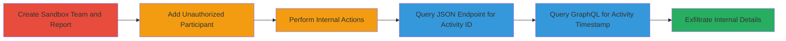

# Information Disclosure of Internal HackerOne Team Activities to Unauthorized Participants

Multi-stage attack chain demonstrating how unauthorized participants in a HackerOne report can access internal team activity details, including latest_activity_id and latest_activity_at timestamps, by exploiting public-facing API endpoints without proper access controls.

## Chain Metrics Dashboard

| Metric | Value |
|--------|-------|
| Chain Status | Unverified |
| Total Steps | 5 |
| Execution Time | ~10 minutes |
| Skill Level | Intermediate |
| Complexity | Medium |
| Impact Level | Medium |

## Attack Flow Visualization



## Prerequisites & Requirements

### Required Tools

- None (uses standard HTTP clients like curl)

### Target Environment

- HackerOne platform (Web API)
- Access to a HackerOne account with team creation privileges
- Sandbox mode enabled for testing

### Initial Access Requirements

- Valid HackerOne account (victim role: team owner)
- Attacker account added as participant
- No special network access beyond internet connectivity

## Detailed Attack Procedures

### Step 1: Create Sandbox Team and Report

procedure: [[procedures/Create-Sandbox-Team-and-Report]]

**Objective**: Set up a controlled environment to simulate the vulnerability by creating a team and report where internal actions can be performed.

**Instructions**: As the victim (team owner), log into HackerOne and create a new sandbox team, then submit a test report within that team. This establishes the baseline for adding participants and triggering internal activities.

**Expected Output**: Confirmation of team and report creation, with a unique report ID generated.

**Success Indicators**:
- Sandbox team visible in dashboard
- Report ID obtainable for subsequent steps

### Step 2: Add Unauthorized Participant to Report

procedure: [[procedures/Add-Unauthorized-Participant-to-Report]]

**Objective**: Introduce the attacker as a participant to the report, granting limited access that will be abused to query endpoints.

**Instructions**: From the team owner account, navigate to the report and add the attacker's HackerOne username as a participant. This simulates an unauthorized user gaining partial visibility.

**Expected Output**: Attacker receives notification or can view the report in their dashboard, but without team member privileges.

**Success Indicators**:
- Attacker listed as participant
- Attacker can access basic report details but not internal comments

### Step 3: Perform Internal Actions as Team Owner

procedure: [[procedures/Perform-Internal-Actions-as-Team-Owner]]

**Objective**: Trigger internal team activities by adding private comments and assignments, updating the latest_activity_id and latest_activity_at fields.

**Instructions**: As the team owner, add team-only internal comments to the report and assign tasks to group members. This modifies the internal state without notifying participants.

**Expected Output**: Internal comments and assignments saved, updating backend activity timestamps and IDs.

**Success Indicators**:
- Internal comment visible only to team members
- Assignment notifications sent internally

### Step 4: Query JSON Endpoint for Latest Activity ID

procedure: [[procedures/Query-JSON-Endpoint-for-Latest-Activity-ID]]

**Objective**: As the unauthorized participant, retrieve the latest_activity_id from the public JSON endpoint to expose internal activity details.

**Instructions**: Use [[commands/get-reports-json]] to fetch the report JSON, authenticating with the attacker's session token if required:

```bash
curl -H "Cookie: <attacker-cookie>" "https://hackerone.com/reports/<report-id>.json"
```

**Expected Output**: JSON response including the "latest_activity_id" field with an internal ID value.

**Success Indicators**:
- Response contains latest_activity_id not visible to participants normally
- ID correlates to recent internal actions

### Step 5: Query GraphQL for Latest Activity Timestamp

procedure: [[procedures/Query-GraphQL-for-Latest-Activity-Timestamp]]

**Objective**: As the unauthorized participant, use GraphQL to fetch the latest_activity_at timestamp, revealing when internal discussions occurred.

**Instructions**: Send a POST request using [[commands/post-graphql-query]] to the GraphQL endpoint with the specified query:

```bash
curl -X POST -H "Content-Type: application/json" -H "Cookie: <attacker-cookie>" -d '{"query":"query { node(id: \"gid://hackerone/Report/<report-id>\") { ... on Report { _id,latest_activity_at }}}","variables":{}}' https://hackerone.com/graphql
```

**Expected Output**: JSON like {"data":{"node":{"_id":"<id>","latest_activity_at":"2023-10-01T12:00:00Z"}}} showing the internal timestamp.

**Success Indicators**:
- Timestamp matches time of internal action
- Data exposed despite participant status

## Attack Chain Summary

### Key Achievements

1. Successful creation of sandbox environment for testing
2. Addition of unauthorized participant without alerting to risks
3. Disclosure of internal activity ID via JSON API
4. Disclosure of internal timestamp via GraphQL
5. Potential correlation of leaked data to reveal team workflows

## Technique & Tactic Coverage

### MITRE ATT&CK Techniques

- [[Exploit Public-Facing Application]]

### MITRE ATT&CK Tactics

- [[Discovery]]

---
*Last updated: 2023-10-01T00:00:00Z*
