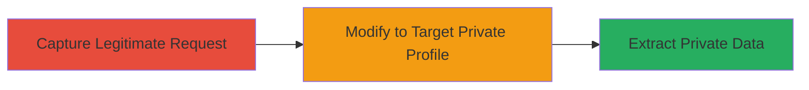

---
tags:
  - information-disclosure
  - api
  - privacy-leak
  - broken-access-control
type: attack_chain
tools:
  - '[[tools/Burp-Suite]]'
tactics:
  - '[[Discovery]]'
verified: false
platforms:
  - Web
submitted: true
complexity: medium
created_at: '2024-01-01T00:00:00Z'
procedures:
  - '[[procedures/Capture-Legitimate-Profile-Update-Request]]'
  - '[[procedures/Modify-Request-to-Target-Private-User-Profile]]'
  - '[[procedures/Extract-Private-Causes-from-API-Response]]'
step_count: 3
techniques:
  - '[[Account Discovery]]'
updated_at: '2025-12-14T17:32:02.058Z'
description: >-
  An authenticated user intercepts a profile update request and modifies it to
  query a private user's API endpoint, exposing hidden 'causes' data in
  violation of privacy settings.
skill_level: intermediate
impact_level: high
id: 34f1d553-fc9e-41d0-84cb-7cdfc2a5660d
validated: true
mitre_tactics:
  - '[[Discovery]]'
mitre_techniques:
  - '[[Account Discovery]]'
---
# Information Disclosure of Private User Causes via Unprotected API Endpoint

Multi-stage attack chain demonstrating how authenticated users can bypass privacy settings on every.org to access private user 'causes' (interest categories) through API manipulation.

## Chain Metrics Dashboard

| Metric | Value |
|--------|-------|
| Chain Status | Unverified |
| Total Steps | 3 |
| Execution Time | ~5 minutes |
| Skill Level | Intermediate |
| Complexity | Medium |
| Impact Level | High |

## Attack Flow Visualization

## Prerequisites & Requirements

### Required Tools

- [[tools/Burp-Suite]]
- Web browser with developer tools or curl for API testing

### Target Environment

- Web platform (e.g., https://www.every.org)
- Authenticated session as a user
- API endpoint: /api/users/<user_id_or_username>

### Initial Access Requirements

- Valid user credentials for authentication
- Network access to the target site
- No prior access to target profile needed

## Detailed Attack Procedures

### Step 1: Capture Legitimate Profile Update Request
procedure: [[procedures/Capture-Legitimate-Profile-Update-Request]]

**Objective**: Intercept a standard profile update request to obtain necessary authentication tokens and headers for API manipulation.

**Instructions**: Log in to the target site, navigate to profile settings, and trigger a PATCH request by updating profile data. Use a proxy tool to capture the request details including CSRF token, cookies, and headers.

**Expected Output**: Captured HTTP request with method PATCH /api/me, JSON body, CSRF token, and session cookies.

**Success Indicators**:
- Request intercepted successfully with all auth artifacts
- No errors in the original update process

### Step 2: Modify Request to Target Private User Profile
procedure: [[procedures/Modify-Request-to-Target-Private-User-Profile]]

**Objective**: Alter the captured request to query a private user's profile endpoint, bypassing front-end privacy controls.

**Instructions**: In the proxy tool, change the method to GET, update the path to /api/users/<private_username>, remove the JSON body, and forward the request using preserved auth headers.

**Expected Output**: HTTP 200 response with JSON containing user data.

**Success Indicators**:
- Response received without authentication errors
- Target endpoint resolves without 404

### Step 3: Extract Private Causes from API Response
procedure: [[procedures/Extract-Private-Causes-from-API-Response]]

**Objective**: Parse the API response to reveal the hidden 'causes' array for the private profile.

**Instructions**: Inspect the JSON response body, focusing on the 'data.user.causes' array to extract entity names and categories.

**Expected Output**: JSON array with private causes, e.g., [{'entityName': 'Example Cause', 'causeCategory': 'EDUCATION'}].

**Success Indicators**:
- 'causes' array populated with data not visible on the public profile page
- Confirmation that the profile is private (e.g., via separate check)

## Attack Chain Summary

### Key Achievements

1. Bypassed privacy settings to access hidden user interests
2. Demonstrated API-server discrepancy with front-end controls
3. Enabled unauthorized enumeration of private account data for any authenticated user

## Technique & Tactic Coverage

### MITRE ATT&CK Techniques

- [[Account Discovery]]

### MITRE ATT&CK Tactics

- [[Discovery]]

---
*Last updated: 2024-01-01T00:00:00Z*
