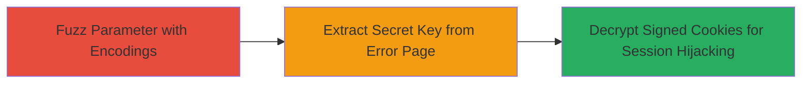

---
tags:
  - information-disclosure
  - rails
  - secret-key-leak
  - cookie-decryption
  - session-hijacking
type: attack_chain
tools: []
tactics:
  - '[[Initial Access]]'
  - '[[Collection]]'
verified: false
platforms:
  - Web
submitted: true
complexity: medium
created_at: '2023-10-01T00:00:00Z'
procedures:
  - '[[procedures/Fuzz-Parameters-to-Leak-Rails-Secret-Key-Base]]'
step_count: 1
techniques:
  - '[[Exploit Public-Facing Application]]'
  - '[[Steal Web Session Cookie]]'
updated_at: '2025-12-14T17:25:18.292Z'
description: >-
  A single-stage attack exploiting an error handling flaw in a Ruby on Rails
  application to disclose the secret_key_base, enabling cookie decryption and
  potential session hijacking.
skill_level: intermediate
impact_level: high
id: 65e446bc-d74c-49bc-8743-d28f95b20b6d
validated: true
mitre_tactics:
  - '[[Initial Access]]'
  - '[[Collection]]'
mitre_techniques:
  - '[[Exploit Public-Facing Application]]'
  - '[[Steal Web Session Cookie]]'
---
# Information Disclosure of Rails Secret Key Base via Encoded Parameter Fuzzing

Multi-stage attack chain demonstrating a complete attack workflow.

## Chain Metrics Dashboard

| Metric | Value |
|--------|-------|
| Chain Status | Unverified |
| Total Steps | 1 |
| Execution Time | ~5 minutes |
| Skill Level | Intermediate |
| Complexity | Medium |
| Impact Level | High |

## Attack Flow Visualization



## Prerequisites & Requirements

### Required Tools

- None specific; use browser developer tools or curl for manual fuzzing.

### Target Environment

- Ruby on Rails web application (e.g., customers.gitlab.com)
- Publicly accessible web endpoint without authentication
- No specific ports required beyond standard HTTP/HTTPS (80/443)

### Initial Access Requirements

- Internet access to the target domain
- No credentials needed (unauthenticated)
- Basic knowledge of web fuzzing and Rails internals

## Detailed Attack Procedures

### Step 1: Fuzz Parameter to Trigger Error and Leak Secret Key
procedure: [[procedures/Fuzz-Parameters-to-Leak-Rails-Secret-Key-Base]]

**Objective**: Identify an input that causes an error page to disclose the Rails secret_key_base token, allowing subsequent cookie manipulation.

**Instructions**: Target an unspecified parameter on the web application (e.g., a search or query parameter in a GET request). Use curl to send requests with various encoded payloads, focusing on special characters like non-ASCII or malformed UTF-8 to trigger parsing errors in Rails.

First, test a basic request to identify the parameter:

```bash
curl -v "https://customers.gitlab.com/some-endpoint?param=test"
```

Then, fuzz with encoded variants using [[commands/curl-fuzz-encoded-parameter]]:

```bash
curl -v "https://customers.gitlab.com/some-endpoint?param=%C3%81"  # Example: UTF-8 encoded accented A
curl -v "https://customers.gitlab.com/some-endpoint?param=\xFF"  # Example: Invalid byte
curl -v "https://customers.gitlab.com/some-endpoint?param=base64:SGVsbG8gd29ybGQ="  # Base64 encoded string
```

Inspect the response for error pages containing stack traces or tokens.

**Expected Output**: An HTTP 500 error page in the response body that includes the secret_key_base token, e.g., a long hexadecimal string like "a1b2c3..." in the error details.

**Success Indicators**:
- Error response leaks Rails application secrets without authentication
- Token extracted matches format of Rails secret_key_base (64-character hex)
- No rate limiting or blocks during fuzzing

## Attack Chain Summary

### Key Achievements

1. Unauthenticated disclosure of sensitive Rails configuration
2. Enablement of signed cookie decryption for session attacks
3. Demonstration of error handling misconfiguration impact

## Technique & Tactic Coverage

### MITRE ATT&CK Techniques

- [[Exploit Public-Facing Application]]
- [[Steal Web Session Cookie]]

### MITRE ATT&CK Tactics

- [[Initial Access]]
- [[Collection]]

---
*Last updated: 2023-10-01T00:00:00Z*
