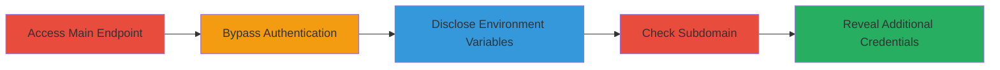

---
tags:
  - information-disclosure
  - auth-bypass
  - credentials-leak
  - web-vulnerability
type: attack_chain
tools: []
tactics:
  - '[[Initial Access]]'
  - '[[Discovery]]'
verified: false
platforms:
  - Web
submitted: true
complexity: low
created_at: '2023-10-01T00:00:00Z'
procedures:
  - '[[procedures/Access-Vulnerable-Endpoint-to-Disclose-Environment-Variables]]'
  - '[[procedures/Identify-Similar-Vulnerability-on-Subdomain]]'
step_count: 2
techniques:
  - '[[Exploit Public-Facing Application]]'
  - '[[System Information Discovery]]'
updated_at: '2025-12-14T17:25:12.620Z'
description: >-
  A multi-stage information disclosure attack exploiting a misconfigured web
  endpoint to bypass authentication and reveal sensitive environment variables,
  including credentials for databases, mail services, and social media APIs,
  with a similar issue on a subdomain.
skill_level: beginner
impact_level: high
id: 10dcb8c3-bc4a-4908-b9ee-d8567dae00b2
validated: true
mitre_tactics:
  - '[[Initial Access]]'
  - '[[Discovery]]'
mitre_techniques:
  - '[[Exploit Public-Facing Application]]'
  - '[[System Information Discovery]]'
---
# Information Disclosure via Authentication Bypass on Web Endpoint Exposing Environment Variables and Credentials

Multi-stage attack chain demonstrating a complete attack workflow exploiting an information disclosure vulnerability in a web application to expose sensitive environment variables.

## Chain Metrics Dashboard

| Metric | Value |
|--------|-------|
| Chain Status | Unverified |
| Total Steps | 2 |
| Execution Time | ~5 minutes |
| Skill Level | Beginner |
| Complexity | Low |
| Impact Level | High |

## Attack Flow Visualization



## Prerequisites & Requirements

### Required Tools

- Web browser or [[commands/curl-access-endpoint]]

### Target Environment

- Web platform with exposed endpoints
- No specific ports required beyond standard HTTPS (443)
- Public network access to the target domain

### Initial Access Requirements

- No prior credentials needed
- Direct internet access to the target website
- No subdomain enumeration required upfront

## Detailed Attack Procedures

### Step 1: Access Vulnerable Endpoint
procedure: [[procedures/Access-Vulnerable-Endpoint-to-Disclose-Environment-Variables]]

**Objective**: Bypass authentication on the main endpoint to disclose all environment variables, including sensitive credentials for servers, databases, mail services, Twitter, and Facebook APIs.

**Instructions**: Navigate to the target endpoint https://www.target.com/vulnerable-endpoint and append a semicolon (;) to the URL to trigger the bypass. This exploits a flaw in the server's authorization handling, likely a parsing error that ignores the 401 response.

Use [[commands/curl-access-endpoint]] for verification:

```bash
curl "https://www.target.com/vulnerable-endpoint;" -v
```

**Expected Output**: JSON or plain text response containing environment variables such as DATABASE_URL, MAIL_PASSWORD, TWITTER_CLIENT_ID, FACEBOOK_CLIENT_SECRET, and server credentials.

**Success Indicators**:
- 200 OK response instead of 401 Unauthorized
- Presence of sensitive keys like client_id, client_secret, or passwords in the output
- Full list of environment variables exposed

### Step 2: Identify Similar Vulnerability on Subdomain
procedure: [[procedures/Identify-Similar-Vulnerability-on-Subdomain]]

**Objective**: Extend the disclosure to a subdomain to reveal additional sensitive data, such as database passwords, confirming the vulnerability's broader scope.

**Instructions**: Access the subdomain endpoint https://sub.target.com/vulnerable-sub-endpoint; using the same semicolon append technique to bypass authentication.

Use [[commands/curl-access-endpoint]] adapted for the subdomain:

```bash
curl "https://sub.target.com/vulnerable-sub-endpoint;" -v
```

**Expected Output**: Response with environment variables, potentially including unique database passwords or other service configs differing from the main domain.

**Success Indicators**:
- Successful bypass on subdomain yielding 200 response
- Exposure of additional credentials not present in the main endpoint
- Confirmation of systemic misconfiguration across domains

## Attack Chain Summary

### Key Achievements

1. Bypassed 401 authentication error using a simple URL manipulation (appending ';')
2. Exposed critical credentials granting full access to databases, mail servers, and social media APIs
3. Identified and exploited a parallel vulnerability on a subdomain, broadening the impact

## Technique & Tactic Coverage

### MITRE ATT&CK Techniques

- [[Exploit Public-Facing Application]]
- [[System Information Discovery]]

### MITRE ATT&CK Tactics

- [[Initial Access]]
- [[Discovery]]

---
*Last updated: 2023-10-01T00:00:00Z*
