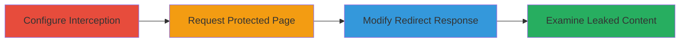

---
tags:
  - broken-access-control
  - information-disclosure
  - web-vulnerability
  - http-interception
type: attack_chain
tools:
  - '[[tools/Burp-Suite]]'
tactics:
  - '[[Initial Access]]'
  - '[[Discovery]]'
verified: false
platforms:
  - Web
submitted: true
complexity: medium
created_at: '2023-10-01T00:00:00Z'
procedures:
  - >-
    [[procedures/Bypass-Access-Control-by-Modifying-Redirect-Response-with-Burp-Suite]]
step_count: 4
techniques:
  - '[[Exploit Public-Facing Application]]'
updated_at: '2025-12-14T17:28:51.995Z'
description: >-
  A multi-step attack exploiting improper access control in a web application
  where unauthorized requests to protected pages return both a redirect to login
  and the full sensitive HTML content, allowing interception and modification to
  disclose private user data like names and emails.
skill_level: intermediate
impact_level: high
id: 4e4f9260-4c72-44b2-ad6a-818da34b193d
validated: true
mitre_tactics:
  - '[[Initial Access]]'
  - '[[Discovery]]'
mitre_techniques:
  - '[[Exploit Public-Facing Application]]'
---
# Information Disclosure via Broken Access Control in Redirect Responses

Multi-stage attack chain demonstrating exploitation of a web application's improper access control, where redirects for unauthorized users include sensitive page content, enabling information disclosure through response manipulation.

## Chain Metrics Dashboard

| Metric | Value |
|--------|-------|
| Chain Status | Unverified |
| Total Steps | 4 |
| Execution Time | ~5 minutes |
| Skill Level | Intermediate |
| Complexity | Medium |
| Impact Level | High |

## Attack Flow Visualization



## Prerequisites & Requirements

### Required Tools

- [[tools/Burp-Suite]]

### Target Environment

- Web application platform (PHP-based with Java session management inferred from cookies)
- Protected endpoints like /personnel.php, /mission.php
- No authentication required for initial requests

### Initial Access Requirements

- Network access to the target web server
- No prior credentials needed; exploits public-facing application
- Burp Suite proxy configured as browser intermediary

## Detailed Attack Procedures

### Step 1: Configure Burp Suite to Intercept HTTP Responses
procedure: [[procedures/Bypass-Access-Control-by-Modifying-Redirect-Response-with-Burp-Suite]]

**Objective**: Set up interception to capture and modify server responses from protected pages.

**Instructions**: Launch Burp Suite and enable response interception in the Proxy tool.

**Expected Output**: Burp Proxy ready to intercept traffic, with the Intercept tab active.

**Success Indicators**:
- Intercept tab shows "Intercept is on"
- Browser traffic routes through Burp proxy

### Step 2: Send Request to Protected Page and Intercept Response
procedure: [[procedures/Bypass-Access-Control-by-Modifying-Redirect-Response-with-Burp-Suite]]

**Objective**: Trigger the vulnerable redirect response containing sensitive content.

**Instructions**: Use the browser or Burp Repeater to send a GET request to a protected endpoint like /personnel.php. Right-click the request in Burp's Proxy history and select "Do intercept > Response to this request" to capture the response. Execute the request using [[commands/http-get-personnel-php]] equivalent in Burp or curl for simulation:

```bash
curl -X GET "https://target/personnel.php" -H "Host: target" -H "User-Agent: Mozilla/5.0 (X11; Ubuntu; Linux x86_64; rv:60.0) Gecko/20100101 Firefox/60.0" -H "Accept: text/html,application/xhtml+xml,application/xml;q=0.9,*/*;q=0.8" -H "Accept-Language: ru,en-US;q=0.7,en;q=0.3" -H "Accept-Encoding: gzip, deflate" -H "Cookie: JSESSIONID=example; __VCAP_ID__=example; TS01771652=example; TS01771652031=example; TSf7f79454027=example" -H "Connection: close" --insecure
```

**Expected Output**: Intercepted 302 redirect response with Location header to login.php and body containing full HTML of the protected page.

**Success Indicators**:
- Response intercepted in Burp
- Body includes sensitive HTML elements

### Step 3: Modify Intercepted Response by Removing Redirect Header
procedure: [[procedures/Bypass-Access-Control-by-Modifying-Redirect-Response-with-Burp-Suite]]

**Objective**: Remove the redirect to prevent browser navigation away from the sensitive content.

**Instructions**: In the Burp Intercept tab, edit the response by deleting the "Location: login.php" header line entirely, then forward the modified response.

**Expected Output**: Browser displays the full HTML content of the protected page without redirecting.

**Success Indicators**:
- No redirect occurs
- Sensitive data visible in browser

### Step 4: Examine Response Body for Leaked Information
procedure: [[procedures/Bypass-Access-Control-by-Modifying-Redirect-Response-with-Burp-Suite]]

**Objective**: Extract and analyze disclosed private information for further exploitation.

**Instructions**: View the forwarded response body in the browser or Burp's Inspector, noting elements like user names, emails from /personnel.php or mission details from /mission.php.

**Expected Output**: HTML revealing private data such as usernames, emails, and internal site panels.

**Success Indicators**:
- Private information (e.g., emails, names) visible
- Enables follow-on attacks like unauthenticated XSS or SQLi testing

## Attack Chain Summary

### Key Achievements

1. Bypassed access controls without credentials
2. Disclosed sensitive user and mission data
3. Enabled discovery of additional vulnerabilities (XSS, SQLi)

## Technique & Tactic Coverage

### MITRE ATT&CK Techniques

- [[Exploit Public-Facing Application]]

### MITRE ATT&CK Tactics

- [[Initial Access]]
- [[Discovery]]

---

*Last updated: 2023-10-01T00:00:00Z*
