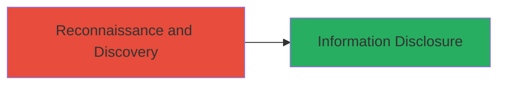

---
tags:
  - django
  - debug-mode
  - information-disclosure
  - misconfiguration
  - reconnaissance
type: attack_chain
tools: []
tactics:
  - '[[Reconnaissance]]'
  - '[[Collection]]'
verified: false
platforms:
  - Web
submitted: true
complexity: low
created_at: '2023-10-01T00:00:00Z'
procedures:
  - '[[procedures/Discover-Django-Debug-Mode-Information-Disclosure]]'
step_count: 1
techniques:
  - '[[Gather Victim Host Information]]'
  - '[[Client Configurations]]'
updated_at: '2025-12-14T17:25:22.823Z'
description: >-
  A reconnaissance-based discovery of Django debug mode enabled on a production
  subdomain, leading to exposure of sensitive configuration and internal
  details.
skill_level: beginner
impact_level: medium
id: 6a94f5cd-88ed-4f74-bd6d-108fe0a37e41
validated: true
mitre_tactics:
  - '[[Reconnaissance]]'
  - '[[Collection]]'
mitre_techniques:
  - '[[Gather Victim Host Information]]'
  - '[[Client Configurations]]'
---
---
id: 123e4567-e89b-12d3-a456-426614174000
name: Information Disclosure via Django Debug Mode on Autodesk Subdomain
type: attack_chain
description: "A reconnaissance-based discovery of Django debug mode enabled on a production subdomain, leading to exposure of sensitive configuration and internal details."
verified: false
submitted: false
step_count: 1
created_at: 2023-10-01T00:00:00Z
updated_at: 2023-10-01T00:00:00Z
procedures: [[procedures/Discover-Django-Debug-Mode-Information-Disclosure]]
techniques: [[Gather Victim Host Information]], [[Client Configurations]]
tactics: [[Reconnaissance]], [[Collection]]
tags: django, debug-mode, information-disclosure, misconfiguration, reconnaissance
platforms: Web
tools: []
---

# Information Disclosure via Django Debug Mode on Autodesk Subdomain

Multi-stage attack chain demonstrating a complete attack workflow.

## Chain Metrics Dashboard

| Metric | Value |
|--------|-------|
| Chain Status | Unverified |
| Total Steps | 1 |
| Execution Time | ~5 minutes |
| Skill Level | Beginner |
| Complexity | Low |
| Impact Level | Medium |

## Attack Flow Visualization



## Prerequisites & Requirements

### Required Tools

- None (uses standard HTTP client like curl or browser)

### Target Environment

- Web platform
- Django-based web application
- Exposed subdomain in production environment

### Initial Access Requirements

- Public internet access to the target subdomain
- No credentials required
- Basic knowledge of HTTP requests

## Detailed Attack Procedures

### Step 1: Subdomain Reconnaissance and Debug Mode Detection

procedure: [[procedures/Discover-Django-Debug-Mode-Information-Disclosure]]

**Objective**: Identify subdomains running Django and detect if debug mode is enabled, leading to potential information disclosure.

**Instructions**: Start by enumerating subdomains of the target domain (e.g., autodesk.com) using passive reconnaissance tools if available, then probe identified subdomains for Django presence and debug mode. For the specific case, focus on api.wwm-dev.autodesk.com. Trigger an error response by requesting an invalid endpoint to check for debug page exposure.

Use [[commands/curl-trigger-error]] to send a request that forces an error:

```bash
curl -v "https://api.wwm-dev.autodesk.com/invalid_endpoint"
```

Inspect the response for Django's debug page, which includes stack traces, configuration variables, installed packages, and source code paths.

**Expected Output**: HTTP 500 error page with detailed Django debug information, such as template paths, settings.py excerpts, or installed apps list.

**Success Indicators**:
- Response contains "DEBUG: True" or verbose error details
- Exposure of internal paths like /usr/local/lib/python3.x/site-packages/
- Confirmation of medium severity impact (CVSS 5.3) due to info disclosure

## Attack Chain Summary

### Key Achievements

1. Successful identification of exposed subdomain api.wwm-dev.autodesk.com
2. Confirmation of Django debug mode leading to sensitive info leak
3. Report and remediation by Autodesk, preventing further exposure

## Technique & Tactic Coverage

### MITRE ATT&CK Techniques

- [[Gather Victim Host Information]] Gather Victim Host Information
- [[Client Configurations]] Client Configurations

### MITRE ATT&CK Tactics

- [[Reconnaissance]] Reconnaissance
- [[Collection]] Collection

---
*Last updated: 2023-10-01T00:00:00Z*
