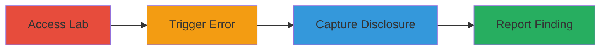

# Information Disclosure via Error Message in Web Security Academy Lab

Multi-stage attack chain demonstrating an accidental information disclosure in an educational web lab environment.

## Chain Metrics Dashboard

| Metric | Value |
|--------|-------|
| Chain Status | Unverified |
| Total Steps | 3 |
| Execution Time | ~1 minute |
| Skill Level | Beginner |
| Complexity | Low |
| Impact Level | Informational |

## Attack Flow Visualization

## Prerequisites & Requirements

### Required Tools

- Web browser (e.g., Chrome or Firefox)

### Target Environment

- Web platform
- PortSwigger Web Security Academy lab instance
- No specific ports or services required beyond standard HTTPS

### Initial Access Requirements

- Public access to the Web Security Academy (no credentials needed)
- Stable initial connection that can be interrupted

## Detailed Attack Procedures

### Step 1: Access the Lab
procedure: [[procedures/Access-Web-Security-Academy-Lab]]

**Objective**: Gain entry to the vulnerable lab environment to set up the scenario for error triggering.

**Instructions**: Navigate to the PortSwigger Web Security Academy website and select a lab exercise. Interact with the lab interface to establish a session.

**Expected Output**: Active lab session with interactive elements loaded.

**Success Indicators**:
- Lab page fully loaded and accessible
- User able to perform actions within the lab

### Step 2: Trigger Error via Connection Drop
procedure: [[procedures/Trigger-Error-via-Connection-Drop]]

**Objective**: Interrupt the network connection to provoke an application error that exposes internal code.

**Instructions**: While interacting with the lab (e.g., submitting a form or loading content), intentionally or accidentally drop the internet connection, such as by disconnecting Wi-Fi or enabling airplane mode briefly.

**Expected Output**: Application displays an error page revealing Node.js source code snippets.

**Success Indicators**:
- Error message appears with visible code
- Internal application logic or file paths exposed

### Step 3: Capture and Report the Disclosure
procedure: [[procedures/Capture-and-Report-Exposed-Code]]

**Objective**: Document the exposed information and submit it for analysis or reporting.

**Instructions**: Take a screenshot of the error message showing the Node.js code. Restore the connection and report the finding via the platform's disclosure program, attaching the evidence.

**Expected Output**: Screenshot or log of the exposed code; confirmation of report submission.

**Success Indicators**:
- Evidence captured without further interaction
- Report acknowledged by the platform

## Attack Chain Summary

### Key Achievements

1. Accidental discovery of source code exposure in a controlled lab setting
2. Documentation of the vulnerability for educational or reporting purposes
3. Highlighted inadequate error handling in Node.js web applications

## Technique & Tactic Coverage

### MITRE ATT&CK Techniques

- [[System Information Discovery]] System Information Discovery
- [[Exploit Public-Facing Application]] Exploit Public-Facing Application

### MITRE ATT&CK Tactics

- [[Discovery]] Discovery

---
*Last updated: 2024-10-01T00:00:00Z*
