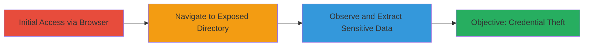

---
tags:
  - information-disclosure
  - directory-listing
  - env-file
  - aws
  - credentials-leak
type: attack_chain
tools:
  - '[[tools/Web-Browser]]'
tactics:
  - '[[Discovery]]'
commands: []
platforms:
  - Web
  - AWS
complexity: low
procedures:
  - '[[procedures/Access-Exposed-Env-File-via-Directory-Listing]]'
step_count: 3
techniques:
  - '[[Credentials In Files]]'
description: >-
  A simple reconnaissance attack exploiting directory listing on an AWS web
  server to access and disclose sensitive .env configuration file containing
  database and email credentials.
skill_level: beginner
impact_level: high
id: 0a72603f-3831-467a-804d-5e72522a9cf5
created_at: '2025-12-14T17:25:17.285Z'
updated_at: '2025-12-14T17:25:17.285Z'
verified: false
validated: true
submitted: true
mitre_tactics:
  - '[[Discovery]]'
mitre_techniques:
  - '[[Credentials In Files]]'
---
# Information Disclosure via Exposed .env File Due to Directory Listing

Multi-stage attack chain demonstrating a complete attack workflow.

## Chain Metrics Dashboard

| Metric | Value |
|--------|-------|
| Chain Status | Unverified |
| Total Steps | 3 |
| Execution Time | ~1 minutes |
| Skill Level | Beginner |
| Complexity | Low |
| Impact Level | High |

## Attack Flow Visualization

## Prerequisites & Requirements

### Required Tools

- [[tools/Web-Browser]]

### Target Environment

- Web server hosted on AWS
- Enabled directory listing (e.g., Apache or Nginx misconfiguration)
- Exposed .env file in web root or accessible directory
- No authentication on the directory

### Initial Access Requirements

- Public internet access to the target URL
- No credentials needed
- Knowledge of the target server's URL structure

## Detailed Attack Procedures

### Step 1: Open a Web Browser
procedure: [[procedures/Access-Exposed-Env-File-via-Directory-Listing]]

**Objective**: Prepare the browsing environment to access the target web server.

**Instructions**: Launch any standard web browser such as Chrome, Firefox, or Edge to initiate the reconnaissance.

**Expected Output**: Browser window opens, ready for URL input.

**Success Indicators**:
- Browser launches successfully
- Address bar is accessible

### Step 2: Navigate to the Target URL
procedure: [[procedures/Access-Exposed-Env-File-via-Directory-Listing]]

**Objective**: Directly access the directory where the .env file is exposed due to enabled directory listing.

**Instructions**: Enter the specific target URL (e.g., http://target.example.com/.env or the directory path) into the browser's address bar and press Enter to load the page.

**Expected Output**: The browser loads the directory listing or directly displays the .env file contents if it's the exact file URL.

**Success Indicators**:
- Page loads without errors or authentication prompts
- Directory contents or file are visible

### Step 3: Observe the Exposed .env File Content
procedure: [[procedures/Access-Exposed-Env-File-via-Directory-Listing]]

**Objective**: View and capture the sensitive configuration data from the .env file.

**Instructions**: Inspect the displayed contents of the .env file, noting key-value pairs such as DB_HOST, DB_USERNAME, DB_PASSWORD, MAIL_USERNAME, and MAIL_PASSWORD.

**Expected Output**: Raw text file contents revealing credentials and configurations for databases and email services.

**Success Indicators**:
- Sensitive variables like passwords are visible
- No access denied errors occur

## Attack Chain Summary

### Key Achievements

1. Successful access to unprotected .env file without any specialized tools
2. Exposure of database and email credentials enabling further attacks like unauthorized access to connected systems
3. Demonstration of low-effort reconnaissance leading to high-impact data leakage

## Technique & Tactic Coverage

### MITRE ATT&CK Techniques

- [[Credentials In Files]]

### MITRE ATT&CK Tactics

- [[Discovery]]

---
*Last updated: 2023-10-01*
