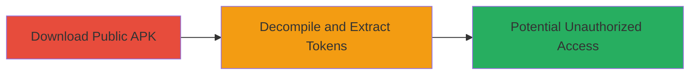

# Information Disclosure via Exposed Internal Tokens in Uber Development APK

## Overview

This attack chain demonstrates the discovery of sensitive internal tokens or credentials leaked within Android APK files hosted on Uber's development build server (devbuilds.uber.com). During development, hardcoded tokens were inadvertently included in public APK builds, allowing attackers to download, decompile, and extract them for potential unauthorized access to internal Uber systems. The vulnerability was reported via HackerOne (Report #848905), rated high severity (7.5), and resolved with a bounty. The chain focuses on reconnaissance and collection phases, highlighting risks of misconfigurations in CI/CD pipelines for mobile apps.

## Chain Metrics Dashboard

| Metric | Value |
|--------|-------|
| Chain Status | Unverified |
| Total Steps | 2 |
| Execution Time | ~10 minutes |
| Skill Level | Intermediate |
| Complexity | Low |
| Impact Level | High |

## Attack Flow Visualization



## Prerequisites & Requirements

### Required Tools

- [[tools/apktool]]
- [[tools/jadx]]

### Target Environment

- Public web server hosting APK files (e.g., devbuilds.uber.com)
- Android APK build artifacts
- No specific ports required; HTTP/HTTPS access to download

### Initial Access Requirements

- Internet access to the build server
- No credentials needed for public downloads
- Basic knowledge of Android app structure

## Detailed Attack Procedures

### Step 1: Download the APK from Development Build Server

procedure: [[procedures/Download-APK-from-Development-Build-Server]]

**Objective**: Retrieve the publicly accessible APK file containing leaked sensitive information.

**Instructions**: Identify the URL for the development build (e.g., via web search or direct access to devbuilds.uber.com). Use [[commands/wget-download-apk]] to fetch the file:

```bash
wget https://devbuilds.uber.com/path/to/development-app.apk -O uber-dev.apk
```

Verify the download integrity with file size or checksum if available.

**Expected Output**: A downloadable .apk file saved locally (e.g., uber-dev.apk).

**Success Indicators**:
- APK file downloaded successfully (check with `ls -la uber-dev.apk`)
- File is a valid ZIP archive (APKs are ZIP-based; test with `unzip -t uber-dev.apk`)

### Step 2: Decompile APK and Extract Leaked Tokens

procedure: [[procedures/Decompile-APK-and-Extract-Leaked-Tokens]]

**Objective**: Reverse-engineer the APK to uncover embedded internal tokens or credentials, enabling information disclosure.

**Instructions**: Decompile the APK using [[tools/apktool]] or [[tools/jadx]]. First, install and run [[commands/apktool-decompile]]:

```bash
apktool d uber-dev.apk -o decompiled-output
```

Navigate to the output directory and search for sensitive strings using [[commands/grep-search-strings]]:

```bash
grep -r "token\|credential\|key" decompiled-output/
```

Alternatively, use [[tools/jadx]] for a GUI-based decompilation to inspect Java/Kotlin source and assets.

**Expected Output**: Decompiled resources, including smali code, assets, and strings revealing hardcoded tokens (e.g., API keys or auth tokens).

**Success Indicators**:
- Presence of sensitive strings like internal Uber tokens in output files
- Ability to copy and test tokens against internal endpoints (e.g., via curl to verify validity)

## Attack Chain Summary

### Key Achievements

1. Successful download of public development APK without authentication.
2. Extraction of leaked internal tokens through decompilation.
3. Potential for high-impact unauthorized access to Uber's internal systems using extracted credentials.

## Technique & Tactic Coverage

### MITRE ATT&CK Techniques

- [[Software]]
- [[Credentials In Files]]

### MITRE ATT&CK Tactics

- [[Reconnaissance]]
- [[Collection]]

---
*Last updated: 2023-10-01T00:00:00Z*
