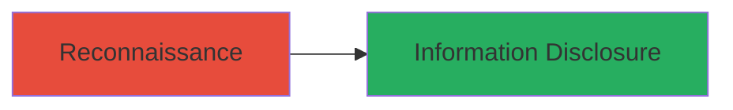

# Information Disclosure via Exposed Uncompiled CSS Files

Multi-stage attack chain demonstrating a complete attack workflow.

## Chain Metrics Dashboard

| Metric | Value |
|--------|-------|
| Chain Status | Unverified |
| Total Steps | 1 |
| Execution Time | ~1 minute |
| Skill Level | Beginner |
| Complexity | Low |
| Impact Level | Low |

## Attack Flow Visualization



## Prerequisites & Requirements

### Required Tools

- None (uses standard browser or curl)

### Target Environment

- Web platform
- Publicly accessible website
- No specific services/ports required beyond HTTP/HTTPS

### Initial Access Requirements

- Internet access
- No credentials or prior access needed

## Detailed Attack Procedures

### Step 1: Access and Inspect Public CSS File
procedure: [[procedures/Inspect-Exposed-CSS-Files-for-Internal-Information]]

**Objective**: Retrieve and examine the publicly exposed CSS file to uncover internal development details like uncompiled SASS code, source maps, comments, and versioning information.

**Instructions**: Use [[commands/curl-retrieve-css]] to fetch the CSS file contents:

```bash
curl https://hackerone.com/assets/application.css -o application.css
```

Open the downloaded file in a text editor or browser developer tools to inspect for development artifacts. Look for unminified code, inline comments, source map references (e.g., /*# sourceMappingURL=... */), and SASS variables or mixins.

**Expected Output**: Raw CSS file containing uncompiled SASS structures, comments with internal notes (e.g., developer style guides), and metadata like build versions.

**Success Indicators**:
- File downloads successfully without errors
- Presence of non-production elements like SASS comments or source maps
- Disclosure of internal details that could aid further reconnaissance

## Attack Chain Summary

### Key Achievements

1. Identified and accessed a publicly exposed uncompiled CSS file
2. Disclosed internal development artifacts without authentication or exploitation
3. Demonstrated potential for reconnaissance through minor information leakage

## Technique & Tactic Coverage

### MITRE ATT&CK Techniques

- [[Software]]

### MITRE ATT&CK Tactics

- [[Reconnaissance]]

---
*Last updated: 2023-10-01T00:00:00Z*
