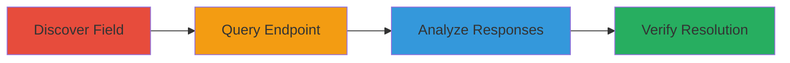

---
tags:
  - information-disclosure
  - graphql
  - reconnaissance
  - api-enumeration
type: attack_chain
tools: []
tactics:
  - '[[Reconnaissance]]'
  - '[[Discovery]]'
verified: false
platforms:
  - Web
submitted: true
complexity: medium
created_at: '2023-10-01T00:00:00Z'
procedures:
  - '[[procedures/Discover-GraphQL-Policy-Field]]'
  - '[[procedures/Query-Team-Policy-Endpoint]]'
  - '[[procedures/Analyze-Policy-Responses-for-Private-Status]]'
  - '[[procedures/Verify-Fix-Post-Patch]]'
step_count: 4
techniques:
  - '[[Hardware]]'
  - '[[Vulnerability Scanning]]'
updated_at: '2025-12-14T17:26:00.187Z'
description: >-
  Multi-stage reconnaissance attack exploiting a GraphQL API vulnerability in
  HackerOne to disclose private program policies and infer invite-only program
  status.
skill_level: intermediate
impact_level: medium
id: c319661a-7e32-45c9-a73e-c34372a42335
validated: true
mitre_tactics:
  - '[[Reconnaissance]]'
  - '[[Discovery]]'
mitre_techniques:
  - '[[Hardware]]'
  - '[[Vulnerability Scanning]]'
---
# Information Disclosure via HackerOne GraphQL API to Detect Private Programs

Multi-stage attack chain demonstrating reconnaissance via GraphQL API enumeration to disclose internal private policies on HackerOne, allowing inference of invite-only program configurations.

## Chain Metrics Dashboard

| Metric | Value |
|--------|-------|
| Chain Status | Unverified |
| Total Steps | 4 |
| Execution Time | ~5 minutes |
| Skill Level | Intermediate |
| Complexity | Medium |
| Impact Level | Medium |

## Attack Flow Visualization



## Prerequisites & Requirements

### Required Tools

- None (uses direct API queries via tools like curl or GraphQL clients)

### Target Environment

- Web platform
- HackerOne GraphQL API endpoint
- No specific ports required (HTTPS/443)

### Initial Access Requirements

- Public internet access
- No authentication needed (unauthenticated GraphQL queries)
- Knowledge of target team handles

## Detailed Attack Procedures

### Step 1: Discover GraphQL Policy Field
procedure: [[procedures/Discover-GraphQL-Policy-Field]]

**Objective**: Identify the newly introduced 'policy_markdown_html' field in the HackerOne GraphQL schema to enable policy enumeration.

**Instructions**: Monitor HackerOne API changes or introspect the GraphQL schema to note the field introduction on May 19, 2020. Test basic team queries to confirm field availability.

**Expected Output**: Confirmation of field presence in schema or initial query responses.

**Success Indicators**:
- Field detected in GraphQL introspection or test query
- Timestamp matches introduction date

### Step 2: Query Team Policy Endpoint
procedure: [[procedures/Query-Team-Policy-Endpoint]]

**Objective**: Fetch the policy_markdown_html field for a target team to retrieve policy content.

**Instructions**: Send a GraphQL query to the HackerOne API endpoint using a known team handle. Use [[commands/graphql-team-policy-query]] to retrieve team name and policy HTML.

```graphql
query { team(handle:"example") { name policy_markdown_html } }
```

Post this to the GraphQL endpoint (e.g., via curl to https://api.hackerone.com/graphql).

**Expected Output**: JSON response with team data, including policy HTML or null.

**Success Indicators**:
- Response contains policy_markdown_html field
- Policy content retrieved without errors

### Step 3: Analyze Policy Responses for Private Status
procedure: [[procedures/Analyze-Policy-Responses-for-Private-Status]]

**Objective**: Interpret query responses across conditions to infer if a program runs invite-only private policies.

**Instructions**: Compare responses: null for no policy, matching public policy for non-private, or differing internal policy for private programs. Repeat queries for multiple teams.

**Expected Output**: Variations in policy content revealing private configurations.

**Success Indicators**:
- Differences in policy HTML indicate private status
- Sensitive configurations exposed

### Step 4: Verify Fix Post-Patch
procedure: [[procedures/Verify-Fix-Post-Patch]]

**Objective**: Confirm the vulnerability resolution after the June 26, 2020 patch by re-testing queries.

**Instructions**: Re-execute [[commands/graphql-team-policy-query]] on affected teams post-fix to ensure private policies are no longer disclosed.

**Expected Output**: Field returns null or public-only content without private disclosures.

**Success Indicators**:
- No private policy exposure in responses
- Vulnerability confirmed resolved

## Attack Chain Summary

### Key Achievements

1. Discovered undocumented GraphQL field exposing policies
2. Queried API to infer private program status
3. Analyzed responses for reconnaissance value
4. Verified patch effectiveness

## Technique & Tactic Coverage

### MITRE ATT&CK Techniques

- [[Hardware]] Gather Victim Org Information
- [[Vulnerability Scanning]] Active Scanning: Vulnerability Scanning

### MITRE ATT&CK Tactics

- [[Reconnaissance]] Reconnaissance
- [[Discovery]] Discovery

---

*Last updated: 2023-10-01T00:00:00Z*
