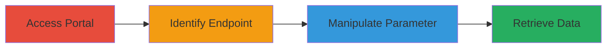

# Information Disclosure via IDOR in TikTok Ads Portal 'aadvid' Parameter

Multi-stage attack chain demonstrating a complete workflow for exploiting an IDOR vulnerability in the TikTok Ads Portal, allowing unauthorized access to sensitive advertiser account details through parameter manipulation.

## Chain Metrics Dashboard

| Metric | Value |
|--------|-------|
| Chain Status | Unverified |
| Total Steps | 4 |
| Execution Time | ~5 minutes |
| Skill Level | Intermediate |
| Complexity | Low |
| Impact Level | High |

## Attack Flow Visualization



## Prerequisites & Requirements

### Required Tools

- Browser with developer tools (e.g., Chrome DevTools)
- Optional: Proxy tool like Burp Suite for request interception

### Target Environment

- TikTok Ads Portal (web application)
- Required services/ports: HTTPS (443)
- Network access requirements: Internet access to ads.tiktok.com

### Initial Access Requirements

- Valid authenticated account in the TikTok Ads Portal
- The attacker's account must have invited Ad Accounts that share the same business group as the target accounts
- No elevated privileges needed beyond standard user access

## Detailed Attack Procedures

### Step 1: Access TikTok Ads Portal and Identify Endpoint
procedure: [[procedures/Access-TikTok-Ads-Portal-and-Identify-Endpoint]]

**Objective**: Gain authenticated access to the portal and locate the vulnerable API endpoint handling advertiser account data.

**Instructions**: Log in to the TikTok Ads Portal using valid credentials. Navigate to sections involving invited Ad Accounts, such as account management or invitation features. Use browser developer tools to inspect network traffic and identify requests containing the 'aadvid' parameter, which retrieves advertiser account information.

**Expected Output**: Identification of the API endpoint URL (e.g., something like /api/advertiser/info?aadvid=OWN_ID) and confirmation of the 'aadvid' parameter usage.

**Success Indicators**:
- Successful login and navigation to Ad Account features
- Network requests reveal the endpoint with 'aadvid' parameter

### Step 2: Manipulate 'aadvid' Parameter for Unauthorized Access
procedure: [[procedures/Manipulate-aadvid-Parameter-for-Unauthorized-Access]]

**Objective**: Alter the 'aadvid' parameter to reference another invited Ad Account ID within the same business group, bypassing access controls.

**Instructions**: Copy the identified endpoint URL. Replace the 'aadvid' value with the ID of a target invited Ad Account (obtainable from portal UI or prior enumeration). Replay the modified request using browser tools or a proxy. Ensure the request includes necessary authentication headers like cookies or tokens from your session.

For example, use a tool like curl to test the manipulation:

```bash
curl -X GET "https://ads.tiktok.com/api/advertiser/info?aadvid=TARGET_ID" -H "Cookie: session=your_session_cookie" -H "User-Agent: Mozilla/5.0"
```

**Expected Output**: The server responds with data for the target account without authorization errors.

**Success Indicators**:
- No 403/401 errors on modified request
- Response contains data not belonging to the attacker's account

### Step 3: Retrieve Leaked Advertiser Information
procedure: [[procedures/Retrieve-Leaked-Advertiser-Information]]

**Objective**: Extract and document the disclosed sensitive information from the unauthorized response.

**Instructions**: Parse the JSON response from the manipulated endpoint. Collect fields such as email addresses, phone numbers, company names, owner names, qualification_url_secret, contact emails, and addresses. Repeat for multiple target IDs if needed to gather more data.

**Expected Output**: JSON object with sensitive details, e.g., {"email": "target@example.com", "phone": "+1234567890", "company": "Target Corp"}.

**Success Indicators**:
- Sensitive personal/business data retrieved
- Confirmation that data belongs to another account owner

## Attack Chain Summary

### Key Achievements

1. Unauthorized access to advertiser account details via simple parameter tampering
2. Disclosure of PII including emails, phones, and addresses
3. Exploitation limited to same-business-group accounts, enabling targeted info gathering

## Technique & Tactic Coverage

### MITRE ATT&CK Techniques

- [[Account Discovery]]

### MITRE ATT&CK Tactics

- [[Discovery]]
- [[Collection]]

---
*Last updated: 2023-10-01T00:00:00Z*
