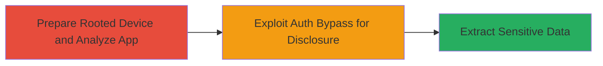

# Information Disclosure via Improper Authentication in Coinbase Android App

Multi-stage attack chain demonstrating a complete attack workflow.

## Chain Metrics Dashboard

| Metric | Value |
|--------|-------|
| Chain Status | Unverified |
| Total Steps | 1 |
| Execution Time | ~30 minutes |
| Skill Level | Advanced |
| Complexity | Medium |
| Impact Level | Low |

## Attack Flow Visualization



## Prerequisites & Requirements

### Required Tools

- [[tools/ADB]]
- [[tools/Frida]]
- [[tools/APKTool]]

### Target Environment

- Target OS/Platform: Android device with Coinbase app installed
- Required services/ports: USB debugging enabled, no specific ports
- Network access requirements: Local USB connection to device

### Initial Access Requirements

- Credential requirements: Root access to Android device
- Network position: Physical or emulated device access
- Prior access needed: Installed Coinbase APK

## Detailed Attack Procedures

### Step 1: Exploit Improper Authentication for Information Disclosure
procedure: [[procedures/Exploit-Improper-Authentication-in-Android-App-for-Info-Disclosure]]

**Objective**: Bypass authentication checks in the Coinbase Android app to access and disclose sensitive user information, such as account details or tokens.

**Instructions**: Begin by ensuring the device is rooted and ADB is set up. Use [[commands/adb-install-apk]] to install or reinstall the Coinbase APK if needed:

```bash
adb install coinbase.apk
```

Next, decompile the app using [[tools/APKTool]] for static analysis to identify authentication functions, then launch dynamic analysis with Frida to hook and bypass auth checks. Attach Frida to the app process using [[commands/frida-trace-auth]]:

```bash
frida -U -f com.coinbase.android -l bypass_auth.js --no-pause
```

In the Frida script (bypass_auth.js), override the authentication validation method to always return true, allowing access to protected endpoints or data stores. Query sensitive data via hooked methods or app internals using [[commands/adb-shell-dump]]:

```bash
adb shell su -c 'cat /data/data/com.coinbase.android/shared_prefs/sensitive_prefs.xml'
```

**Expected Output**: Decompiled APK files, Frida hooks confirming bypass, and extracted sensitive data like API tokens or user info in XML/JSON format.

**Success Indicators**:
- Frida script loads without errors and auth checks are bypassed (logged as 'Auth bypassed')
- Sensitive files or data are readable without crashing the app
- Disclosed information includes non-public app data

## Attack Chain Summary

### Key Achievements

1. Successful root access and app installation on test device
2. Identification and bypass of improper authentication mechanism
3. Extraction of sensitive information without legitimate credentials

## Technique & Tactic Coverage

### MITRE ATT&CK Techniques

- [[Valid Accounts]]
- [[Data from Information Repositories]]

### MITRE ATT&CK Tactics

- [[Initial Access]]
- [[Collection]]

---
*Last updated: 2023-10-01T00:00:00Z*
