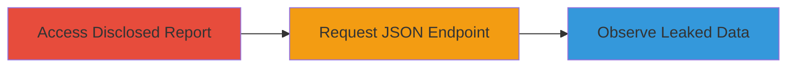

---
tags:
  - information-disclosure
  - rails
  - json
  - web-vulnerability
type: attack_chain
tools:
  - '[[tools/approvals-gem]]'
tactics:
  - '[[Discovery]]'
  - '[[Collection]]'
commands:
  - '[[commands/get-report-json]]'
  - '[[commands/hash-symbol-key-access]]'
  - '[[commands/hash-string-key-access]]'
  - '[[commands/hash-to-json]]'
  - '[[commands/verify-json-structure]]'
  - '[[commands/json-parse-duplicate-keys]]'
platforms:
  - Web
complexity: low
procedures:
  - >-
    [[procedures/Exploit-Information-Disclosure-in-HackerOne-Report-JSON-Endpoint]]
step_count: 3
techniques:
  - '[[Data from Information Repositories]]'
  - '[[Exploit Public-Facing Application]]'
description: >-
  Exploitation of an information disclosure vulnerability in HackerOne's report
  JSON endpoint leading to leakage of sensitive user data
skill_level: beginner
impact_level: high
id: e8e22670-ff31-42af-8e84-a61e631f87fc
created_at: '2025-12-11T06:10:28.463Z'
updated_at: '2025-12-11T06:10:28.463Z'
verified: false
validated: true
submitted: true
mitre_tactics:
  - '[[TA0007]]'
  - '[[TA0009]]'
mitre_techniques:
  - '[[T1213]]'
  - '[[T1190]]'
---
# Information Disclosure via JSON Endpoint in HackerOne Reports

Multi-stage attack chain demonstrating the exploitation of an information disclosure vulnerability in HackerOne's /reports/:id.json endpoint, caused by a Rails upgrade that altered JSON serialization behavior, leading to the leakage of sensitive user attributes such as emails, OTP backup codes, and more.

## Chain Metrics Dashboard

| Metric | Value |
|--------|-------|
| Chain Status | Unverified |
| Total Steps | 3 |
| Execution Time | ~1 minutes |
| Skill Level | Beginner |
| Complexity | Low |
| Impact Level | High |

## Attack Flow Visualization



## Prerequisites & Requirements

### Required Tools

- [[tools/approvals-gem]]

### Target Environment

- Web platform (HackerOne)
- No specific ports required
- Public network access to hackerone.com

### Initial Access Requirements

- Access to a publicly disclosed report URL on HackerOne
- No credentials needed
- Browser or HTTP client for requests

## Detailed Attack Procedures

### Step 1: Access Disclosed Report - [[procedures/Exploit-Information-Disclosure-in-HackerOne-Report-JSON-Endpoint]]

**Procedure**: [[procedures/Exploit-Information-Disclosure-in-HackerOne-Report-JSON-Endpoint]]

**Objective**: Identify and access a publicly disclosed report on HackerOne to explore its endpoints.

**Expected Output**: Successful loading of the report page.

**Success Indicators**:
- Report content is visible
- URL structure includes /reports/:id

First, navigate to a disclosed report URL on hackerone.com.

### Step 2: Request JSON Endpoint - [[procedures/Exploit-Information-Disclosure-in-HackerOne-Report-JSON-Endpoint]]

**Procedure**: [[procedures/Exploit-Information-Disclosure-in-HackerOne-Report-JSON-Endpoint]]

**Objective**: Append .json to the report URL and send a GET request to access the vulnerable JSON endpoint.

**Expected Output**: JSON response containing sensitive data.

**Success Indicators**:
- HTTP 200 response
- JSON structure includes summaries with user attributes

Use [[commands/get-report-json]] to request the JSON version:

```bash
GET /reports/█████.json HTTP/2
Host: hackerone.com
```

### Step 3: Observe Leaked Sensitive Data - [[procedures/Exploit-Information-Disclosure-in-HackerOne-Report-JSON-Endpoint]]

**Procedure**: [[procedures/Exploit-Information-Disclosure-in-HackerOne-Report-JSON-Endpoint]]

**Objective**: Analyze the JSON response for exposed sensitive information.

**Expected Output**: Visibility of leaked data such as email, OTP codes, etc.

**Success Indicators**:
- Sensitive fields present in JSON
- Data matches expected user attributes

Review the JSON output for keys like email, otp_backup_codes, phone_number, and graphql_secret_token.

## Attack Chain Summary

### Key Achievements

1. Accessed public report endpoint
2. Exploited JSON serialization flaw to leak data
3. Identified root cause in Rails upgrade

## Technique & Tactic Coverage

### MITRE ATT&CK Techniques

- [[Data from Information Repositories]]
- [[Exploit Public-Facing Application]]

### MITRE ATT&CK Tactics

- [[Discovery]]
- [[Collection]]

*Last updated: [TIMESTAMP]*
