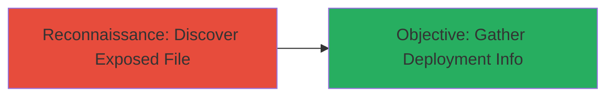

# Information Disclosure via Publicly Accessible .dockerignore File

Multi-stage attack chain demonstrating a complete attack workflow.

## Chain Metrics Dashboard

| Metric | Value |
|--------|-------|
| Chain Status | Unverified |
| Total Steps | 1 |
| Execution Time | ~1 minute |
| Skill Level | Beginner |
| Complexity | Low |
| Impact Level | Low |

## Attack Flow Visualization



## Prerequisites & Requirements

### Required Tools

- None (uses standard web browser or curl)

### Target Environment

- Web application hosted on Docker
- Publicly accessible production environment
- No authentication required for file access

### Initial Access Requirements

- Internet access to the target domain
- No credentials needed
- Basic knowledge of common file paths in web apps

## Detailed Attack Procedures

### Step 1: Reconnaissance - Discover Exposed File
procedure: [[procedures/Discover-Exposed-Dockerignore-File]]

**Objective**: Identify and access the publicly exposed .dockerignore file to reveal deployment environment details such as ignored paths or secrets hints.

**Instructions**: Start by navigating to the target's production domain and attempt to access common configuration file paths directly via browser or command line. For example, try accessing the root path for .dockerignore:

Use a web browser to visit `https://target.com/.dockerignore` or execute [[commands/curl-fetch-file]] to retrieve the file contents:

```bash
curl -s https://target.com/.dockerignore
```

If the file is exposed, it will return the contents without errors. Review the output for details like ignored directories, files, or environment-specific paths that hint at the Docker build process.

**Expected Output**: Raw text of the .dockerignore file, e.g., lines like `node_modules` or `*.env` indicating build exclusions.

**Success Indicators**:
- HTTP 200 response with file contents
- Presence of Docker-specific ignore patterns
- No 404 or authentication prompt
