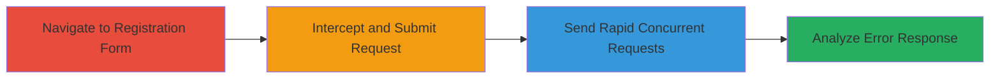

---
tags:
  - information-disclosure
  - race-condition
  - error-message
  - stack-trace
  - sql-leak
type: attack_chain
tools:
  - '[[tools/Burp-Suite]]'
tactics:
  - '[[Reconnaissance]]'
verified: false
platforms:
  - Web
  - .NET
submitted: true
complexity: medium
created_at: '2023-10-01T00:00:00Z'
procedures:
  - '[[procedures/Trigger-Race-Condition-for-Error-Disclosure]]'
step_count: 3
techniques:
  - '[[Gather Victim Host Information]]'
  - '[[Exploit Public-Facing Application]]'
updated_at: '2025-12-14T17:26:26.834Z'
description: >-
  Multi-stage attack exploiting concurrency issues in a .NET-based registration
  endpoint to trigger error messages revealing internal file paths, SQL queries,
  and stack traces.
skill_level: intermediate
impact_level: low
id: ea1fad3c-121d-4668-a380-98cc78736815
validated: true
mitre_tactics:
  - '[[Reconnaissance]]'
mitre_techniques:
  - '[[Gather Victim Host Information]]'
  - '[[Exploit Public-Facing Application]]'
---
---
id: 123e4567-e89b-12d3-a456-426614174000
name: Information Disclosure via Race Condition in User Registration Endpoint
type: attack_chain
description: "Multi-stage attack exploiting concurrency issues in a .NET-based registration endpoint to trigger error messages revealing internal file paths, SQL queries, and stack traces."
verified: false
submitted: false
step_count: 3
created_at: 2023-10-01T00:00:00Z
updated_at: 2023-10-01T00:00:00Z
procedures: [[procedures/Trigger-Race-Condition-for-Error-Disclosure]]
techniques: [[Gather Victim Host Information]], [[Exploit Public-Facing Application]]
tactics: [[Reconnaissance]]
tags: [information-disclosure, race-condition, error-message, stack-trace, sql-leak]
platforms: [Web, .NET]
tools: [[tools/Burp-Suite]]
---

# Information Disclosure via Race Condition in User Registration Endpoint

Multi-stage attack chain demonstrating a complete attack workflow exploiting race conditions in user registration to disclose sensitive application internals.

## Chain Metrics Dashboard

| Metric | Value |
|--------|-------|
| Chain Status | Unverified |
| Total Steps | 3 |
| Execution Time | ~5 minutes |
| Skill Level | Intermediate |
| Complexity | Medium |
| Impact Level | Low |

## Attack Flow Visualization

## Prerequisites & Requirements

### Required Tools

- [[tools/Burp-Suite]]

### Target Environment

- Web platform with .NET backend (e.g., Telerik Sitefinity)
- SQL Database service
- Public-facing registration endpoint (e.g., POST /registration)

### Initial Access Requirements

- Network access to the target URL (e.g., https://valleyconnect.tva.gov/registration)
- No credentials required
- Proxy setup for request interception

## Detailed Attack Procedures

### Step 1: Navigate to Registration Form
procedure: [[procedures/Trigger-Race-Condition-for-Error-Disclosure]]

**Objective**: Access the target registration endpoint to prepare for exploitation.

**Instructions**: Open a web browser and navigate to the registration page at https://valleyconnect.tva.gov/registration. Inspect the form fields including UserName, Password, and EmailAddress to understand the submission structure.

**Expected Output**: Registration form loaded with input fields visible.

**Success Indicators**:
- Form fields are accessible
- Endpoint URL confirmed as POST /registration

### Step 2: Intercept and Submit Request
procedure: [[procedures/Trigger-Race-Condition-for-Error-Disclosure]]

**Objective**: Capture a baseline registration request using Burp Suite for modification.

**Instructions**: Configure your browser to proxy through Burp Suite. Fill in the form with test data (e.g., UserName: testuser, Password: testpass, EmailAddress: test@example.com) and submit. Intercept the POST request in Burp's Proxy tab and forward it to observe the normal response.

**Expected Output**: Successful or failed registration response without errors.

**Success Indicators**:
- Request intercepted and details captured
- Form submission works without anomalies

### Step 3: Send Rapid Concurrent Requests
procedure: [[procedures/Trigger-Race-Condition-for-Error-Disclosure]]

**Objective**: Induce a race condition by flooding the endpoint with concurrent requests to trigger the OptimisticVerificationException.

**Instructions**: In Burp Suite, send the captured request to the Intruder tool. Configure Intruder to target the EmailAddress parameter with a payload list of varying emails (e.g., Z@jetamooz.com, test1@example.com). Set the attack type to Sniper and launch at high speed to simulate concurrency. Monitor responses for error messages.

**Expected Output**: Error response containing stack traces, e.g., OptimisticVerificationException with details like "D:\\Agent\\ _work\\1825\\s\\Code\\DataAccessLayer\\Classes\\RegistrationRequestService.cs" and SQL queries like "UPDATE [sf_dynamic_content] SET ...".

**Success Indicators**:
- Exception triggered in responses
- Internal paths and SQL structures exposed

## Attack Chain Summary

### Key Achievements

1. Accessed and intercepted registration requests without authentication.
2. Induced race condition via rapid concurrent submissions.
3. Disclosed backend internals including file paths, stack traces, and SQL query fragments for reconnaissance.

## Technique & Tactic Coverage

### MITRE ATT&CK Techniques

- [[Gather Victim Host Information]] Gather Victim Host Information
- [[Exploit Public-Facing Application]] Exploit Public-Facing Application

### MITRE ATT&CK Tactics

- [[Reconnaissance]] Reconnaissance

---
*Last updated: 2023-10-01T00:00:00Z*
