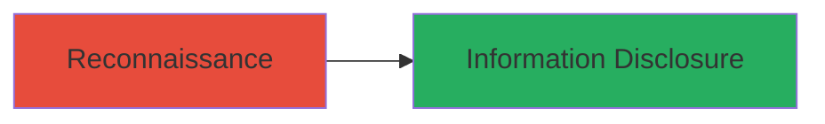

---
tags:
  - information-disclosure
  - jira
  - cve-2020-14179
  - unauthenticated-access
type: attack_chain
tools: []
tactics:
  - '[[Reconnaissance]]'
verified: false
platforms:
  - Web
submitted: true
complexity: low
created_at: '2024-10-01T00:00:00Z'
procedures:
  - '[[procedures/Exploit-CVE-2020-14179-for-Jira-Configuration-Disclosure]]'
step_count: 1
techniques:
  - '[[Software]]'
  - '[[Exploit Public-Facing Application]]'
updated_at: '2025-12-14T17:25:13.031Z'
description: >-
  A simple reconnaissance attack exploiting CVE-2020-14179 to disclose sensitive
  Jira configuration details without authentication.
skill_level: beginner
impact_level: medium
id: aca9707b-15a5-47ce-8f74-d4fe79c635a2
validated: true
mitre_tactics:
  - '[[Reconnaissance]]'
mitre_techniques:
  - '[[Software]]'
  - '[[Exploit Public-Facing Application]]'
---
# Information Disclosure via Unauthenticated Access to Jira QueryComponent Endpoint

Multi-stage attack chain demonstrating a complete attack workflow.

## Chain Metrics Dashboard

| Metric | Value |
|--------|-------|
| Chain Status | Unverified |
| Total Steps | 1 |
| Execution Time | ~1 minute |
| Skill Level | Beginner |
| Complexity | Low |
| Impact Level | Medium |

## Attack Flow Visualization



## Prerequisites & Requirements

### Required Tools

- None (uses standard HTTP client like curl or browser)

### Target Environment

- Web platform with Atlassian Jira Server or Data Center (versions before 8.5.8 or 8.6.0 before 8.11.1)
- Exposed Jira instance on HTTPS
- No specific ports beyond standard 443/80

### Initial Access Requirements

- Public network access to the Jira instance
- No credentials required
- No prior access needed

## Detailed Attack Procedures

### Step 1: Access Vulnerable Endpoint
procedure: [[procedures/Exploit-CVE-2020-14179-for-Jira-Configuration-Disclosure]]

**Objective**: Retrieve sensitive internal configuration details, such as custom field names and custom SLA names, from the unauthenticated Jira endpoint.

**Instructions**: Use [[commands/curl-jira-querycomponent]] to fetch the content of the vulnerable endpoint:

```bash
curl -k "https://jira.theendlessweb.com/secure/QueryComponent!Default.jspa"
```

Alternatively, navigate directly to the URL in a web browser for manual inspection.

**Expected Output**: HTML response containing exposed data like custom field names (e.g., "Priority", "Custom Field 1") and SLA configurations (e.g., "SLA Name: Response Time").

**Success Indicators**:
- Response includes internal Jira configuration elements without prompting for login
- Visible custom fields or SLAs that reveal organizational setup

## Attack Chain Summary

### Key Achievements

1. Unauthenticated access to sensitive configuration data
2. Revelation of custom fields and SLAs aiding further reconnaissance
3. Demonstration of information disclosure impact on Jira instances

## Technique & Tactic Coverage

### MITRE ATT&CK Techniques

- [[Software]] Gather Victim Host Information: Software
- [[Exploit Public-Facing Application]] Exploit Public-Facing Application

### MITRE ATT&CK Tactics

- [[Reconnaissance]] Reconnaissance

---
*Last updated: 2024-10-01T00:00:00Z*
