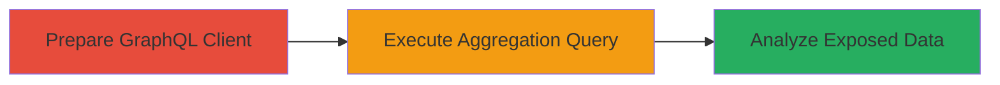

# Information Disclosure via Unfiltered GraphQL Aggregations in HackerOne Opportunities Search

Multi-stage attack chain demonstrating exploitation of GraphQL endpoints in HackerOne to bypass access controls and expose private program information through unfiltered aggregations.

## Chain Metrics Dashboard

| Metric | Value |
|--------|-------|
| Chain Status | Unverified |
| Total Steps | 3 |
| Execution Time | ~5 minutes |
| Skill Level | Intermediate |
| Complexity | Medium |
| Impact Level | High |

## Attack Flow Visualization



## Prerequisites & Requirements

### Required Tools

- [[tools/GraphQL-Client]]

### Target Environment

- Web platform with GraphQL API (e.g., HackerOne's API at https://api.hackerone.com/graphql)
- No specific ports required; standard HTTPS (443)
- Network access to the public API endpoint

### Initial Access Requirements

- Valid user session or API token for authenticated access to HackerOne (anonymous access may suffice for public endpoints, but private data exposure requires context of logged-in user)
- Basic knowledge of GraphQL query syntax
- No prior privileged access needed; exploits public-facing API misconfiguration

## Detailed Attack Procedures

### Step 1: Prepare GraphQL Client
procedure: [[procedures/Prepare-GraphQL-Client-for-HackerOne-API]]

**Objective**: Set up a GraphQL client to interact with the HackerOne API and prepare for query execution.

**Instructions**: Install and configure a GraphQL client like Insomnia or Postman, or use curl. Point it to the HackerOne GraphQL endpoint (https://api.hackerone.com/graphql). Authenticate if required using your HackerOne session cookie or API key.

**Expected Output**: Successful connection to the endpoint, with ability to send test queries (e.g., { me { id } } returns user ID or null).

**Success Indicators**:
- Client connected without errors
- Basic query like fetching user ID executes successfully

### Step 2: Execute Terms Aggregation Query
procedure: [[procedures/Execute-Terms-Aggregation-Query-on-Handle-Field]]

**Objective**: Send a crafted GraphQL query using the 'aggs' argument to perform terms aggregation on the 'handle' field, bypassing privacy filters.

**Instructions**: Use the prepared client to execute the aggregation query. Target the 'opportunities_search' endpoint with an empty query and terms on 'handle'. Example using [[commands/graphql-terms-aggregation-on-handle]] via curl:

```bash
curl -X POST https://api.hackerone.com/graphql \
  -H "Content-Type: application/json" \
  -H "Authorization: Bearer YOUR_TOKEN" \
  -d '{"query": "query { me { id } opportunities_search(query:{}, aggs:{results:{terms: {field:\"handle\"}}}) { aggs } }"}'
```

Tweak the query for specificity if needed, such as limiting bucket size.

**Expected Output**: JSON response with 'aggs' containing buckets, including 'private' keys and doc_counts.

**Success Indicators**:
- Response includes unfiltered aggregations
- Buckets reveal private handles (e.g., {"key": "private", "doc_count": 1})

### Step 3: Analyze Response for Private Data Exposure
procedure: [[procedures/Analyze-Response-for-Private-Data-Exposure]]

**Objective**: Inspect the aggregation results to identify and extract exposed private information.

**Instructions**: Parse the JSON response from the query. Look for buckets in 'aggs.results.buckets' that include sensitive keys like 'private' or handles of non-accessible programs. Cross-reference with known public programs to confirm exposure.

**Expected Output**: List of private handles, asset info, and counts (e.g., sum_other_doc_count: 37, multiple private entries).

**Success Indicators**:
- Identification of private program handles not visible in standard UI
- Confirmation of data leakage without access controls

## Attack Chain Summary

### Key Achievements

1. Bypassed privacy filters in GraphQL aggregations to access private program metadata.
2. Exposed handles and counts for private teams and assets.
3. Demonstrated potential for broader data aggregation attacks on sensitive fields.

## Technique & Tactic Coverage

### MITRE ATT&CK Techniques

- [[Exploit Public-Facing Application]] Exploit Public-Facing Application
- [[Data from Local System]] Data from Local System (adapted for API data collection)

### MITRE ATT&CK Tactics

- [[Initial Access]] Initial Access
- [[Collection]] Collection

---

*Last updated: 2024-01-01T00:00:00Z*
