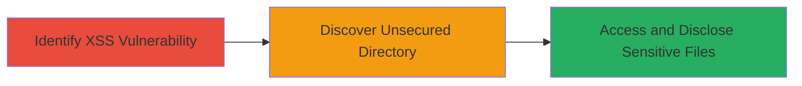

---
tags:
  - xss
  - information-disclosure
  - web-vulnerability
  - bug-bounty
type: attack_chain
tools: []
tactics:
  - '[[Execution]]'
  - '[[Discovery]]'
verified: false
platforms:
  - Web
submitted: true
complexity: low
procedures:
  - '[[procedures/Test-for-XSS-Vulnerability]]'
  - >-
    [[procedures/Exploit-Unsecured-Attachment-Directory-for-Information-Disclosure]]
step_count: 2
techniques:
  - '[[JavaScript]]'
  - '[[File and Directory Discovery]]'
description: >-
  An initial high-severity XSS vulnerability on sdrc.starbucks.com was reported
  but deemed out of scope. Further analysis revealed an unsecured attachment
  directory, allowing unauthorized access to sensitive files and elevating the
  issue to critical severity with a bounty payout.
skill_level: intermediate
impact_level: critical
id: a4c679ff-7f93-48fb-851d-ed867f0920df
created_at: '2025-12-14T17:25:22.841Z'
updated_at: '2025-12-14T17:25:22.841Z'
validated: true
mitre_tactics:
  - '[[Execution]]'
  - '[[Discovery]]'
mitre_techniques:
  - '[[JavaScript]]'
  - '[[File and Directory Discovery]]'
---
# Information Disclosure via Unsecured Attachment Directory Elevated from XSS on Starbucks Domain

Multi-stage attack chain demonstrating vulnerability discovery and exploitation on a public-facing web application, leading to unauthorized information disclosure.

## Chain Metrics Dashboard

| Metric | Value |
|--------|-------|
| Chain Status | Unverified |
| Total Steps | 2 |
| Execution Time | ~5 minutes |
| Skill Level | Intermediate |
| Complexity | Low |
| Impact Level | Critical |

## Attack Flow Visualization



## Prerequisites & Requirements

### Required Tools

- Browser developer tools for XSS testing
- [[commands/curl-list-directory]] for directory access

### Target Environment

- Web platform
- Publicly accessible domain: sdrc.starbucks.com
- No authentication required for vulnerable endpoints

### Initial Access Requirements

- Internet access to the target domain
- No prior credentials needed
- Basic knowledge of web vulnerabilities

## Detailed Attack Procedures

### Step 1: Identify XSS Vulnerability
procedure: [[procedures/Test-for-XSS-Vulnerability]]

**Objective**: Test for and confirm cross-site scripting vulnerability to assess initial attack surface.

**Instructions**: Navigate to sdrc.starbucks.com in a browser and identify user input fields (e.g., search or form parameters). Inject a test payload such as `<script>alert('XSS')</script>` into vulnerable parameters. Use developer tools to inspect if the script executes. Report the finding via the program's disclosure process.

```bash
# Example using curl to test reflected XSS (adapt to specific endpoint)
curl "https://sdrc.starbucks.com/search?q=<script>alert('XSS')</script>" -v
```

**Expected Output**: Alert box pops up in browser, or response reflects the payload unescaped, confirming XSS.

**Success Indicators**:
- Script execution in victim's browser context
- Vulnerability confirmed but potentially out of scope

### Step 2: Discover and Exploit Unsecured Directory
procedure: [[procedures/Exploit-Unsecured-Attachment-Directory-for-Information-Disclosure]]

**Objective**: Locate and access the unsecured attachment directory to disclose sensitive information, elevating the report's severity.

**Instructions**: During further reconnaissance, guess common paths like /attachments/ or /uploads/ on sdrc.starbucks.com. Use [[commands/curl-list-directory]] to list contents without authentication. Download exposed files to reveal sensitive data such as internal documents or user information.

```bash
# List directory contents
curl https://sdrc.starbucks.com/attachments/ -v

# Download a specific file (example)
curl https://sdrc.starbucks.com/attachments/sensitive-file.pdf -o sensitive-file.pdf
```

**Expected Output**: Directory listing or direct file access without login prompts, exposing file names and contents.

**Success Indicators**:
- Unauthorized access to files
- Sensitive information retrieved, leading to scope adjustment and payout

## Attack Chain Summary

### Key Achievements

1. Confirmed high-severity XSS, establishing initial vulnerability
2. Discovered unsecured directory enabling critical information disclosure
3. Elevated report severity from high to critical, resulting in bounty

## Technique & Tactic Coverage

### MITRE ATT&CK Techniques

- [[JavaScript]]
- [[File and Directory Discovery]]

### MITRE ATT&CK Tactics

- [[Execution]]
- [[Discovery]]

---
*Last updated: 2023-10-01*
