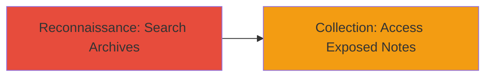

---
tags:
  - information-disclosure
  - wayback-machine
  - simplenote
  - privacy-leak
  - reconnaissance
type: attack_chain
tools:
  - '[[tools/web.archive.org]]'
tactics:
  - '[[Reconnaissance]]'
verified: false
platforms:
  - Web
submitted: true
complexity: low
created_at: '2023-10-01T00:00:00Z'
procedures:
  - '[[procedures/Discover-Archived-Private-Notes-Using-Wayback-Machine]]'
step_count: 1
techniques:
  - '[[Search Engines]]'
updated_at: '2025-12-14T17:25:12.971Z'
description: >-
  Attack chain demonstrating the discovery of privately shared Simplenote notes
  archived publicly by the Wayback Machine, leading to unauthorized access to
  sensitive user data.
skill_level: beginner
impact_level: high
id: 9872237e-26ff-4838-a810-d7fd7c55bf1d
validated: true
mitre_tactics:
  - '[[Reconnaissance]]'
mitre_techniques:
  - '[[Search Engines]]'
---
# Information Disclosure via Wayback Machine Archiving of Private Simplenote Notes

Multi-stage attack chain demonstrating a complete attack workflow for discovering and accessing privately shared notes from Simplenote that were unintentionally archived by the Wayback Machine, exposing sensitive information such as emails, passwords, and confidential data to the public.

## Chain Metrics Dashboard

| Metric | Value |
|--------|-------|
| Chain Status | Unverified |
| Total Steps | 1 |
| Execution Time | ~5 minutes |
| Skill Level | Beginner |
| Complexity | Low |
| Impact Level | High |

## Attack Flow Visualization

## Prerequisites & Requirements

### Required Tools

- [[tools/web.archive.org]]

### Target Environment

- Web platform
- Access to public internet
- No specific services or ports required beyond standard HTTP/HTTPS

### Initial Access Requirements

- No credentials required
- Public network access
- No prior access to target needed

## Detailed Attack Procedures

### Step 1: Discover Archived Private Notes
procedure: [[procedures/Discover-Archived-Private-Notes-Using-Wayback-Machine]]

**Objective**: Search the Wayback Machine for snapshots of Simplenote private note URLs to identify and access content that was not intended for public viewing.

**Instructions**: Navigate to web.archive.org and search for Simplenote endpoints such as "http://app.simplenote.com/" or "http://simp.ly/p/". Review the archived snapshots, focusing on recent captures (e.g., from December 31, 2020), to locate private notes containing sensitive data like emails and passwords.

**Expected Output**: Archived web pages displaying the contents of private Simplenote notes, including text with potentially confidential information.

**Success Indicators**:
- Archived snapshots load successfully
- Private note contents are visible and contain user data (e.g., emails, passwords)

## Attack Chain Summary

### Key Achievements

1. Identified unintended archiving of private Simplenote notes by the Wayback Machine
2. Accessed sensitive user information without authentication
3. Demonstrated privacy violation through public exposure of shareable content

## Technique & Tactic Coverage

### MITRE ATT&CK Techniques

- [[Search Engines]]

### MITRE ATT&CK Tactics

- [[Reconnaissance]]

---
*Last updated: 2023-10-01T00:00:00Z*
