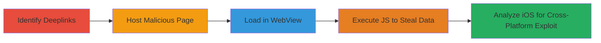

# Insecure Deeplink in Grab Apps Leading to Sensitive User Data Disclosure via WebView

Multi-stage attack chain demonstrating exploitation of an insecure deeplink in the Grab Android and iOS apps, allowing arbitrary URL loading in a Zendesk WebView with exposed JavaScript interfaces, resulting in unauthorized access to sensitive user profile data.

## Chain Metrics Dashboard

| Metric | Value |
|--------|-------|
| Chain Status | Unverified |
| Total Steps | 5 |
| Execution Time | ~10 minutes |
| Skill Level | Intermediate |
| Complexity | Medium |
| Impact Level | High |

## Attack Flow Visualization

## Prerequisites & Requirements

### Required Tools

- AWS S3 for hosting (or equivalent)
- Web browser for analysis

### Target Environment

- Grab Android/iOS app installed
- Access to device with app
- No authentication required beyond app installation

### Initial Access Requirements

- Physical or emulated device access
- Ability to trigger deeplinks via external links (e.g., messengers)
- No prior credentials needed

## Detailed Attack Procedures

### Step 1: Identify Deeplinks
procedure: [[procedures/Identify-Grab-App-Deeplinks]]

**Objective**: Discover deeplinks in the Grab app that can load arbitrary content in the ZendeskSupportActivity WebView.

**Instructions**: Analyze the app for deeplink schemes, focusing on 'HELPCENTER' which uses the format grab://open?screenType=HELPCENTER&page=<URL> to open external pages without validation.

**Expected Output**: Confirmation of vulnerable deeplink scheme.

**Success Indicators**:
- Deeplink identified and testable
- App responds to scheme by opening WebView

### Step 2: Host Malicious Trigger Page
procedure: [[procedures/Host-Malicious-Trigger-Page-on-S3]]

**Objective**: Create and host an HTML page on AWS S3 that triggers the deeplink and loads a malicious payload.

**Instructions**: Upload an HTML file to S3 containing a link like <a href="grab://open?screenType=HELPCENTER&amp;page=https://s3.amazonaws.com/edited/page2.html">Begin attack!</a>, where page2.html includes the JavaScript exploit.

**Expected Output**: Publicly accessible malicious page ready for deeplink invocation.

**Success Indicators**:
- Page hosted and accessible via HTTPS
- Link triggers deeplink when clicked in browser or messenger

### Step 3: Load Malicious Page in WebView
procedure: [[procedures/Load-Malicious-Page-in-WebView-with-Exposed-Interface]]

**Objective**: Trigger the deeplink to load the attacker-controlled page in the app's WebView, exposing the JavaScriptInterface.

**Instructions**: Click the hosted link on the device, causing the app to open ZendeskSupportActivity and load the URL in WebView configured with mWebView.addJavascriptInterface(new com.grab.pax.support.ZendeskSupportActivity.WebAppInterface(this), "Android").

**Expected Output**: WebView loads the malicious page with access to Android JavaScript bridge.

**Success Indicators**:
- WebView opens without errors
- JavaScript console accessible for testing

### Step 4: Execute JavaScript to Steal User Data
procedure: [[procedures/Execute-JavaScript-to-Steal-User-Data]]

**Objective**: Use JavaScript on the loaded page to invoke the exposed interface and exfiltrate serialized user data.

**Instructions**: The page executes: if(window.Android){ data = window.Android.getGrabUser(); } else if(window.grabUser){ data = JSON.stringify(window.grabUser); } then document.write("Stolen data: "+ data); calling getGrabUser() to retrieve Gson-serialized profile info.

**Expected Output**: Display of sensitive user data like profile details in the WebView.

**Success Indicators**:
- User data retrieved and visible
- No authentication prompts during access

### Step 5: Analyze iOS Implementation
procedure: [[procedures/Analyze-iOS-WebView-Implementation]]

**Objective**: Confirm similar vulnerability on iOS by inspecting the help page JavaScript.

**Instructions**: Visit https://help.grab.com/ and search for 'getGrabUser' to reveal window.grabUser exposure and Stores.GrabUser.setGrabUser logic, enabling cross-platform exploitation.

**Expected Output**: JavaScript code confirming iOS global object exposure.

**Success Indicators**:
- iOS-specific code found
- Equivalent JS payload testable on iOS

## Attack Chain Summary

### Key Achievements

1. Bypassed app boundaries via insecure deeplink to load arbitrary content.
2. Exploited WebView misconfigurations to access sensitive user objects.
3. Achieved unauthenticated data disclosure across Android and iOS.

## Technique & Tactic Coverage

### MITRE ATT&CK Techniques

- [[Drive-by Compromise]] Drive-by Compromise
- [[JavaScript]] JavaScript

### MITRE ATT&CK Tactics

- [[Initial Access]] Initial Access
- [[Collection]] Collection

---

*Last updated: 2023-10-01T00:00:00Z*
