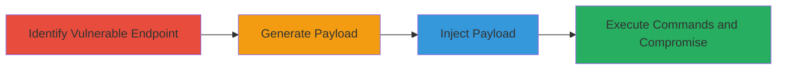

# Insecure Deserialization in Sitecore ThumbnailsAccessToken Header Leading to RCE

Multi-stage attack chain demonstrating a complete attack workflow exploiting insecure deserialization in a Sitecore implementation to achieve remote code execution (RCE).

## Chain Metrics Dashboard

| Metric | Value |
|--------|-------|
| Chain Status | Unverified |
| Total Steps | 4 |
| Execution Time | ~5 minutes |
| Skill Level | Intermediate |
| Complexity | Medium |
| Impact Level | High |

## Attack Flow Visualization



## Prerequisites & Requirements

### Required Tools

- [[tools/ysoserial.net]]

### Target Environment

- Web platform with Sitecore CMS
- .NET runtime environment
- Exposed Sitecore application (typically on port 80/443)

### Initial Access Requirements

- Network access to the Sitecore application
- No credentials required for unauthenticated exploitation
- Ability to send HTTP requests with custom headers

## Detailed Attack Procedures

### Step 1: Identify Vulnerable Endpoint
procedure: [[procedures/Identify-Vulnerable-Deserialization-Endpoint-in-Sitecore]]

**Objective**: Locate the deserialization vulnerability in the ThumbnailsAccessToken header of the Sitecore application.

**Instructions**: Review the application's API endpoints or use network inspection tools to identify requests involving the ThumbnailsAccessToken header. Test for deserialization by sending a benign serialized object and observing server behavior.

**Expected Output**: Confirmation that the header processes unsanitized input via BinaryFormatter.

**Success Indicators**:
- Server accepts and deserializes input from the header without validation
- No immediate errors on malformed input

### Step 2: Generate Malicious Payload
procedure: [[procedures/Generate-Malicious-Serialized-Payload-Using-ysoserial.net]]

**Objective**: Create a serialized gadget chain that triggers RCE upon deserialization.

**Instructions**: Use [[tools/ysoserial.net]] to generate a BinaryFormatter-compatible payload. For example, execute [[commands/ysoserial-generate-rce-payload]] to produce a payload that runs a command like opening a calculator or reverse shell.

```bash
ysoserial.exe -f BinaryFormatter -g TypeConfuseDelegate -c "calc.exe" --out payload.bin
```

Convert the binary to base64 for header injection if needed.

**Expected Output**: A binary or base64-encoded serialized object file ready for injection.

**Success Indicators**:
- Payload file generated without errors
- Validation shows it deserializes to execute code in a test environment

### Step 3: Inject Payload
procedure: [[procedures/Inject-Payload-into-ThumbnailsAccessToken-Header]]

**Objective**: Send the malicious payload to the vulnerable endpoint to trigger deserialization.

**Instructions**: Use a tool like curl to send an HTTP request to the Sitecore thumbnail endpoint with the payload in the ThumbnailsAccessToken header. Execute [[commands/curl-inject-deserialization-payload]]:

```bash
curl -H "ThumbnailsAccessToken: $(base64 -w 0 payload.bin)" https://target-sitecore.com/api/thumbnails
```

Monitor the response for signs of execution.

**Expected Output**: Server response indicating successful deserialization, potentially with delayed effects like command output.

**Success Indicators**:
- No rejection of the header
- Server-side effects observed (e.g., process spawn)

### Step 4: Execute Commands and Compromise
procedure: [[procedures/Execute-Arbitrary-OS-Commands-via-Deserialization]]

**Objective**: Leverage the RCE to run arbitrary commands, read/exfiltrate files, and gain full system control.

**Instructions**: Modify the payload to execute specific commands, such as file reads or shell access. Re-inject with updated payloads using [[commands/curl-inject-deserialization-payload]] but change the command in the ysoserial generation (e.g., to "whoami > output.txt" or establish a reverse shell).

**Expected Output**: Command execution results, such as file contents exfiltrated via response or secondary channel.

**Success Indicators**:
- Arbitrary commands run successfully
- Files created/read/exfiltrated
- Full system access confirmed

## Attack Chain Summary

### Key Achievements

1. Identification of deserialization sink in ThumbnailsAccessToken header
2. Generation and injection of RCE payload using BinaryFormatter gadgets
3. Achievement of arbitrary OS command execution and system compromise
4. Potential for data exfiltration and persistence

## Technique & Tactic Coverage

### MITRE ATT&CK Techniques

- [[Exploit Public-Facing Application]]
- [[PowerShell]]

### MITRE ATT&CK Tactics

- [[Initial Access]]
- [[Execution]]

---
*Last updated: 2023-10-01T12:00:00Z*
