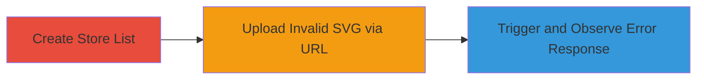

# Instacart Store List Image Upload Path Disclosure via SVG Error

Multi-stage attack chain demonstrating information disclosure through error handling flaws in Instacart's store list background image upload feature.

## Chain Metrics Dashboard

| Metric | Value |
|--------|-------|
| Chain Status | Unverified |
| Total Steps | 3 |
| Execution Time | ~2 minutes |
| Skill Level | Low |
| Complexity | Low |
| Impact Level | Medium |

## Attack Flow Visualization

## Prerequisites & Requirements

### Required Tools

- Web browser (e.g., Chrome or Firefox)

### Target Environment

- Instacart web application
- User account with access to create store lists
- No special services or ports required beyond standard HTTPS (443)

### Initial Access Requirements

- Valid Instacart user credentials
- Direct network access to instacart.com
- No prior elevated access needed

## Detailed Attack Procedures

### Step 1: Create Store List
procedure: [[procedures/Create-Instacart-Store-List]]

**Objective**: Establish a store list to access the background image upload functionality.

**Instructions**: Log in to the Instacart web application and navigate to the store lists section to create a new list.

**Expected Output**: A new store list is created and visible in the user's dashboard.

**Success Indicators**:
- Store list creation confirmation
- Access to edit the list's background image settings

### Step 2: Attempt SVG Image Upload via URL
procedure: [[procedures/Attempt-SVG-Image-Upload-via-URL]]

**Objective**: Trigger the image processing failure by uploading an unsupported SVG format from a remote URL.

**Instructions**: In the store list editing interface, locate the background image upload field and input a remote URL pointing to an SVG file (e.g., https://example.com/test.svg).

**Expected Output**: The upload attempt is processed, leading to a failure due to unsupported format.

**Success Indicators**:
- Upload request submitted
- Error response returned from the server

### Step 3: Capture Error Response for Path Disclosure
procedure: [[procedures/Capture-Error-Response-for-Path-Disclosure]]

**Objective**: Analyze the error message to extract disclosed internal server paths.

**Instructions**: Inspect the JSON error response in the browser's developer tools or network tab for details from the rmagick library error.

**Expected Output**: JSON response containing error details with absolute file paths, such as /var/app/current/tmp/uploads/... .

**Success Indicators**:
- Internal paths like /var/app/current/ visible in error message
- Confirmation of temporary upload directory and timestamps leaked

## Attack Chain Summary

### Key Achievements

1. Successful creation of a store list to access vulnerable upload feature
2. Triggering of rmagick processing error via invalid SVG URL
3. Extraction of sensitive filesystem paths aiding infrastructure reconnaissance

## Technique & Tactic Coverage

### MITRE ATT&CK Techniques

- [[File and Directory Discovery]]

### MITRE ATT&CK Tactics

- [[Discovery]]

---
*Last updated: 2023-10-01T00:00:00Z*
