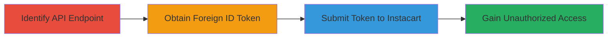

---
tags:
  - auth-bypass
  - google-oauth
  - id-token
  - mobile
type: attack_chain
tools: []
tactics:
  - '[[Initial Access]]'
commands: []
platforms:
  - iOS
  - Web
complexity: medium
procedures:
  - '[[procedures/Bypass-Instacart-Google-Auth-with-Foreign-ID-Token]]'
step_count: 4
techniques:
  - '[[Valid Accounts]]'
description: >-
  Multi-stage attack exploiting improper validation of Google ID tokens in
  Instacart's iOS app login, allowing authentication with tokens from
  third-party apps like Meetup.
skill_level: intermediate
impact_level: high
id: b3d68683-bb5e-4e4e-8a51-50c0bd34738f
created_at: '2025-12-14T17:24:42.305Z'
updated_at: '2025-12-14T17:24:42.305Z'
verified: false
validated: true
submitted: true
mitre_tactics:
  - '[[Initial Access]]'
mitre_techniques:
  - '[[Valid Accounts]]'
---
# Instacart iOS App Google Login Authentication Bypass via Foreign ID Token

Multi-stage attack chain demonstrating authentication bypass in Instacart's iOS app by reusing Google ID tokens from third-party applications, leading to unauthorized account access.

## Chain Metrics Dashboard

| Metric | Value |
|--------|-------|
| Chain Status | Unverified |
| Total Steps | 4 |
| Execution Time | ~10 minutes |
| Skill Level | Intermediate |
| Complexity | Medium |
| Impact Level | High |

## Attack Flow Visualization



## Prerequisites & Requirements

### Required Tools

- Browser developer tools or proxy like Burp Suite for inspecting app traffic
- Another app supporting Google Sign-In (e.g., Meetup)

### Target Environment

- Instacart iOS app
- Access to Google Sign-In enabled apps
- Network access to Instacart API (https://www.instacart.com)

### Initial Access Requirements

- No prior credentials needed
- Ability to install and use third-party apps
- Basic API testing setup

## Detailed Attack Procedures

### Step 1: Identify the Google Login API Endpoint
procedure: [[procedures/Bypass-Instacart-Google-Auth-with-Foreign-ID-Token]]

**Objective**: Locate the API endpoint used for Google login authentication in the Instacart iOS app.

**Instructions**: Use a mobile proxy tool like Burp Suite or Charles Proxy to intercept traffic from the Instacart iOS app during a simulated Google login attempt. Look for POST requests to endpoints containing 'google_login' in the path.

**Expected Output**: Identification of the endpoint https://www.instacart.com/api/v2/users/google_login_auth, which accepts parameters like id_token, access_token, client_id, login_only, and read_terms.

**Success Indicators**:
- Endpoint URL and required parameters documented
- Confirmation that id_token is used for authentication

### Step 2: Obtain an ID Token from Another App's Google Login
procedure: [[procedures/Bypass-Instacart-Google-Auth-with-Foreign-ID-Token]]

**Objective**: Generate a Google ID token from a third-party app to use in the bypass.

**Instructions**: Install and open the Meetup app (or similar Google Sign-In app). Initiate a Google login flow within the app. Intercept the network traffic using a proxy to capture the generated id_token, which is specific to Meetup's client_id.

**Expected Output**: A valid id_token string from the intercepted request.

**Success Indicators**:
- ID token captured successfully
- Token verified as belonging to a different client_id (e.g., Meetup's)

### Step 3: Submit the Foreign ID Token to Instacart's API
procedure: [[procedures/Bypass-Instacart-Google-Auth-with-Foreign-ID-Token]]

**Objective**: Replay the foreign ID token against Instacart's endpoint to bypass authentication.

**Instructions**: Construct a POST request to https://www.instacart.com/api/v2/users/google_login_auth using a tool like curl. Include the captured id_token from Meetup, along with other parameters: access_token (from Meetup), client_id (Meetup's), login_only=true, read_terms=true.

Example request:

```bash
curl -X POST https://www.instacart.com/api/v2/users/google_login_auth \
  -d 'access_token=your_access_token' \
  -d 'client_id=meetup_client_id' \
  -d 'id_token=your_captured_id_token' \
  -d 'login_only=true' \
  -d 'read_terms=true'
```

**Expected Output**: Server response indicating successful authentication, such as a session token or user data.

**Success Indicators**:
- 200 OK response with authentication success
- Access to user account without valid Instacart credentials

### Step 4: Observe Successful Authentication and Access
procedure: [[procedures/Bypass-Instacart-Google-Auth-with-Foreign-ID-Token]]

**Objective**: Confirm unauthorized access to Instacart user accounts.

**Instructions**: Use the returned session token from the API response to make authenticated requests to Instacart's user endpoints, such as fetching profile data or placing orders.

Example follow-up request:

```bash
curl -X GET https://www.instacart.com/api/v2/users/me \
  -H 'Authorization: Bearer your_session_token'
```

**Expected Output**: Retrieval of sensitive user information, confirming account compromise.

**Success Indicators**:
- User profile or account actions accessible
- No additional verification prompted

## Attack Chain Summary

### Key Achievements

1. Identified vulnerable API endpoint in Instacart iOS app
2. Captured and reused foreign Google ID token from Meetup
3. Bypassed authentication to gain account access
4. Demonstrated potential for third-party app compromise of Instacart users

## Technique & Tactic Coverage

### MITRE ATT&CK Techniques

- [[Valid Accounts]]

### MITRE ATT&CK Tactics

- [[Initial Access]]

---
*Last updated: 2023-10-01*
