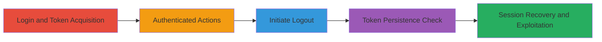

---
tags:
  - oauth
  - android
  - session-hijacking
  - token-reuse
  - insufficient-expiration
type: attack_chain
tools:
  - '[[tools/okhttp]]'
tactics:
  - '[[Credential Access]]'
  - '[[Persistence]]'
verified: false
platforms:
  - Android
  - Web
submitted: true
complexity: medium
created_at: '2023-10-01T00:00:00Z'
procedures:
  - '[[procedures/Perform-OAuth-Login-in-Shopify-Ping-App]]'
  - '[[procedures/Exchange-Authorization-Code-for-Access-Tokens]]'
  - '[[procedures/Perform-Authenticated-Actions-with-Primary-Token]]'
  - '[[procedures/Initiate-Logout-in-Shopify-Ping-App]]'
  - '[[procedures/Verify-Persistent-Access-Token-Post-Logout]]'
step_count: 5
techniques:
  - '[[Application Access Token]]'
  - '[[Valid Accounts]]'
updated_at: '2025-12-14T17:24:45.109Z'
description: >-
  Demonstrates exploitation of improper session invalidation in the Shopify Ping
  Android app, where the primary access token persists after logout, enabling
  unauthorized session recovery and API access.
skill_level: intermediate
impact_level: high
id: 013c241b-91d5-470d-a55c-3eeb559d96bf
validated: true
mitre_tactics:
  - '[[Credential Access]]'
  - '[[Persistence]]'
mitre_techniques:
  - '[[Application Access Token]]'
  - '[[Valid Accounts]]'
---
# Insufficient Session Expiration in Shopify Ping Android App Allowing Post-Logout Token Reuse

Multi-stage attack chain demonstrating exploitation of a vulnerability in the Shopify Ping Android app where the initial access_token is not invalidated upon logout due to a missing 'Logout Token Hint' in the DELETE /api/v1/logout request. This allows an attacker with device access to reuse the token for unauthorized actions like fetching user data or exchanging for new tokens.

## Chain Metrics Dashboard

| Metric | Value |
|--------|-------|
| Chain Status | Unverified |
| Total Steps | 5 |
| Execution Time | ~5 minutes |
| Skill Level | Intermediate |
| Complexity | Medium |
| Impact Level | High |

## Attack Flow Visualization



## Prerequisites & Requirements

### Required Tools

- [[tools/okhttp]]
- HTTP proxy like Burp Suite or mitmproxy for request interception (inferred for debugging)

### Target Environment

- Android device with Shopify Ping app (com.shopify.ping) installed
- Access to app debugging or proxy interception
- Network connectivity to accounts.shopify.com, myshopify.com, and firebaseinstallations.googleapis.com

### Initial Access Requirements

- Physical or logical access to the target Android device
- Ability to monitor or extract stored tokens from app storage (e.g., SharedPreferences or files)
- No prior credentials needed if token is already obtained post-login

## Detailed Attack Procedures

### Step 1: Perform OAuth Login

procedure: [[procedures/Perform-OAuth-Login-in-Shopify-Ping-App]]

**Objective**: Initiate the login process to obtain an authorization code via browser redirect.

**Instructions**: Launch the Shopify Ping app and trigger login, which opens the default browser to https://accounts.shopify.com/ for authentication. Upon successful login, the browser redirects to the app's custom scheme: com.shopify.ping://auth/callback?code=ABCDEFG&state=**************.

**Expected Output**: Authorization code received in the app callback.

**Success Indicators**:
- Browser opens Shopify login page
- Redirect to app with code parameter

### Step 2: Exchange Authorization Code for Tokens

procedure: [[procedures/Exchange-Authorization-Code-for-Access-Tokens]]

**Objective**: Use the authorization code to obtain the primary access_token (tokenA), refresh_token, and id_token via OAuth token endpoint.

**Instructions**: The app automatically sends a POST request to /oauth/token. Intercept or simulate with [[commands/oauth-code-exchange]]:

```bash
curl -X POST https://accounts.shopify.com/oauth/token \
  -d "code=ABCDEFG&grant_type=authorization_code&redirect_uri=com.shopify.ping%3A%2F%2Fauth%2Fcallback&code_verifier=Uiz7J0nHRPvKDpX8ETGYaV9YEW0fx_drl7W4Mmiy-ZOMkwY0mb-5mvNmsDcg3IqBIXQ5XtYrS-wHh1xa6IbEkA&client_id=8bb79a45-2d69-4890-9006-ab6ca705d708"
```

**Expected Output**: JSON response with access_token, refresh_token, and id_token.

**Success Indicators**:
- Tokens issued successfully
- TokenA can be used for subsequent requests

### Step 3: Perform Authenticated Actions with Primary Token

procedure: [[procedures/Perform-Authenticated-Actions-with-Primary-Token]]

**Objective**: Demonstrate usage of tokenA for API calls, including userinfo retrieval and token exchange for secondary tokens.

**Instructions**: Use tokenA in Authorization header for requests. For userinfo, execute [[commands/userinfo-retrieve]]:

```bash
curl -X GET https://accounts.shopify.com/oauth/userinfo \
  -H "Authorization: Bearer [tokenA]"
```

For token exchange to get tokenB, use [[commands/token-exchange-for-unified-bearer]]:

```bash
curl -X POST https://accounts.shopify.com/oauth/token \
  -d "subject_token=[tokenA]&subject_token_type=urn:ietf:params:oauth:token-type:access_token&client_id=8bb79a45-2d69-4890-9006-ab6ca705d708"
```

**Expected Output**: User data JSON for userinfo; new access_token for exchange.

**Success Indicators**:
- User profile data returned
- Secondary tokenB obtained

### Step 4: Initiate Logout

procedure: [[procedures/Initiate-Logout-in-Shopify-Ping-App]]

**Objective**: Trigger the app's logout process, which attempts to revoke tokens but fails for the primary tokenA.

**Instructions**: In the app, trigger logout. This sends three DELETE requests: revoke tokenB, Firebase installation, and attempt logout for tokenA using [[commands/logout-request]]:

```bash
curl -X DELETE https://accounts.shopify.com/api/v1/logout \
  -H "Authorization: Bearer [tokenA]"
```

The first two succeed, but the third fails with 400 due to missing Logout Token Hint.

**Expected Output**: 400 Bad Request for /api/v1/logout with {"error":"Missing Logout Token Hint"}.

**Success Indicators**:
- Secondary tokens revoked
- Primary logout fails (vulnerability trigger)

### Step 5: Verify Persistent Access Token Post-Logout

procedure: [[procedures/Verify-Persistent-Access-Token-Post-Logout]]

**Objective**: Confirm tokenA remains valid, allowing session recovery.

**Instructions**: Post-logout, reuse tokenA with [[commands/userinfo-retrieve-post-logout]]:

```bash
curl -X GET https://accounts.shopify.com/oauth/userinfo \
  -H "Authorization: Bearer [tokenA]"
```

And attempt token exchange with [[commands/token-exchange-post-logout]]:

```bash
curl -X POST https://accounts.shopify.com/oauth/token \
  -d "grant_type=urn:ietf:params:oauth:grant-type:token-exchange&audience=...&scope=https://api.shopify.com/auth/destinations.readonly&subject_token=[tokenA]&subject_token_type=urn:ietf:params:oauth:token-type:access_token&client_id=..."
```

**Expected Output**: Successful userinfo response and new token issuance.

**Success Indicators**:
- User data accessible
- New tokens exchanged successfully

## Attack Chain Summary

### Key Achievements

1. Obtained persistent access_token via app login
2. Demonstrated failed invalidation during logout
3. Recovered full session post-logout for unauthorized access

## Technique & Tactic Coverage

### MITRE ATT&CK Techniques

- [[Application Access Token]] Application Access Token
- [[Valid Accounts]] Valid Accounts

### MITRE ATT&CK Tactics

- [[Credential Access]] Credential Access
- [[Persistence]] Persistence

---

*Last updated: 2023-10-01T00:00:00Z*
