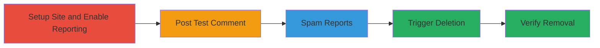

---
tags:
  - rate-limit-bypass
  - business-logic
  - comment-abuse
  - web-vulnerability
type: attack_chain
tools: []
tactics:
  - '[[Initial Access]]'
verified: false
platforms:
  - Web
submitted: true
complexity: medium
procedures:
  - '[[procedures/Setup-IntenseDebate-Site-and-Enable-Reporting]]'
  - '[[procedures/Post-Test-Comment-on-Site]]'
  - '[[procedures/Spam-Report-Comment-with-Multiple-Accounts]]'
  - '[[procedures/Verify-Comment-Deletion]]'
step_count: 5
techniques:
  - '[[Exploit Public-Facing Application]]'
description: >-
  Multi-stage attack exploiting the lack of rate limiting on IntenseDebate's
  comment reporting feature to delete arbitrary comments through spam reports.
skill_level: intermediate
impact_level: high
id: dd75bbee-0c27-4712-a7db-1960c290fe40
created_at: '2025-12-14T17:28:28.740Z'
updated_at: '2025-12-14T17:28:28.740Z'
validated: true
mitre_tactics:
  - '[[Initial Access]]'
mitre_techniques:
  - '[[Exploit Public-Facing Application]]'
---
# IntenseDebate Comment Deletion via Unrestricted Report Spamming

Multi-stage attack chain demonstrating a complete attack workflow exploiting the absence of rate limiting on the comment reporting functionality in IntenseDebate.com. Attackers can configure a low report threshold, post a comment, and spam reports from another account to trigger automatic deletion, enabling unauthorized removal of any comment on integrated sites.

## Chain Metrics Dashboard

| Metric | Value |
|--------|-------|
| Chain Status | Unverified |
| Total Steps | 5 |
| Execution Time | ~15 minutes |
| Skill Level | Intermediate |
| Complexity | Medium |
| Impact Level | High |

## Attack Flow Visualization

## Prerequisites & Requirements

### Required Tools

- Web browser (e.g., Chrome or Firefox)

### Target Environment

- IntenseDebate.com platform
- Access to a test site or any site integrated with IntenseDebate comments
- No specific ports or services beyond standard HTTPS (443)

### Initial Access Requirements

- Valid IntenseDebate account credentials
- Ability to create a new site
- Second account for reporting (can be created during attack)

## Detailed Attack Procedures

### Step 1: Setup Site and Enable Reporting
procedure: [[procedures/Setup-IntenseDebate-Site-and-Enable-Reporting]]

**Objective**: Create a test site on IntenseDebate and configure the report feature with a low deletion threshold to enable easy triggering of automatic comment removal.

**Instructions**: Log in to IntenseDebate, create a new site via the installation page, access the moderation dashboard, navigate to comment settings, enable the "Report this comment" button, set the report threshold to 10, and save changes.

**Expected Output**: Confirmation that settings are saved, with the report feature active on the site.

**Success Indicators**:
- Site created successfully
- Report threshold set to 10 reports for deletion

### Step 2: Post Test Comment
procedure: [[procedures/Post-Test-Comment-on-Site]]

**Objective**: Add a sample comment to the site to serve as the target for the spam reporting attack.

**Instructions**: Navigate to the newly created site, locate the comment section, and post a non-offensive test comment.

**Expected Output**: The comment appears visibly on the site page.

**Success Indicators**:
- Comment posted and visible
- Report button available next to the comment

### Step 3: Spam Report Comment with Multiple Accounts
procedure: [[procedures/Spam-Report-Comment-with-Multiple-Accounts]]

**Objective**: Use a secondary account to repeatedly report the test comment, bypassing rate limits to reach the deletion threshold quickly.

**Instructions**: Log in with a different account, visit the site, click the "Report this comment" button 10 times (or use browser automation if scaling), ensuring each report is submitted without restrictions.

**Expected Output**: Each report submission succeeds without errors or blocks.

**Success Indicators**:
- 10 reports accumulated
- No rate limiting errors encountered

### Step 4: Trigger and Verify Deletion
procedure: [[procedures/Verify-Comment-Deletion]]

**Objective**: Confirm that the spam reports have caused the automatic deletion of the target comment.

**Instructions**: After reaching the threshold, refresh the site page to check if the comment has been removed.

**Expected Output**: The comment is no longer visible on the page.

**Success Indicators**:
- Comment disappears after refresh
- Moderation logs (if accessible) show deletion due to reports

## Attack Chain Summary

### Key Achievements

1. Successful site setup and report feature activation with vulnerable threshold
2. Arbitrary comment posting and targeting
3. Unrestricted spamming of reports to trigger deletion
4. Demonstration of unauthorized content removal

## Technique & Tactic Coverage

### MITRE ATT&CK Techniques

- [[Exploit Public-Facing Application]]

### MITRE ATT&CK Tactics

- [[Initial Access]]

---
*Last updated: 2024-01-01T12:00:00Z*
